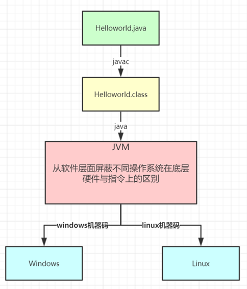
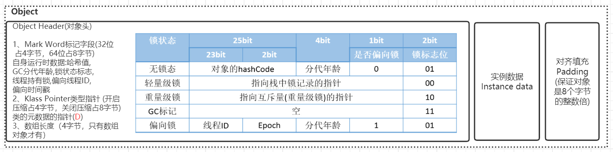
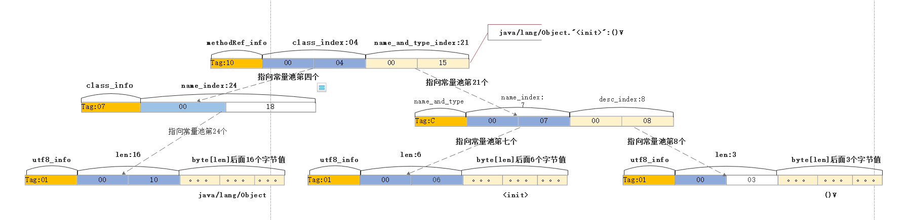
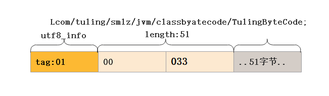
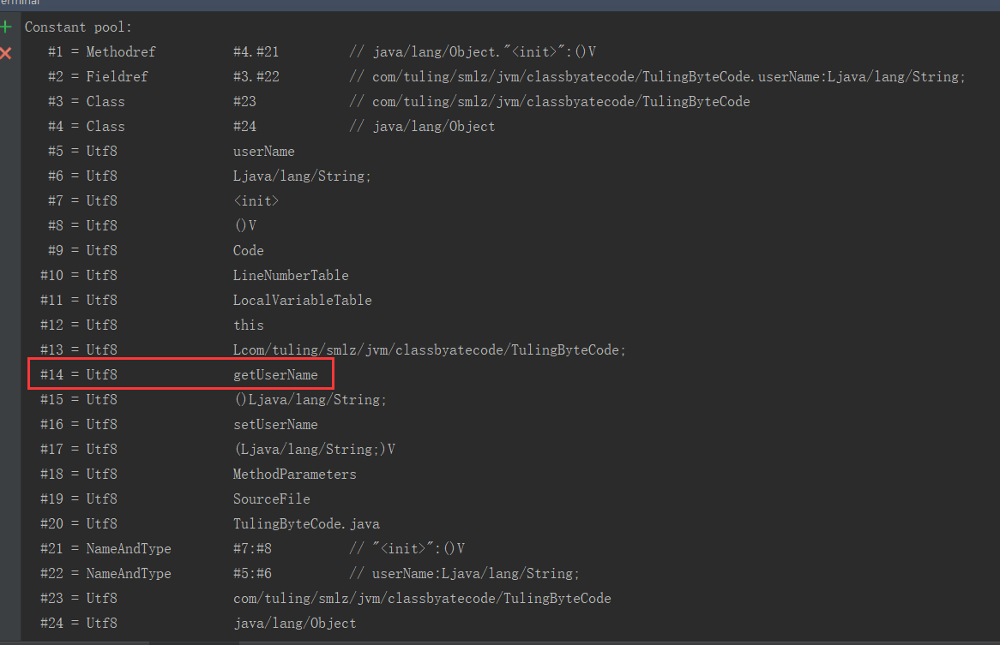
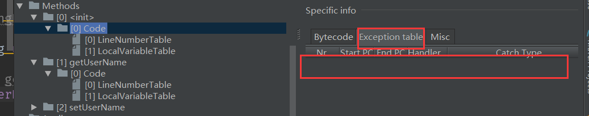
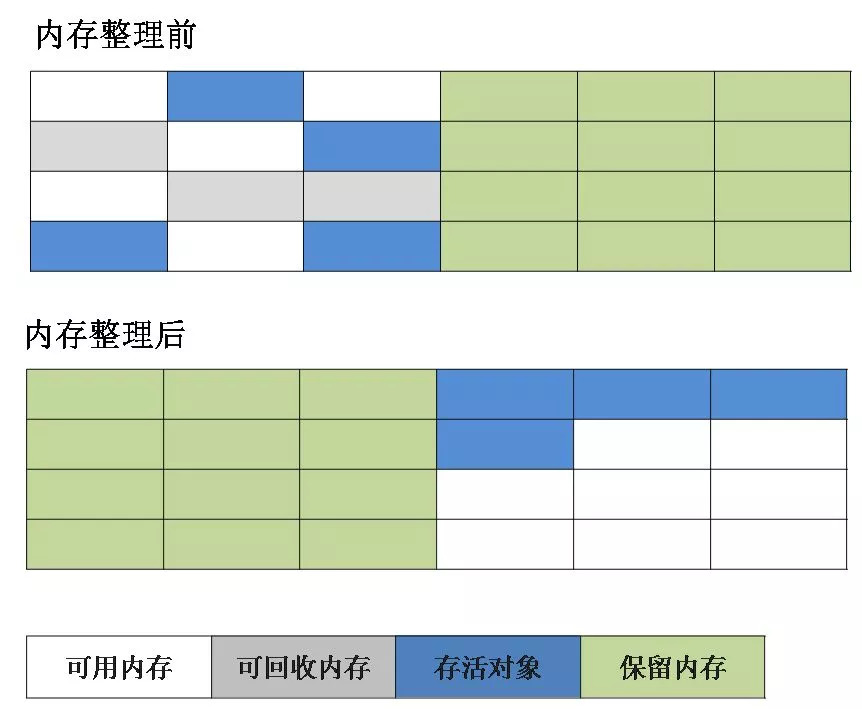
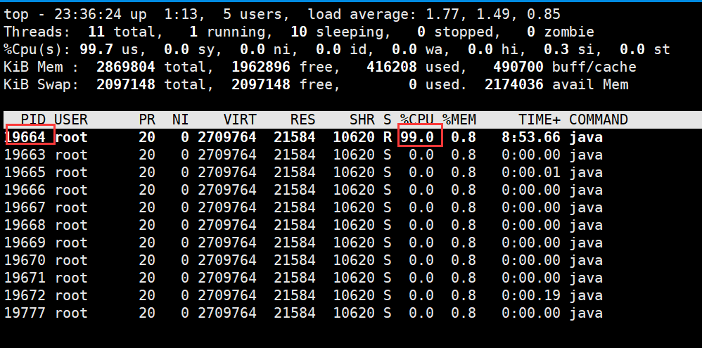
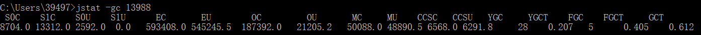
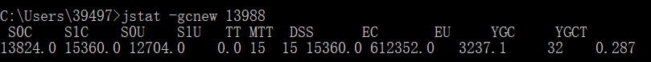

# JVM类加载机制

## 类加载运行全过程

当我们用java命令运行某个类的main函数启动程序时，首先需要通过**类加载器**把主类加载到JVM。

```java
package com.test.jvm;

public class Math {
    public static final int initData = 666;
    public static User user = new User();

    public int compute() { //一个方法对应一块栈帧内存区域
        int a = 1;
        int b = 2;
        int c = (a + b) * 10;
        return c;
    }

    public static void main(String[] args) {
        Math math = new Math();
        math.compute();
    }

}
```

**通过Java命令执行代码的大体流程如下：**  


其中<font color='red'>**loadClass**</font>的类加载过程有如下几步：
**加载 >> 验证 >> 准备 >> 解析 >> 初始化** >> 使用 >> 卸载

- **加载**：在硬盘上查找并通过IO读入字节码文件，使用到类时才会加载，例如调用类的main()方法，new对象等等，在加载阶段会在内存中生成一个代表这个类的java.lang.Class对象，作为方法区这个类的各种数据的访问入口
- **验证**：校验字节码文件的正确性
- **准备**：给类的静态变量分配内存，并赋予默认值
- **解析**：将**符号引用**替换为**直接引用**，该阶段会把一些静态方法(符号引用，比如main()方法)替换为指向数据所存内存的指针或句柄等(直接引用)，这是所谓的**静态链接**过程(类加载期间完成)，**动态链接**是在程序运行期间完成的将符号引用替换为直接引用，下节课会讲到动态链接
- **初始化**：对类的静态变量初始化为指定的值，执行静态代码块  


类被加载到方法区中后主要包含 **运行时常量池、类型信息、字段信息、方法信息、类加载器的引用、对应class实例**的引用等信息。
**类加载器的引用**：这个类到类加载器实例的引用
**对应class实例的引用**：类加载器在加载类信息放到方法区中后，会创建一个对应的Class 类型的对象实例放到堆
(Heap)中, 作为开发人员访问方法区中类定义的入口和切入点。
**注意**，主类在运行过程中如果使用到其它类，会逐步加载这些类。
jar包或war包里的类不是一次性全部加载的，是使用到时才加载。  

```java
public class TestDynamicLoad {
    static {
        System.out.println("*************load TestDynamicLoad************");
    }

    public static void main(String[] args) {
        new A();
        System.out.println("*************load test************");
        B b = null; //B不会加载，除非这里执行 new B()
    }
}

class A {
    static {
        System.out.println("*************load A************");
    }

    public A() {
        System.out.println("*************initial A************");
    }
}

class B {
    static {
        System.out.println("*************load B************");
    }

    public B() {
        System.out.println("*************initial B************");
    }
}

运行结果：
*************load TestDynamicLoad************
*************load A************
*************initial A************
*************load test************
```

**类加载器和双亲委派机制**

上面的类加载过程主要是通过类加载器来实现的，Java里有如下几种类加载器

- **启动类加载器**：负责加载支撑JVM运行的位于JRE的lib目录下的核心类库，比如rt.jar、charsets.jar等
- **扩展类加载器**：负责加载支撑JVM运行的位于JRE的lib目录下的ext扩展目录中的JAR类包
- **应用程序类加载器**：负责加载ClassPath路径下的类包，主要就是加载你自己写的那些类
- **自定义加载器**：负责加载用户自定义路径下的类包


类加载器示例：

```java
import sun.misc.Launcher;

import java.net.URL;

public class TestJDKClassLoader {

    public static void main(String[] args) {
        System.out.println(String.class.getClassLoader());
        System.out.println(com.sun.crypto.provider.DESKeyFactory.class.getClassLoader());
        System.out.println(TestJDKClassLoader.class.getClassLoader().getClass().getName());

        System.out.println();
        ClassLoader appClassLoader = ClassLoader.getSystemClassLoader();
        ClassLoader extClassloader = appClassLoader.getParent();
        ClassLoader bootstrapLoader = extClassloader.getParent();
        System.out.println("the bootstrapLoader : " + bootstrapLoader);
        System.out.println("the extClassloader : " + extClassloader);
        System.out.println("the appClassLoader : " + appClassLoader);

        System.out.println();
        System.out.println("bootstrapLoader加载以下文件：");
        URL[] urls = Launcher.getBootstrapClassPath().getURLs();
        for (int i = 0; i < urls.length; i++) {
            System.out.println(urls[i]);
        }

        System.out.println();
        System.out.println("extClassloader加载以下文件：");
        System.out.println(System.getProperty("java.ext.dirs"));

        System.out.println();
        System.out.println("appClassLoader加载以下文件：");
        System.out.println(System.getProperty("java.class.path"));

    }
}

运行结果：
null
sun.misc.Launcher$ExtClassLoader@7dc36524
sun.misc.Launcher$AppClassLoader

the bootstrapLoader : null
the extClassloader : sun.misc.Launcher$ExtClassLoader@7dc36524
the appClassLoader : sun.misc.Launcher$AppClassLoader@18b4aac2

bootstrapLoader加载以下文件：
file:/D:/DevelopTools/jdk-8/jre/lib/resources.jar
file:/D:/DevelopTools/jdk-8/jre/lib/rt.jar
file:/D:/DevelopTools/jdk-8/jre/lib/sunrsasign.jar
file:/D:/DevelopTools/jdk-8/jre/lib/jsse.jar
file:/D:/DevelopTools/jdk-8/jre/lib/jce.jar
file:/D:/DevelopTools/jdk-8/jre/lib/charsets.jar
file:/D:/DevelopTools/jdk-8/jre/lib/jfr.jar
file:/D:/DevelopTools/jdk-8/jre/classes

extClassloader加载以下文件：
D:\DevelopTools\jdk-8\jre\lib\ext;C:\WINDOWS\Sun\Java\lib\ext

appClassLoader加载以下文件：
D:\DevelopTools\jdk-8\jre\lib\charsets.jar;D:\DevelopTools\jdk-8\jre\lib\deploy.jar;D:\DevelopTools\jdk-8\jre\lib\ext\access-bridge-64.jar;D:\DevelopTools\jdk-8\jre\lib\ext\cldrdata.jar;D:\DevelopTools\jdk-8\jre\lib\ext\dnsns.jar;D:\DevelopTools\jdk-8\jre\lib\ext\jaccess.jar;D:\DevelopTools\jdk-8\jre\lib\ext\jfxrt.jar;D:\DevelopTools\jdk-8\jre\lib\ext\localedata.jar;D:\DevelopTools\jdk-8\jre\lib\ext\nashorn.jar;D:\DevelopTools\jdk-8\jre\lib\ext\sunec.jar;D:\DevelopTools\jdk-8\jre\lib\ext\sunjce_provider.jar;D:\DevelopTools\jdk-8\jre\lib\ext\sunmscapi.jar;D:\DevelopTools\jdk-8\jre\lib\ext\sunpkcs11.jar;D:\DevelopTools\jdk-8\jre\lib\ext\zipfs.jar;D:\DevelopTools\jdk-8\jre\lib\javaws.jar;D:\DevelopTools\jdk-8\jre\lib\jce.jar;D:\DevelopTools\jdk-8\jre\lib\jfr.jar;D:\DevelopTools\jdk-8\jre\lib\jfxswt.jar;D:\DevelopTools\jdk-8\jre\lib\jsse.jar;D:\DevelopTools\jdk-8\jre\lib\management-agent.jar;D:\DevelopTools\jdk-8\jre\lib\plugin.jar;D:\DevelopTools\jdk-8\jre\lib\resources.jar;D:\DevelopTools\jdk-8\jre\lib\rt.jar;E:\test\target\classes;D:\DevelopTools\IDEA2019.1.4\lib\idea_rt.jar;D:\DevelopTools\IDEA2019.1.4\lib\rt\debugger-agent.jar
```

**类加载器初始化过程**：
参见类运行加载全过程图可知其中会创建JVM启动器实例`sun.misc.Launcher`。
在Launcher构造方法内部，其创建了两个类加载器，分别是`sun.misc.Launcher.ExtClassLoader`(扩展类加载器)和
`sun.misc.Launcher.AppClassLoader`(应用类加载器)。
JVM默认使用Launcher的getClassLoader()方法返回的类加载器AppClassLoader的实例加载我们的应用程序  

```java
public Launcher() {
        Launcher.ExtClassLoader var1;
        try {
            //构造扩展类加载器，在构造的过程中将其父加载器设置为null
            var1 = Launcher.ExtClassLoader.getExtClassLoader();
        } catch (IOException var10) {
            throw new InternalError("Could not create extension class loader", var10);
        }

        try {
            //构造应用类加载器，在构造的过程中将其父加载器设置为ExtClassLoader，
            //Launcher的loader属性值是AppClassLoader，我们一般都是用这个类加载器来加载我们自己写的应用程序
            this.loader = Launcher.AppClassLoader.getAppClassLoader(var1);
        } catch (IOException var9) {
            throw new InternalError("Could not create application class loader", var9);
        }

        Thread.currentThread().setContextClassLoader(this.loader);
        String var2 = System.getProperty("java.security.manager");
        //省略一些不需要关注的代码

    }
```

**双亲委派机制**

JVM类加载器是有亲子层级结构的，如下图

   

这里类加载其实就有一个**双亲委派机制**，加载某个类时会先委托父加载器寻找目标类，找不到再委托上层父加载器加载，如果所有父加载器在自己的加载类路径下都找不到目标类，则在自己的类加载路径中查找并载入目标类。

比如我们的Math类，最先会找应用程序类加载器加载，应用程序类加载器会先委托扩展类加载器加载，扩展类加载器再委托引导类加载器，顶层引导类加载器在自己的类加载路径里找了半天没找到Math类，则向下退回加载Math类的请求，扩展类加载器收到回复就自己加载，在自己的类加载路径里找了半天也没找到Math类，又向下退回Math类的加载请求给应用程序类加载器，应用程序类加载器于是在自己的类加载路径里找Math类，结果找到了就自己加载了。。

**双亲委派机制说简单点就是，先找父亲加载，不行再由儿子自己加载**

我们来看下应用程序类加载器AppClassLoader加载类的双亲委派机制源码，AppClassLoader的loadClass方法最终会调用其父类ClassLoader的loadClass方法，该方法的大体逻辑如下：

1. 首先，检查一下指定名称的类是否已经加载过，如果加载过了，就不需要再加载，直接返回。
2. 如果此类没有加载过，那么，再判断一下是否有父加载器；如果有父加载器，则由父加载器加载（即调用parent.loadClass(name, false);）.或者是调用bootstrap类加载器来加载。
3. 如果父加载器及bootstrap类加载器都没有找到指定的类，那么调用当前类加载器的findClass方法来完成类加载。

```java
//ClassLoader的loadClass方法，里面实现了双亲委派机制
protected Class<?> loadClass(String name, boolean resolve)
    throws ClassNotFoundException
{
    synchronized (getClassLoadingLock(name)) {
        // 检查当前类加载器是否已经加载了该类
        Class<?> c = findLoadedClass(name);
        if (c == null) {
            long t0 = System.nanoTime();
            try {
                if (parent != null) {  //如果当前加载器父加载器不为空则委托父加载器加载该类
                    c = parent.loadClass(name, false);
                } else {  //如果当前加载器父加载器为空则委托引导类加载器加载该类
                    c = findBootstrapClassOrNull(name);
                }
            } catch (ClassNotFoundException e) {
                // ClassNotFoundException thrown if class not found
                // from the non-null parent class loader
            }

            if (c == null) {
                // If still not found, then invoke findClass in order
                // to find the class.
                long t1 = System.nanoTime();
                //都会调用URLClassLoader的findClass方法在加载器的类路径里查找并加载该类
                c = findClass(name);

                // this is the defining class loader; record the stats
                sun.misc.PerfCounter.getParentDelegationTime().addTime(t1 - t0);
                sun.misc.PerfCounter.getFindClassTime().addElapsedTimeFrom(t1);
                sun.misc.PerfCounter.getFindClasses().increment();
            }
        }
        if (resolve) {  //不会执行
            resolveClass(c);
        }
        return c;
    }
}
```

**为什么要设计双亲委派机制？**

- 沙箱安全机制：自己写的java.lang.String.class类不会被加载，这样便可以防止核心API库被随意篡改
- 避免类的重复加载：当父亲已经加载了该类时，就没有必要子ClassLoader再加载一次，保证**被加载类的唯一性**

看一个类加载示例：

```java
package java.lang;

public class String {
    public static void main(String[] args) {
        System.out.println("**************My String Class**************");
    }
}

运行结果：
错误: 在类 java.lang.String 中找不到 main 方法, 请将 main 方法定义为:
   public static void main(String[] args)
否则 JavaFX 应用程序类必须扩展javafx.application.Application
```

**全盘负责委托机制**

**“全盘负责”是指当一个ClassLoder装载一个类时，除非显示的使用另外一个ClassLoder，该类所依赖及引用的类也由这个ClassLoder载入。**

**自定义类加载器示例：**

自定义类加载器只需要继承 java.lang.ClassLoader 类，该类有两个核心方法，一个是loadClass(String, boolean)，实现了**双亲委派机制**，还有一个方法是findClass，默认实现是空方法，所以我们自定义类加载器主要是**重写findClass**方法。

```java
public class MyClassLoaderTest {
    static class MyClassLoader extends ClassLoader {
        private String classPath;

        public MyClassLoader(String classPath) {
            this.classPath = classPath;
        }

        private byte[] loadByte(String name) throws Exception {
            name = name.replaceAll("\\.", "/");
            FileInputStream fis = new FileInputStream(classPath + "/" + name
                    + ".class");
            int len = fis.available();
            byte[] data = new byte[len];
            fis.read(data);
            fis.close();
            return data;
        }

        protected Class<?> findClass(String name) throws ClassNotFoundException {
            try {
                byte[] data = loadByte(name);
                //defineClass将一个字节数组转为Class对象，这个字节数组是class文件读取后最终的字节数组。
                return defineClass(name, data, 0, data.length);
            } catch (Exception e) {
                e.printStackTrace();
                throw new ClassNotFoundException();
            }
        }

    }

    public static void main(String args[]) throws Exception {
        //初始化自定义类加载器，会先初始化父类ClassLoader，其中会把自定义类加载器的父加载器设置为应用程序类加载器AppClassLoader
        MyClassLoader classLoader = new MyClassLoader("D:/test");
        //D盘创建 test/com/tuling/jvm 几级目录，将User类的复制类User1.class丢入该目录
        Class clazz = classLoader.loadClass("com.test.jvm.User1");
        Object obj = clazz.newInstance();
        Method method = clazz.getDeclaredMethod("sout", null);
        method.invoke(obj, null);
        System.out.println(clazz.getClassLoader().getClass().getName());
    }
}

运行结果：
=======自己的加载器加载类调用方法=======
com.test.jvm.MyClassLoaderTest$MyClassLoader
```

**打破双亲委派机制**

再来一个沙箱安全机制示例，尝试打破双亲委派机制，用自定义类加载器加载我们自己实现的 java.lang.String.class

```java
public class MyClassLoaderTest {
    static class MyClassLoader extends ClassLoader {
        private String classPath;

        public MyClassLoader(String classPath) {
            this.classPath = classPath;
        }

        private byte[] loadByte(String name) throws Exception {
            name = name.replaceAll("\\.", "/");
            FileInputStream fis = new FileInputStream(classPath + "/" + name
                    + ".class");
            int len = fis.available();
            byte[] data = new byte[len];
            fis.read(data);
            fis.close();
            return data;

        }

        protected Class<?> findClass(String name) throws ClassNotFoundException {
            try {
                byte[] data = loadByte(name);
                return defineClass(name, data, 0, data.length);
            } catch (Exception e) {
                e.printStackTrace();
                throw new ClassNotFoundException();
            }
        }

        /**
         * 重写类加载方法，实现自己的加载逻辑，不委派给双亲加载
         * @param name
         * @param resolve
         * @return
         * @throws ClassNotFoundException
         */
        protected Class<?> loadClass(String name, boolean resolve)
                throws ClassNotFoundException {
            synchronized (getClassLoadingLock(name)) {
                // First, check if the class has already been loaded
                Class<?> c = findLoadedClass(name);

                if (c == null) {
                    // If still not found, then invoke findClass in order
                    // to find the class.
                    long t1 = System.nanoTime();
                    c = findClass(name);

                    // this is the defining class loader; record the stats
                    sun.misc.PerfCounter.getFindClassTime().addElapsedTimeFrom(t1);
                    sun.misc.PerfCounter.getFindClasses().increment();
                }
                if (resolve) {
                    resolveClass(c);
                }
                return c;
            }
        }
    }

    public static void main(String args[]) throws Exception {
        MyClassLoader classLoader = new MyClassLoader("D:/test");
        //尝试用自己改写类加载机制去加载自己写的java.lang.String.class
        Class clazz = classLoader.loadClass("java.lang.String");
        Object obj = clazz.newInstance();
        Method method= clazz.getDeclaredMethod("sout", null);
        method.invoke(obj, null);
        System.out.println(clazz.getClassLoader().getClass().getName());
    }
}

运行结果：
java.lang.SecurityException: Prohibited package name: java.lang
	at java.lang.ClassLoader.preDefineClass(ClassLoader.java:659)
	at java.lang.ClassLoader.defineClass(ClassLoader.java:758)
```

**Tomcat打破双亲委派机制**

以Tomcat类加载为例，Tomcat 如果使用默认的双亲委派类加载机制行不行？

我们思考一下：Tomcat是个web容器， 那么它要解决什么问题： 

1. 一个web容器可能需要部署两个应用程序，不同的应用程序可能会**依赖同一个第三方类库的不同版本**，不能要求同一个类库在同一个服务器只有一份，因此要保证每个应用程序的类库都是独立的，保证相互隔离。 

2. 部署在同一个web容器中**相同的类库相同的版本可以共享**。否则，如果服务器有10个应用程序，那么要有10份相同的类库加载进虚拟机。 

3. **web容器也有自己依赖的类库，不能与应用程序的类库混淆**。基于安全考虑，应该让容器的类库和程序的类库隔离开来。 

4. web容器要支持jsp的修改，我们知道，jsp 文件最终也是要编译成class文件才能在虚拟机中运行，但程序运行后修改jsp已经是司空见惯的事情， web容器需要支持 jsp 修改后不用重启。

再看看我们的问题：**Tomcat 如果使用默认的双亲委派类加载机制行不行？** 

答案是不行的。为什么？

第一个问题，如果使用默认的类加载器机制，那么是无法加载两个相同类库的不同版本的，默认的类加器是不管你是什么版本的，只在乎你的全限定类名，并且只有一份。

第二个问题，默认的类加载器是能够实现的，因为他的职责就是保证**唯一性**。

第三个问题和第一个问题一样。

我们再看第四个问题，我们想我们要怎么实现jsp文件的热加载，jsp 文件其实也就是class文件，那么如果修改了，但类名还是一样，类加载器会直接取方法区中已经存在的，修改后的jsp是不会重新加载的。那么怎么办呢？我们可以直接卸载掉这jsp文件的类加载器，所以你应该想到了，每个jsp文件对应一个唯一的类加载器，当一个jsp文件修改了，就直接卸载这个jsp类加载器。重新创建类加载器，重新加载jsp文件。

**Tomcat自定义加载器详解**

​    

tomcat的几个主要类加载器：

- commonLoader：Tomcat最基本的类加载器，加载路径中的class可以被Tomcat容器本身以及各个Webapp访问；
- catalinaLoader：Tomcat容器私有的类加载器，加载路径中的class对于Webapp不可见；
- sharedLoader：各个Webapp共享的类加载器，加载路径中的class对于所有Webapp可见，但是对于Tomcat容器不可见；
- WebappClassLoader：各个Webapp私有的类加载器，加载路径中的class只对当前Webapp可见，比如加载war包里相关的类，每个war包应用都有自己的WebappClassLoader，实现相互隔离，比如不同war包应用引入了不同的spring版本，这样实现就能加载各自的spring版本；

从图中的委派关系中可以看出：

CommonClassLoader能加载的类都可以被CatalinaClassLoader和SharedClassLoader使用，从而实现了公有类库的共用，而CatalinaClassLoader和SharedClassLoader自己能加载的类则与对方相互隔离。

WebAppClassLoader可以使用SharedClassLoader加载到的类，但各个WebAppClassLoader实例之间相互隔离。

而JasperLoader的加载范围仅仅是这个JSP文件所编译出来的那一个.Class文件，它出现的目的就是为了被丢弃：当Web容器检测到JSP文件被修改时，会替换掉目前的JasperLoader的实例，并通过再建立一个新的Jsp类加载器来实现JSP文件的热加载功能。

tomcat 这种类加载机制违背了java 推荐的双亲委派模型了吗？答案是：违背了。 

很显然，tomcat 不是这样实现，tomcat 为了实现隔离性，没有遵守这个约定，**每个webappClassLoader加载自己的目录下的class文件，不会传递给父类加载器，打破了双亲委派机制**。

**模拟实现Tomcat的webappClassLoader加载自己war包应用内不同版本类实现相互共存与隔离**

```java
public class MyClassLoaderTest {
    static class MyClassLoader extends ClassLoader {
        private String classPath;

        public MyClassLoader(String classPath) {
            this.classPath = classPath;
        }

        private byte[] loadByte(String name) throws Exception {
            name = name.replaceAll("\\.", "/");
            FileInputStream fis = new FileInputStream(classPath + "/" + name
                    + ".class");
            int len = fis.available();
            byte[] data = new byte[len];
            fis.read(data);
            fis.close();
            return data;

        }

        protected Class<?> findClass(String name) throws ClassNotFoundException {
            try {
                byte[] data = loadByte(name);
                return defineClass(name, data, 0, data.length);
            } catch (Exception e) {
                e.printStackTrace();
                throw new ClassNotFoundException();
            }
        }

        /**
         * 重写类加载方法，实现自己的加载逻辑，不委派给双亲加载
         * @param name
         * @param resolve
         * @return
         * @throws ClassNotFoundException
         */
        protected Class<?> loadClass(String name, boolean resolve)
                throws ClassNotFoundException {
            synchronized (getClassLoadingLock(name)) {
                // First, check if the class has already been loaded
                Class<?> c = findLoadedClass(name);

                if (c == null) {
                    // If still not found, then invoke findClass in order
                    // to find the class.
                    long t1 = System.nanoTime();

                    //非自定义的类还是走双亲委派加载
                    if (!name.startsWith("com.tuling.jvm")){
                        c = this.getParent().loadClass(name);
                    }else{
                        c = findClass(name);
                    }

                    // this is the defining class loader; record the stats
                    sun.misc.PerfCounter.getFindClassTime().addElapsedTimeFrom(t1);
                    sun.misc.PerfCounter.getFindClasses().increment();
                }
                if (resolve) {
                    resolveClass(c);
                }
                return c;
            }
        }
    }

    public static void main(String args[]) throws Exception {
        MyClassLoader classLoader = new MyClassLoader("D:/test");
        Class clazz = classLoader.loadClass("com.tuling.jvm.User1");
        Object obj = clazz.newInstance();
        Method method= clazz.getDeclaredMethod("sout", null);
        method.invoke(obj, null);
        System.out.println(clazz.getClassLoader());
        
        System.out.println();
        MyClassLoader classLoader1 = new MyClassLoader("D:/test1");
        Class clazz1 = classLoader1.loadClass("com.tuling.jvm.User1");
        Object obj1 = clazz1.newInstance();
        Method method1= clazz1.getDeclaredMethod("sout", null);
        method1.invoke(obj1, null);
        System.out.println(clazz1.getClassLoader());
    }
}

运行结果：
=======自己的加载器加载类调用方法=======
com.tuling.jvm.MyClassLoaderTest$MyClassLoader@266474c2

=======另外一个User1版本：自己的加载器加载类调用方法=======
com.tuling.jvm.MyClassLoaderTest$MyClassLoader@66d3c617
```

注意：同一个JVM内，两个相同包名和类名的类对象可以共存，因为他们的类加载器可以不一样，所以看两个类对象是否是同一个，除了看类的包名和类名是否都相同之外，还需要他们的类加载器也是同一个才能认为他们是同一个。

**模拟实现Tomcat的JasperLoader热加载**

原理：后台启动线程监听jsp文件变化，如果变化了找到该jsp对应的servlet类的加载器引用(gcroot)，重新生成新的**JasperLoader**加载器赋值给引用，然后加载新的jsp对应的servlet类，之前的那个加载器因为没有gcroot引用了，下一次gc的时候会被销毁。

附下User类的代码：

```java
package com.tuling.jvm;

public class User {

    private int id;
    private String name;
    
    public User() {
    }

    public User(int id, String name) {
        super();
        this.id = id;
        this.name = name;
    }

    public int getId() {
        return id;
    }

    public void setId(int id) {
        this.id = id;
    }

    public String getName() {
        return name;
    }

    public void setName(String name) {
        this.name = name;
    }

    public void sout() {
        System.out.println("=======自己的加载器加载类调用方法=======");
    }
}
```

# JVM内存模型深度剖析与优化

**JDK体系结构**

------

​    

**Java语言的跨平台特性**

------

​    

**JVM整体结构及内存模型**

------

 

堆内存


新生代：Eden`[ˈiːdn]`(伊甸园区)、s0(from)、s1(to) 三块区域默认比例8:1:1，s0(from)和s1(to)组成Survivor`[səˈvaɪvə(r)]`区

老年代：

**补充一个问题：**

**在minor gc(young gc)过程中对象挪动后，引用如何修改？**

对象在堆内部挪动的过程其实是复制，原有区域对象还在，一般不直接清理，JVM内部清理过程只是将对象分配指针移动到区域的头位置即可，比如扫描s0区域，扫到gcroot引用的非垃圾对象是将这些对象**复制**到s1或老年代，最后扫描完了将s0区域的对象分配指针移动到区域的起始位置即可，s0区域之前对象并不直接清理，当有新对象分配了，原有区域里的对象也就被清除了。

minor gc在根扫描过程中会记录所有被扫描到的对象引用(在年轻代这些引用很少，因为大部分都是垃圾对象不会扫描到)，如果引用的对象被复制到新地址了，最后会一并更新引用指向新地址。

这里面内部算法比较复杂，感兴趣可以参考R大的这篇文章：

https://www.zhihu.com/question/42181722/answer/145085437

https://hllvm-group.iteye.com/group/topic/39376#post-257329

**二、JVM内存参数设置**

------

​    

Spring Boot程序的JVM参数设置格式(Tomcat启动直接加在bin目录下catalina.sh文件里)：

```java
java -Xms2048M -Xmx2048M -Xmn1024M -Xss512K -XX:MetaspaceSize=256M -XX:MaxMetaspaceSize=256M -jar microservice-eureka-server.jar             
```

-Xss：每个线程的栈大小

-Xms：初始堆大小，默认物理内存的1/64

-Xmx：最大堆大小，默认物理内存的1/4

-Xmn：新生代大小

-XX:NewSize：设置新生代初始大小

-XX:NewRatio：默认2表示新生代占年老代的1/2，占整个堆内存的1/3。

-XX:SurvivorRatio：默认8表示一个survivor区占用1/8的Eden内存，即1/10的新生代内存。

关于元空间的JVM参数有两个：-XX:MetaspaceSize=N和 -XX:MaxMetaspaceSize=N

**-XX：MaxMetaspaceSize**： 设置元空间最大值， 默认是-1， 即不限制， 或者说只受限于本地内存大小。

**-XX：MetaspaceSize**： 指定元空间触发Fullgc的初始阈值(元空间无固定初始大小)， 以字节为单位，默认是21M左右，达到该值就会触发full gc进行类型卸载， 同时收集器会对该值进行调整： 如果释放了大量的空间， 就适当降低该值； 如果释放了很少的空间， 那么在不超过-XX：MaxMetaspaceSize（如果设置了的话） 的情况下， 适当提高该值。这个跟早期jdk版本的**-XX:PermSize**参数意思不一样，-**XX:PermSize**代表永久代的初始容量。

由于调整元空间的大小需要Full GC，这是非常昂贵的操作，如果应用在启动的时候发生大量Full GC，通常都是由于永久代或元空间发生了大小调整，基于这种情况，一般建议在JVM参数中将MetaspaceSize和MaxMetaspaceSize设置成一样的值，并设置得比初始值要大，对于8G物理内存的机器来说，一般我会将这两个值都设置为256M。

**StackOverflowError**示例：

```java
// JVM设置  -Xss128k(默认1M)
public class StackOverflowTest {
    
    static int count = 0;
    
    static void redo() {
        count++;
        redo();
    }

    public static void main(String[] args) {
        try {
            redo();
        } catch (Throwable t) {
            t.printStackTrace();
            System.out.println(count);
        }
    }
}

运行结果：
java.lang.StackOverflowError
	at com.test.jvm.StackOverflowTest.redo(StackOverflowTest.java:12)
	at com.test.jvm.StackOverflowTest.redo(StackOverflowTest.java:13)
	at com.test.jvm.StackOverflowTest.redo(StackOverflowTest.java:13)
   ......
```


**结论：**

-Xss设置越小count值越小，说明一个线程栈里能分配的栈帧就越少，但是对JVM整体来说能开启的线程数会更多

**JVM内存参数大小该如何设置？**

JVM参数大小设置并没有固定标准，需要根据实际项目情况分析，给大家举个例子

**日均百万级订单交易系统如何设置JVM参数**

​    

**结论：通过上面这些内容介绍，大家应该对JVM优化有些概念了，就是尽可能让对象都在新生代里分配和回收，尽量别让太多对象频繁进入老年代，避免频繁对老年代进行垃圾回收，同时给系统充足的内存大小，避免新生代频繁的进行垃圾回收。**    

# JVM对象创建与内存分配机制深度剖析

**对象的创建**

对象创建的主要流程:


**1.类加载检查**

 虚拟机遇到一条new指令时，首先将去检查这个指令的参数是否能在常量池中定位到一个类的符号引用，并且检查这个符号引用代表的类是否已被加载、解析和初始化过。如果没有，那必须先执行相应的类加载过程。

 new指令对应到语言层面上讲是，new关键词、对象克隆、对象序列化等。

**2.分配内存**

 在类加载检查通过后，接下来虚拟机将为新生对象分配内存。对象所需内存的大小在类 加载完成后便可完全确定，为对象分配空间的任务等同于把 一块确定大小的内存从Java堆中划分出来。

这个步骤有两个问题：

1.如何划分内存。

2.在并发情况下， 可能出现正在给对象A分配内存，指针还没来得及修改，对象B又同时使用了原来的指针来分配内存的情况。

**划分内存的方法：**

- “指针碰撞”（Bump the Pointer）(默认用指针碰撞)

如果Java堆中内存是绝对规整的，所有用过的内存都放在一边，空闲的内存放在另一边，中间放着一个指针作为分界点的指示器，那所分配内存就仅仅是把那个指针向空闲空间那边挪动一段与对象大小相等的距离。

- “空闲列表”（Free List）

如果Java堆中的内存并不是规整的，已使用的内存和空 闲的内存相互交错，那就没有办法简单地进行指针碰撞了，虚拟机就必须维护一个列表，记 录上哪些内存块是可用的，在分配的时候从列表中找到一块足够大的空间划分给对象实例， 并更新列表上的记录

**解决并发问题的方法：**

- CAS（compare and swap）

虚拟机采用**CAS配上失败重试**的方式保证更新操作的原子性来对分配内存空间的动作进行同步处理。

- 本地线程分配缓冲（Thread Local Allocation Buffer,TLAB）

把内存分配的动作按照线程划分在不同的空间之中进行，即每个线程在Java堆中预先分配一小块内存。通过**-XX:+/-UseTLAB**参数来设定虚拟机是否使用TLAB(JVM会默认开启**-XX:+UseTLAB**)，-XX:TLABSize 指定TLAB大小。

**3.初始化零值**

内存分配完成后，虚拟机需要将分配到的内存空间都初始化为零值（不包括对象头）， 如果使用TLAB，这一工作过程也可以提前至TLAB分配时进行。这一步操作保证了对象的实例字段在Java代码中可以不赋初始值就直接使用，程序能访问到这些字段的数据类型所对应的零值。

**4.设置对象头**

初始化零值之后，虚拟机要对对象进行必要的设置，例如这个对象是哪个类的实例、如何才能找到类的元数据信息、对象的哈希码、对象的GC分代年龄等信息。这些信息存放在对象的对象头Object Header之中。

在HotSpot虚拟机中，对象在内存中存储的布局可以分为3块区域：对象头（Header）、 实例数据（Instance Data）和对齐填充（Padding）。 HotSpot虚拟机的对象头包括两部分信息，第一部分用于存储对象自身的运行时数据， 如哈希码（HashCode）、GC分代年龄、锁状态标志、线程持有的锁、偏向线程ID、偏向时 间戳等。对象头的另外一部分是类型指针，即对象指向它的类元数据的指针，虚拟机通过这个指针来确定这个对象是哪个类的实例。

**32位对象头**

​    

**64位对象头**

​    

对象头在hotspot的C++源码markOop.hpp文件里的注释如下：

```java
// Bit-format of an object header (most significant first, big endian layout below):
//
//  32 bits:
//  --------
//             hash:25 ------------>| age:4    biased_lock:1 lock:2 (normal object)
//             JavaThread*:23 epoch:2 age:4    biased_lock:1 lock:2 (biased object)
//             size:32 ------------------------------------------>| (CMS free block)
//             PromotedObject*:29 ---------->| promo_bits:3 ----->| (CMS promoted object)
//
//  64 bits:
//  --------
//  unused:25 hash:31 -->| unused:1   age:4    biased_lock:1 lock:2 (normal object)
//  JavaThread*:54 epoch:2 unused:1   age:4    biased_lock:1 lock:2 (biased object)
//  PromotedObject*:61 --------------------->| promo_bits:3 ----->| (CMS promoted object)
//  size:64 ----------------------------------------------------->| (CMS free block)
//
//  unused:25 hash:31 -->| cms_free:1 age:4    biased_lock:1 lock:2 (COOPs && normal object)
//  JavaThread*:54 epoch:2 cms_free:1 age:4    biased_lock:1 lock:2 (COOPs && biased object)
//  narrowOop:32 unused:24 cms_free:1 unused:4 promo_bits:3 ----->| (COOPs && CMS promoted object)
//  unused:21 size:35 -->| cms_free:1 unused:7 ------------------>| (COOPs && CMS free block)
```


**5.执行init方法**

 执行方法，即对象按照程序员的意愿进行初始化。对应到语言层面上讲，就是为属性赋值（注意，这与上面的赋零值不同，这是由程序员赋的值），和执行构造方法。

**对象大小与指针压缩**

对象大小可以用jol-core包查看，引入依赖

```java
<dependency>
    <groupId>org.openjdk.jol</groupId>
    <artifactId>jol-core</artifactId>
    <version>0.9</version>
</dependency>
```

```java
import org.openjdk.jol.info.ClassLayout;

/**
 * 计算对象大小
 */
public class JOLSample {

    public static void main(String[] args) {
        ClassLayout layout = ClassLayout.parseInstance(new Object());
        System.out.println(layout.toPrintable());

        System.out.println();
        ClassLayout layout1 = ClassLayout.parseInstance(new int[]{});
        System.out.println(layout1.toPrintable());

        System.out.println();
        ClassLayout layout2 = ClassLayout.parseInstance(new A());
        System.out.println(layout2.toPrintable());
    }

    // -XX:+UseCompressedOops           默认开启的压缩所有指针
    // -XX:+UseCompressedClassPointers  默认开启的压缩对象头里的类型指针Klass Pointer
    // Oops : Ordinary Object Pointers
    public static class A {
                       //8B mark word
                       //4B Klass Pointer   如果关闭压缩-XX:-UseCompressedClassPointers或-XX:-UseCompressedOops，则占用8B
        int id;        //4B
        String name;   //4B  如果关闭压缩-XX:-UseCompressedOops，则占用8B
        byte b;        //1B 
        Object o;      //4B  如果关闭压缩-XX:-UseCompressedOops，则占用8B
    }
}


运行结果：
java.lang.Object object internals:
 OFFSET  SIZE   TYPE DESCRIPTION                               VALUE
      0     4        (object header)                           01 00 00 00 (00000001 00000000 00000000 00000000) (1)    //mark word
      4     4        (object header)                           00 00 00 00 (00000000 00000000 00000000 00000000) (0)    //mark word     
      8     4        (object header)                           e5 01 00 f8 (11100101 00000001 00000000 11111000) (-134217243)    //Klass Pointer
     12     4        (loss due to the next object alignment)
Instance size: 16 bytes
Space losses: 0 bytes internal + 4 bytes external = 4 bytes total


[I object internals:
 OFFSET  SIZE   TYPE DESCRIPTION                               VALUE
      0     4        (object header)                           01 00 00 00 (00000001 00000000 00000000 00000000) (1)
      4     4        (object header)                           00 00 00 00 (00000000 00000000 00000000 00000000) (0)
      8     4        (object header)                           6d 01 00 f8 (01101101 00000001 00000000 11111000) (-134217363)
     12     4        (object header)                           00 00 00 00 (00000000 00000000 00000000 00000000) (0)
     16     0    int [I.<elements>                             N/A
Instance size: 16 bytes
Space losses: 0 bytes internal + 0 bytes external = 0 bytes total


com.tuling.jvm.JOLSample$A object internals:
 OFFSET  SIZE               TYPE DESCRIPTION                               VALUE
      0     4                    (object header)                           01 00 00 00 (00000001 00000000 00000000 00000000) (1)
      4     4                    (object header)                           00 00 00 00 (00000000 00000000 00000000 00000000) (0)
      8     4                    (object header)                           61 cc 00 f8 (01100001 11001100 00000000 11111000) (-134165407)
     12     4                int A.id                                      0
     16     1               byte A.b                                       0
     17     3                    (alignment/padding gap)                  
     20     4   java.lang.String A.name                                    null
     24     4   java.lang.Object A.o                                       null
     28     4                    (loss due to the next object alignment)
Instance size: 32 bytes
Space losses: 3 bytes internal + 4 bytes external = 7 bytes total
```


什么是java对象的**指针压缩**？

1.jdk1.6 update14开始，在64bit操作系统中，JVM支持指针压缩

2.jvm配置参数:UseCompressedOops，compressed--压缩、oop(ordinary object pointer)--对象指针

3.启用指针压缩:-XX:+UseCompressedOops(**默认开启**)，禁止指针压缩:-XX:-UseCompressedOops

为什么要进行指针压缩？

1.在64位平台的HotSpot中使用32位指针(实际存储用64位)，内存使用会多出1.5倍左右，使用较大指针在主内存和缓存之间移动数据，**占用较大宽带，同时GC也会承受较大压力**

2.为了减少64位平台下内存的消耗，启用指针压缩功能

3.在jvm中，32位地址最大支持4G内存(2的32次方)，可以通过对对象指针的存入**堆内存**时压缩编码、取出到**cpu寄存器**后解码方式进行优化(对象指针在堆中是32位，在寄存器中是35位，2的35次方=32G)，使得jvm只用32位地址就可以支持更大的内存配置(小于等于32G)

4.堆内存小于4G时，不需要启用指针压缩，jvm会直接去除高32位地址，即使用低虚拟地址空间

5.堆内存大于32G时，压缩指针会失效，会强制使用64位(即8字节)来对java对象寻址，这就会出现1的问题，所以堆内存不要大于32G为好

**关于对齐填充：**对于大部分处理器，对象以8字节整数倍来对齐填充都是最高效的存取方式。

**对象内存分配**

**对象内存分配流程图**


**对象栈上分配**

我们通过JVM内存分配可以知道JAVA中的对象都是在堆上进行分配，当对象没有被引用的时候，需要依靠GC进行回收内存，如果对象数量较多的时候，会给GC带来较大压力，也间接影响了应用的性能。为了减少临时对象在堆内分配的数量，JVM通过**逃逸分析**确定该对象不会被外部访问。如果不会逃逸可以将该对象在**栈上分配**内存，这样该对象所占用的内存空间就可以随栈帧出栈而销毁，就减轻了垃圾回收的压力。

**对象逃逸分析**：就是分析对象动态作用域，当一个对象在方法中被定义后，它可能被外部方法所引用，例如作为调用参数传递到其他地方中。

JVM的运行模式有三种：
**解释模式**（Interpreted Mode）：只使用解释器（-Xint 强制JVM使用解释模式），执行一行JVM字节码就编译一行为机器码
**编译模式**（Compiled Mode）：只使用编译器（-Xcomp JVM使用编译模式），先将所有JVM字节码一次编译为机器码，然后一次性执行所有机器码
**混合模式**（Mixed Mode）：依然使用解释模式执行代码，但是对于一些 "热点" 代码采用编译模式执行，JVM一般采用混合模式执行代码

**解释模式**启动快，对于只需要执行部分代码，并且大多数代码只会执行一次的情况比较适合；**编译模式**启动慢，但是后期执行速度快，而
且比较占用内存，因为机器码的数量至少是JVM字节码的十倍以上，这种模式适合代码可能会被反复执行的场景；**混合模式**是JVM默认采
用的执行代码方式，一开始还是解释执行，但是对于少部分 “热点 ”代码会采用编译模式执行，这些热点代码对应的机器码会被缓存起来，下次再执行无需再编译，这就是我们常见的JIT(Just In Time Compiler)即时编译技术。
在即时编译过程中JVM可能会对我们的代码最一些优化，比如对象逃逸分析等  

```java
public User test1() {
   User user = new User();
   user.setId(1);
   user.setName("zhuge");
   //TODO 保存到数据库
   return user;
}

public void test2() {
   User user = new User();
   user.setId(1);
   user.setName("zhuge");
   //TODO 保存到数据库
}
```

很显然test1方法中的user对象被返回了，这个对象的作用域范围不确定，test2方法中的user对象我们可以确定当方法结束这个对象就可以认为是无效对象了，对于这样的对象我们其实可以将其分配在栈内存里，让其在方法结束时跟随栈内存一起被回收掉。

JVM对于这种情况可以通过开启逃逸分析参数(-XX:+DoEscapeAnalysis)来优化对象内存分配位置，使其通过**标量替换**优先分配在栈上(**栈上分配**)，**JDK7之后默认开启逃逸分析**，如果要关闭使用参数(-XX:-DoEscapeAnalysis)

**标量替换：**通过逃逸分析确定该对象不会被外部访问，并且对象可以被进一步分解时，**JVM不会创建该对象**，而是将该对象成员变量分解若干个被这个方法使用的成员变量所代替，这些代替的成员变量在栈帧或寄存器上分配空间，这样就不会因为没有一大块连续空间导致对象内存不够分配。开启标量替换参数(-XX:+EliminateAllocations)，**JDK7之后默认开启**。

**标量与聚合量：**标量即不可被进一步分解的量，而JAVA的基本数据类型就是标量（如：int，long等基本数据类型以及reference类型等），标量的对立就是可以被进一步分解的量，而这种量称之为聚合量。而在JAVA中对象就是可以被进一步分解的聚合量。

**栈上分配示例：**

```java
/**
 * 栈上分配，标量替换
 * 代码调用了1亿次alloc()，如果是分配到堆上，大概需要1GB以上堆空间，如果堆空间小于该值，必然会触发GC。
 * 
 * 使用如下参数不会发生GC
 * -Xmx15m -Xms15m -XX:+DoEscapeAnalysis -XX:+PrintGC -XX:+EliminateAllocations
 * 使用如下参数都会发生大量GC
 * -Xmx15m -Xms15m -XX:-DoEscapeAnalysis -XX:+PrintGC -XX:+EliminateAllocations
 * -Xmx15m -Xms15m -XX:+DoEscapeAnalysis -XX:+PrintGC -XX:-EliminateAllocations
 */
public class AllotOnStack {

    public static void main(String[] args) {
        long start = System.currentTimeMillis();
        for (int i = 0; i < 100000000; i++) {
            alloc();
        }
        long end = System.currentTimeMillis();
        System.out.println(end - start);
    }

    private static void alloc() {
        User user = new User();
        user.setId(1);
        user.setName("zhuge");
    }
}
```

**结论：<font color='red'>栈上分配依赖于逃逸分析和标量替换</font>**

**对象在Eden区分配**

大多数情况下，对象在新生代中 Eden 区分配。当 Eden 区没有足够空间进行分配时，虚拟机将发起一次Minor GC。我们来进行实际测试一下。

在测试之前我们先来看看 **Minor GC和Full GC 有什么不同呢？**

- **Minor GC/Young GC**：指发生新生代的的垃圾收集动作，Minor GC非常频繁，回收速度一般也比较快。
- **Major`[ˈmeɪdʒə(r)]` GC/Full GC**：一般会回收老年代 ，年轻代，方法区的垃圾，Major GC的速度一般会比Minor GC的慢10倍以上。

**Eden与Survivor区默认8:1:1**

大量的对象被分配在eden区，eden区满了后会触发minor gc，可能会有99%以上的对象成为垃圾被回收掉，剩余存活的对象会被挪到为空的那块survivor区，下一次eden区满了后又会触发minor gc，把eden区和survivor区垃圾对象回收，把剩余存活的对象一次性挪动到另外一块为空的survivor区，因为新生代的对象都是朝生夕死的，存活时间很短，所以JVM默认的8:1:1的比例是很合适的，**让eden区尽量的大，survivor区够用即可，**

JVM默认有这个参数-XX:+UseAdaptiveSizePolicy(默认开启)，会导致这个8:1:1比例自动变化，如果不想这个比例有变化可以设置参数-XX:-UseAdaptiveSizePolicy

**示例：**

```java
//添加运行JVM参数： -XX:+PrintGCDetails
public class GCTest {
   public static void main(String[] args) throws InterruptedException {
      byte[] allocation1, allocation2/*, allocation3, allocation4, allocation5, allocation6*/;
      allocation1 = new byte[60000*1024];

      //allocation2 = new byte[8000*1024];

      /*allocation3 = new byte[1000*1024];
     allocation4 = new byte[1000*1024];
     allocation5 = new byte[1000*1024];
     allocation6 = new byte[1000*1024];*/
   }
}

运行结果：
Heap
 PSYoungGen      total 76288K, used 65536K [0x000000076b400000, 0x0000000770900000, 0x00000007c0000000)
  eden space 65536K, 100% used [0x000000076b400000,0x000000076f400000,0x000000076f400000)
  from space 10752K, 0% used [0x000000076fe80000,0x000000076fe80000,0x0000000770900000)
  to   space 10752K, 0% used [0x000000076f400000,0x000000076f400000,0x000000076fe80000)
 ParOldGen       total 175104K, used 0K [0x00000006c1c00000, 0x00000006cc700000, 0x000000076b400000)
  object space 175104K, 0% used [0x00000006c1c00000,0x00000006c1c00000,0x00000006cc700000)
 Metaspace       used 3342K, capacity 4496K, committed 4864K, reserved 1056768K
  class space    used 361K, capacity 388K, committed 512K, reserved 1048576K
```


我们可以看出eden区内存几乎已经被分配完全（即使程序什么也不做，新生代也会使用至少几M内存）。**假如我们再为allocation2分配内存会出现什么情况呢？**

 ```java
//添加运行JVM参数： -XX:+PrintGCDetails
public class GCTest {
   public static void main(String[] args) throws InterruptedException {
      byte[] allocation1, allocation2/*, allocation3, allocation4, allocation5, allocation6*/;
      allocation1 = new byte[60000*1024];

      allocation2 = new byte[8000*1024];

      /*allocation3 = new byte[1000*1024];
      allocation4 = new byte[1000*1024];
      allocation5 = new byte[1000*1024];
      allocation6 = new byte[1000*1024];*/
   }
}

运行结果：
[GC (Allocation Failure) [PSYoungGen: 65253K->936K(76288K)] 65253K->60944K(251392K), 0.0279083 secs] [Times: user=0.13 sys=0.02, real=0.03 secs] 
Heap
 PSYoungGen      total 76288K, used 9591K [0x000000076b400000, 0x0000000774900000, 0x00000007c0000000)
  eden space 65536K, 13% used [0x000000076b400000,0x000000076bc73ef8,0x000000076f400000)
  from space 10752K, 8% used [0x000000076f400000,0x000000076f4ea020,0x000000076fe80000)
  to   space 10752K, 0% used [0x0000000773e80000,0x0000000773e80000,0x0000000774900000)
 ParOldGen       total 175104K, used 60008K [0x00000006c1c00000, 0x00000006cc700000, 0x000000076b400000)
  object space 175104K, 34% used [0x00000006c1c00000,0x00000006c569a010,0x00000006cc700000)
 Metaspace       used 3342K, capacity 4496K, committed 4864K, reserved 1056768K
 ```


**简单解释一下为什么会出现这种情况：** 因为给allocation2分配内存的时候eden区内存几乎已经被分配完了，我们刚刚讲了当Eden区没有足够空间进行分配时，虚拟机将发起一次Minor GC，GC期间虚拟机又发现allocation1无法存入Survior空间，所以只好把新生代的对象**提前转移到老年代**中去，老年代上的空间足够存放allocation1，所以不会出现Full GC。执行Minor GC后，后面分配的对象如果能够存在eden区的话，还是会在eden区分配内存。可以执行如下代码验证：

```java
public class GCTest {
   public static void main(String[] args) throws InterruptedException {
      byte[] allocation1, allocation2, allocation3, allocation4, allocation5, allocation6;
      allocation1 = new byte[60000*1024];

      allocation2 = new byte[8000*1024];

      allocation3 = new byte[1000*1024];
      allocation4 = new byte[1000*1024];
     allocation5 = new byte[1000*1024];
     allocation6 = new byte[1000*1024];
   }
}

运行结果：
[GC (Allocation Failure) [PSYoungGen: 65253K->952K(76288K)] 65253K->60960K(251392K), 0.0311467 secs] [Times: user=0.08 sys=0.02, real=0.03 secs] 
Heap
 PSYoungGen      total 76288K, used 13878K [0x000000076b400000, 0x0000000774900000, 0x00000007c0000000)
  eden space 65536K, 19% used [0x000000076b400000,0x000000076c09fb68,0x000000076f400000)
  from space 10752K, 8% used [0x000000076f400000,0x000000076f4ee030,0x000000076fe80000)
  to   space 10752K, 0% used [0x0000000773e80000,0x0000000773e80000,0x0000000774900000)
 ParOldGen       total 175104K, used 60008K [0x00000006c1c00000, 0x00000006cc700000, 0x000000076b400000)
  object space 175104K, 34% used [0x00000006c1c00000,0x00000006c569a010,0x00000006cc700000)
 Metaspace       used 3343K, capacity 4496K, committed 4864K, reserved 1056768K
  class space    used 361K, capacity 388K, committed 512K, reserved 1048576K
```


**大对象直接进入老年代**

大对象就是需要大量连续内存空间的对象（比如：字符串、数组）。JVM参数 -XX:PretenureSizeThreshold 可以设置大对象的大小，如果对象超过设置大小会直接进入老年代，不会进入年轻代，这个参数只在 Serial 和ParNew两个收集器下有效。

比如设置JVM参数：-XX:PretenureSizeThreshold=1000000 (单位是字节)  -XX:+UseSerialGC  ，再执行下上面的第一个程序会发现大对象直接进了老年代

**为什么要这样呢？**

为了避免为大对象分配内存时的复制操作而降低效率。

**长期存活的对象将进入老年代**

既然虚拟机采用了分代收集的思想来管理内存，那么内存回收时就必须能识别哪些对象应放在新生代，哪些对象应放在老年代中。为了做到这一点，虚拟机给每个对象一个对象年龄（Age）计数器。

如果对象在 Eden 出生并经过第一次 Minor GC 后仍然能够存活，并且能被 Survivor 容纳的话，将被移动到 Survivor 空间中，并将对象年龄设为1。对象在 Survivor 中每熬过一次 MinorGC，年龄就增加1岁，当它的年龄增加到一定程度（默认为15岁，CMS收集器默认6岁，不同的垃圾收集器会略微有点不同），就会被晋升到老年代中。对象晋升到老年代的年龄阈值，可以通过参数 **-XX:MaxTenuringThreshold** 来设置。

**对象动态年龄判断**

当前放对象的Survivor区域里(其中一块区域，放对象的那块s区)，一批对象的总大小大于这块Survivor区域内存大小的50%(-XX:TargetSurvivorRatio可以指定)，那么此时**大于等于**这批对象年龄最大值的对象，就可以直接进入老年代了，例如Survivor区域里现在有一批对象，年龄1+年龄2+年龄n的多个年龄对象总和超过了Survivor区域的50%，此时就会把年龄n(含)以上的对象都放入老年代。这个规则其实是希望那些可能是长期存活的对象，尽早进入老年代。**对象动态年龄判断机制一般是在minor gc之后触发的。**

**老年代空间分配担保机制**

年轻代每次**minor gc**之前JVM都会计算下老年代**剩余可用空间**

如果这个可用空间小于年轻代里现有的所有对象大小之和(**包括垃圾对象**)

就会看一个“-XX:-HandlePromotionFailure”(jdk1.8默认就设置了)的参数是否设置了

如果有这个参数，就会看看老年代的可用内存大小，是否大于之前每一次minor gc后进入老年代的对象的**平均大小**。

如果上一步结果是小于或者之前说的参数没有设置，那么就会触发一次Full gc，对老年代和年轻代一起回收一次垃圾，如果回收完还是没有足够空间存放新的对象就会发生"OOM"

当然，如果minor gc之后剩余存活的需要挪动到老年代的对象大小还是大于老年代可用空间，那么也会触发full gc，full gc完之后如果还是没有空间放minor gc之后的存活对象，则也会发生“OOM”

​    

**对象内存回收**

堆中几乎放着所有的对象实例，对堆垃圾回收前的第一步就是要判断哪些对象已经死亡（即不能再被任何途径使用的对象）。

**引用计数法**

给对象中添加一个引用计数器，每当有一个地方引用它，计数器就加1；当引用失效，计数器就减1；任何时候计数器为0的对象就是不可能再被使用的。

**这个方法实现简单，效率高，但是目前主流的虚拟机中并没有选择这个算法来管理内存，其最主要的原因是它很难解决对象之间相互循环引用的问题。** 所谓对象之间的相互引用问题，如下面代码所示：除了对象objA 和 objB 相互引用着对方之外，这两个对象之间再无任何引用。但是他们因为互相引用对方，导致它们的引用计数器都不为0，于是引用计数算法无法通知 GC 回收器回收他们。

```java
public class ReferenceCountingGc {
   Object instance = null;

   public static void main(String[] args) {
      ReferenceCountingGc objA = new ReferenceCountingGc();
      ReferenceCountingGc objB = new ReferenceCountingGc();
      objA.instance = objB;
      objB.instance = objA;
      objA = null;
      objB = null;
   }
}
```


**可达性分析算法**

将**“GC Roots”** 对象作为起点，从这些节点开始向下搜索引用的对象，找到的对象都标记为**非垃圾对象**，其余未标记的对象都是垃圾对象

**GC Roots**根节点：线程栈的本地变量、静态变量、本地方法栈的变量等等

​    

**常见引用类型**

java的引用类型一般分为四种：**强引用**、**软引用**、弱引用、虚引用

**强引用**：普通的变量引用

```java
public static User user = new User();
```

**软引用**：将对象用SoftReference软引用类型的对象包裹，正常情况不会被回收，但是GC做完后发现释放不出空间存放新的对象，则会把这些软引用的对象回收掉。**软引用可用来实现内存敏感的高速缓存。**
```java
public static SoftReference<User> user = new SoftReference<User>(new User()); 
```

软引用在实际中有重要的应用，例如浏览器的后退按钮。按后退时，这个后退时显示的网页内容是重新进行请求还是从缓存中取出呢？这就要看具体的实现策略了。

（1）如果一个网页在浏览结束时就进行内容的回收，则按后退查看前面浏览过的页面时，需要重新构建

（2）如果将浏览过的网页存储到内存中会造成内存的大量浪费，甚至会造成内存溢出

**弱引用**：将对象用WeakReference软引用类型的对象包裹，弱引用跟没引用差不多，**GC会直接回收掉**，很少用
```java
public static WeakReference<User> user = new WeakReference<User>(new User()); 
```

**虚引用：**虚引用也称为幽灵引用或者幻影引用，它是最弱的一种引用关系，几乎不用

**finalize()方法最终判定对象是否存活**

即使在可达性分析算法中不可达的对象，也并非是“非死不可”的，这时候它们暂时处于“缓刑”阶段，要真正宣告一个对象死亡，至少要经历再次标记过程。

**标记的前提是对象在进行可达性分析后发现没有与GC Roots相连接的引用链。**

**1. 第一次标记并进行一次筛选。**

筛选的条件是此对象是否有必要执行finalize()方法。

当对象没有覆盖finalize方法，对象将直接被回收。

**2. 第二次标记**

如果这个对象覆盖了finalize方法，finalize方法是对象脱逃死亡命运的最后一次机会，如果对象要在finalize()中成功拯救自己，只要重新与引用链上的任何的一个对象建立关联即可，譬如把自己赋值给某个类变量或对象的成员变量，那在第二次标记时它将移除出“即将回收”的集合。如果对象这时候还没逃脱，那基本上它就真的被回收了。

注意：一个对象的finalize()方法只会被执行一次，也就是说通过调用finalize方法自我救命的机会就一次。

示例代码：

```java
public class OOMTest {

   public static void main(String[] args) {
      List<Object> list = new ArrayList<>();
      int i = 0;
      int j = 0;
      while (true) {
         list.add(new User(i++, UUID.randomUUID().toString()));
         new User(j--, UUID.randomUUID().toString());
      }
   }
}


//User类需要重写finalize方法
@Override
protected void finalize() throws Throwable {
    OOMTest.list.add(this);
    System.out.println("关闭资源，userid=" + id + "即将被回收");
}
```

finalize()方法的运行代价高昂， 不确定性大， 无法保证各个对象的调用顺序， 如今已被官方明确声明为不推荐使用的语法。 有些资料描述它适合做“关闭外部资源”之类的清理性工作， 这完全是对finalize()方法用途的一种自我安慰。 finalize()能做的所有工作， 使用try-finally或者其他方式都可以做得更好、更及时， 所以建议大家完全可以忘掉Java语言里面的这个方法。

**如何判断一个类是无用的类**

方法区主要回收的是无用的类，那么如何判断一个类是无用的类呢？

类需要同时满足下面3个条件才能算是 **“无用的类”** ：

- 该类所有的对象实例都已经被回收，也就是 Java 堆中不存在该类的任何实例。
- 加载该类的 ClassLoader 已经被回收。
- 该类对应的 java.lang.Class 对象没有在任何地方被引用，无法在任何地方通过反射访问该类的方法。

# JVM字节码文件深度分析

**一:源代码**

```java
package com.tuling.smlz.jvm.classbyatecode;

/**
 * Created by smlz on 2019/11/5.
 */
public class TulingByteCode {

    private String userName;

    public String getUserName() {
        return userName;
    }

    public void setUserName(String userName) {
        this.userName = userName;
    }
}
```
**二:通过我们javap -verbose TulingByteCode .class反编译**
```java
//表示我们通过反编译的来源是哪个字节码文件
Classfile /D:/work_space/idea_space/spring-cloud-source/tuling-jvm/target/classes/com/tuling/smlz/jvm/classbyatecode/TulingByteCode.class
  //最后修改日期；文件大小
  Last modified 2019-11-5; size 629 bytes
  //文件的md5值
  MD5 checksum a0a9c001787f00738627278b0946a388
  //.class文件是通过哪个源文件编译过来的
  Compiled from "TulingByteCode.java"
  //字节码的详细信息
public class com.tuling.smlz.jvm.classbyatecode.TulingByteCode
  //jdk的次版本号
  minor version: 0
  //jdk的主版本号
  major version: 52
  //访问权限
  flags: ACC_PUBLIC, ACC_SUPER
  //常量池
Constant pool:
   #1 = Methodref          #4.#21         // java/lang/Object."<init>":()V
   #2 = Fieldref           #3.#22         // com/tuling/smlz/jvm/classbyatecode/TulingByteCode.userName:Ljava/lang/String;
   #3 = Class              #23            // com/tuling/smlz/jvm/classbyatecode/TulingByteCode
   #4 = Class              #24            // java/lang/Object
   #5 = Utf8               userName
   #6 = Utf8               Ljava/lang/String;
   #7 = Utf8               <init>
   #8 = Utf8               ()V
   #9 = Utf8               Code
  #10 = Utf8               LineNumberTable
  #11 = Utf8               LocalVariableTable
  #12 = Utf8               this
  #13 = Utf8               Lcom/tuling/smlz/jvm/classbyatecode/TulingByteCode;
  #14 = Utf8               getUserName
  #15 = Utf8               ()Ljava/lang/String;
  #16 = Utf8               setUserName
  #17 = Utf8               (Ljava/lang/String;)V
  #18 = Utf8               MethodParameters
  #19 = Utf8               SourceFile
  #20 = Utf8               TulingByteCode.java
  #21 = NameAndType        #7:#8          // "<init>":()V
  #22 = NameAndType        #5:#6          // userName:Ljava/lang/String;
  #23 = Utf8               com/tuling/smlz/jvm/classbyatecode/TulingByteCode
  #24 = Utf8               java/lang/Object
{ 
  //构造方法
  public com.tuling.smlz.jvm.classbyatecode.TulingByteCode();
    descriptor: ()V
    flags: ACC_PUBLIC
    Code:
      stack=1, locals=1, args_size=1
         0: aload_0
         1: invokespecial #1                  // Method java/lang/Object."<init>":()V
         4: return
      LineNumberTable:
        line 6: 0
      LocalVariableTable:
        Start  Length  Slot  Name   Signature
            0       5     0  this   Lcom/tuling/smlz/jvm/classbyatecode/TulingByteCode;
  //get方法
  public java.lang.String getUserName();
    descriptor: ()Ljava/lang/String;
    flags: ACC_PUBLIC
    Code:
      stack=1, locals=1, args_size=1
         0: aload_0
         1: getfield      #2                  // Field userName:Ljava/lang/String;
         4: areturn
      LineNumberTable:
        line 11: 0
      LocalVariableTable:
        Start  Length  Slot  Name   Signature
            0       5     0  this   Lcom/tuling/smlz/jvm/classbyatecode/TulingByteCode;
  //set方法
  public void setUserName(java.lang.String);
    descriptor: (Ljava/lang/String;)V
    flags: ACC_PUBLIC
    Code:
      stack=2, locals=2, args_size=2
         0: aload_0
         1: aload_1
         2: putfield      #2                  // Field userName:Ljava/lang/String;
         5: return
      LineNumberTable:
        line 15: 0
        line 16: 5
      LocalVariableTable:
        Start  Length  Slot  Name   Signature
            0       6     0  this   Lcom/tuling/smlz/jvm/classbyatecode/TulingByteCode;
            0       6     1 userName   Ljava/lang/String;
    MethodParameters:
      Name                           Flags
      userName
}
SourceFile: "TulingByteCode.java"
```

**三:class文件通过16进制查看器打开如下**

**通过16进制查看器打开的文件结构是一个当个字节来显示，因为一个16进制数可以通过4位来表示,一个字节8位可以表示二个16进制数**

​    

**我们class文件结构图**

​    

**Class文件结构参照表:**

​    

**Class文件结构伪代码**

​    

**3.1)我们通过javap -verbose来分析一个字节码的时候，将会分析字节码文件的魔数,主 次版本号,常量池，类信息，类的构造方法，类的中的方法信息，类变量与成员变量等信息.**

**魔数:** **文件的开头的 四个字节 是固定 值位**   **0xCAFEBABE**

​    

**3.2)次版本号(minor version):二个字节00 00 表示jdk的次版本号**

​    

**3.3)主版本号(major version)**:二个字节 00 34  表示为jdk的主版本号，34对于10进制为52

**那么52代表的是1.8，51代表的是1.7 等等一直类推下去**

​    

**所以通过主次版本号来确定我们jdk的版本是1.8.0**

​    

**3.4)常量池入口，占用二个字节,表示常量池中的个数=00 19 (25)-1=24个, 为啥需要-1，因为常量池中的第0个位置被我们的jvm占用了表示为null  所以我们通过编译出来的常量池索引是从1开始的.**

```java
Constant pool:
   #1 = Methodref          #4.#21         // java/lang/Object."<init>":()V
   #2 = Fieldref           #3.#22         // com/tuling/smlz/jvm/classbyatecode/TulingByteCode.userName:Ljava/lang/String;
   #3 = Class              #23            // com/tuling/smlz/jvm/classbyatecode/TulingByteCode
   #4 = Class              #24            // java/lang/Object
   #5 = Utf8               userName
   #6 = Utf8               Ljava/lang/String;
   #7 = Utf8               <init>
   #8 = Utf8               ()V
   #9 = Utf8               Code
  #10 = Utf8               LineNumberTable
  #11 = Utf8               LocalVariableTable
  #12 = Utf8               this
  #13 = Utf8               Lcom/tuling/smlz/jvm/classbyatecode/TulingByteCode;
  #14 = Utf8               getUserName
  #15 = Utf8               ()Ljava/lang/String;
  #16 = Utf8               setUserName
  #17 = Utf8               (Ljava/lang/String;)V
  #18 = Utf8               MethodParameters
  #19 = Utf8               SourceFile
  #20 = Utf8               TulingByteCode.java
  #21 = NameAndType        #7:#8          // "<init>":()V
  #22 = NameAndType        #5:#6          // userName:Ljava/lang/String;
  #23 = Utf8               com/tuling/smlz/jvm/classbyatecode/TulingByteCode
  #24 = Utf8               java/lang/Object
```

**3.4.1）常量池结构表如图所示**

**u1,u2,u4,u8分别代表1个字节,2个字节,4个字节,8个字节的无符号数**

​    

​    

**图示:**

​    

**3.4.2)我们的常量池可以看作我们的java class类的一个资源仓库(比如Java类定的方法和变量信息),我们后面的方法 类的信息的描述信息都是通过索引去常量池中获取。**

**1)常量池中主要存放二种常量,一种是字面量  一种是符号引用**

​    

​    

**3.4.3)在JVM规范中，每个字段或者变量都有描述信息,描述信息的主要作用是 数据类型，方法参数列表,返回值类型等.** 

**1)基本参数类型和void类型都是用一个大写的字符来表示，对象类型是通过一个大写L加全类名表示，这么做的好处就是在保证jvm能读懂class文件的情况下尽量的压缩class文件体积.**

**基本数据类型表示:**

**B---->byte**

**C---->char**

**D---->double** 

**F----->float**

**I------>int**

**J------>long**

**S------>short**

**Z------>boolean**

**V------->void**

**对象类型:**

**String------>Ljava/lang/String;(后面有一个分号)**

**对于数组类型: 每一个唯独都是用一个前置 [ 来表示**

**比如:** **int[] ------>[ I,** 

​         **String [][]------>[[Ljava.lang.String;**

**2）用描述符来描述方法的,先参数列表，后返回值的格式，参数列表按照严格的顺序放在()中**

**比如源码    String  getUserInfoByIdAndName(int id,String name) 的方法描述符号**

**（I,Ljava/lang/String;）Ljava/lang/String;**

**第1个常量池分析:**  **0A 00 04 00 15** 

**0A:表示是常量池中的常量类型为方法引用**

​    

**00 04二个字节表示的是是方法所在类   指向常量池的索引位置为#4,然后我们发现**

**#4的常量类型是Class，也是符号引用类型，指向常量池#24的位置,而#24是的常量池类型是字面量值为:java/lang/Object**

**00 15二个字节表示是方法的描述符，指向常量池索引#21的位置,我们发现#21的常量类型是"NameAndType类型"属于引用类型，指向常量池的#7  #8位置**

**#7常量类型是UTF-8类型属于字面量值为: 为构造方法**

**#8常量也是UTF-8类型的字面量值为:()V**

**所以常量池中的第一个常量是：java/lang/Object."":()V**

**画图分析:**

​    

​    

**第二个常量分析：09 00 03 00 16** 

**09表示的是我们的** **CONSTANT_Methodref_info 字段类型的常量**

​    

**00 03表示的class_index 表示是常量池中第三个 为我们的class常量的索引位置**

**00 16:表示该字段的名称和类型 指向我们常量池中索引为22的位置**

**解释:03表示指向常量池第三个位置,我们发现第三个位子是Class类型的常量，03位置的常量池应用指向的是#23的位置，而我们的#23常量池类型是utf-8表示是字面量**

**值为:com/tuling/smlz/jvm/classbyatecode/TulingByteCode**

**#22为常量池类型的nameAndType类型，分别指向我们的常量池第#5(utf-8类型的常量)的位置表示我们的字段的名称userName，#6指向的是常量池第六个位置,类型是utf-8类型的值为:Ljava/lang/String;**

**第二个常量com/tuling/smlz/jvm/classbyatecode/TulingByteCode.userName:Ljava/lang/String;**

**画图分析:**

​    

​    

**第三个常量分析: 07 00 17** 

​    

**第一个字节:07表示的是   class_info符号引用类型的常量**

**第二三个字节: 00 17表示是指向常量池中索引为23的位置,#23的常量池类型是utf8字面量**

**那么****utf8_info****的结构如下:**

​    

第#23的常量的结构是

**其中 01表示utf8_info的常量类型**

**00 31：表示后面跟着49个字节是字面量的值**

01 00 31 63 6F 6D 2F 74 75  6C 69 6E 67 2F 73 6D 6C

7A 2F 6A 76 6D 2F 63 6C  61 73 73 62 79 61 74 65

63 6F 64 65 2F 54 75 6C  69 6E 67 42 79 74 65 43

6F 64 65 

​    

​    

​    

**第四个常量分析:  07 00 18**

​    

**第一个字节:07表示的是   class_info符号引用类型的常量**

**第二三个字节: 00 18表示是指向常量池中索引为24的位置,#24的常量池类型是utf8字面量**

**那么****utf8_info****的结构如下:**

​    

**01 00 10 6A 61  76 61 2F 6C 61 6E 67 2F 4F 62 6A 65 63 74**

 **其中 01表示utf8_info的常量类型**

 **00 10：表示后面跟着16个字节是字面量的值**

**6A 61  76 61 2F 6C 61 6E 67 2F 4F 62 6A 65 63 74 字面量的值为:****java/lang/Object**

​    

​    

**第五个常量:  01 00 08 75 73 65  72 4E 61 6D 65** 

​    

**01：tag位表示的是utf8类型的字面量常量**

**00 08二个字节表示的是字面量常量的长度为8   、**

**75 73 65  72 4E 61 6D 65  转为字符串为userName**

​    

​    

​    

**第六个常量分析:** 

**01 00 12  4C 6A 61 76 61 2F 6C 61 6E 67 2F 53 74 72 69 6E  67  3B**

​    

**01：tag位表示的是utf8类型的字面量常量**

**00 12二个字节表示的是字面量常量的长度为18  、**

**4C 6A 61 76 61 2F 6C 61 6E 67 2F 53 74 72 69 6E  67  3B  转为字符串为  Ljava/lang/String;**

​    

​    

​    

**第七个常量分析:01 00 06 3C 69 6E 69 74 3E** 

​    

**01：tag位表示的是utf8类型的字面量常量**

**00 06二个字节表示的是字面量常量的长度为6** 

 **3C 69 6E 69 74 3E**   **转为字符串为**  

​    

​    

​    

**第八个常量分析:01 00 03 28 29  56** 

​    

**01：tag位表示的是utf8类型的字面量常量**

**00 03二个字节表示的是字面量常量的长度为3**

**28 29  56**    **转为字符串为  ()V**

​    

​    

​    

**第九个常量分析:01 00 04 43 6F 64 65**

​    

**01：tag位表示的是utf8类型的字面量常量**

**00 04二个字节表示的是字面量常量的长度为4**

**43 6F 64 65**  **转为字符串为 Code**

​    

​    

​    

**第十个常量分析:01 00 0F 4C 69 6E 65 4E  75 6D 62 65 72 54 61 62 6C 65** 

​    

**01：tag位表示的是utf8类型的字面量常量**

**00 0F二个字节表示的是字面量常量的长度为15**

**4C 69 6E 65 4E  75 6D 62 65 72 54 61 62 6C 65  转为字符串为 LineNumberTable**

**表示这个是行号表**

​    

​    

​    

**第11个常量:01 00 12 4C 6F 63  61 6C 56 61 72 69 61 62 6C 65 54 61 62 6C 65** 

​    

**01：tag位表示的是utf8类型的字面量常量**

**00 12二个字节表示的是字面量常量的长度为18**

**4C 6F 63  61 6C 56 61 72 69 61 62 6C 65 54 61 62 6C 65**   **转为字符串为LocalVariableTable**

**表示这个是本地变量表**

​    

​    

​    

**第12个常量: 01  00 04 74 68 69 73** 

​    

**01：tag位表示的是utf8类型的字面量常量**

**00 14二个字节表示的是字面量常量的长度为4**

**74 68 69 73**    **转为字符串为this**

​    

​    

​    

**第13个常量:** 

**01 00 33 4C 63 6F 6D 2F 74 75  6C 69 6E 67 2F 73 6D 6C 7A 2F 6A 76 6D 2F 63 6C  61 73 73 62 79 61 74 65 63 6F 64 65 2F 54 75 6C  69 6E 67 42 79 74 65 43 6F 64 65 3B** 

​    

**01：tag位表示的是utf8类型的字面量常量**

**00 33二个字节表示的是字面量常量的长度为51**

**4C 63 6F 6D 2F 74 75  6C 69 6E 67 2F 73 6D 6C 7A 2F 6A 76 6D 2F 63 6C  61 73 73 62 79 61 74 65 63 6F 64 65 2F 54 75 6C  69 6E 67 42 79 74 65 43 6F 64 65 3B** 

**表示字符串: Lcom/tuling/smlz/jvm/classbyatecode/TulingByteCode;**

​    

​    

​    

**第14个常量:01 00 0B 67  65 74 55 73 65 72 4E 61 6D 65** 

**01：tag位表示的是utf8类型的字面量常量**

**00 0B 二个字节表示的是字面量常量的长度为11**

​    

**67  65 74 55 73 65 72 4E 61 6D 65 表示的是字符串getUserName**

​    

​    

​    

**第15个常量分析:01 00 14 28 29 4C  6A 61 76 61 2F 6C 61 6E 67 2F 53 74 72 69 6E 67  3B** 

​    

**01：tag位表示的是utf8类型的字面量常量**

**00 14 二个字节表示的是字面量常量的长度为20**

**接下来20个字节:** **28 29 4C  6A 61 76 61 2F 6C 61 6E 67 2F 53 74 72 69 6E 67  3B  表示字符串**

**()Ljava/lang/String;**

​    

​    

​    

**第16个常量池分析: 01 00 0B 73 65 74 55 73 65 72 4E 61 6D 65** 

​    

**01：tag位表示的是utf8类型的字面量常量**

**00 0B 二个字节表示的是字面量常量的长度为11**

**接下来11个字节:** **73 65 74 55 73 65 72 4E 61 6D 65  表示字符串 setUserName**

​    

​    

​    

**第17个常量池:01  00 15 28 4C 6A 61 76 61 2F 6C 61 6E 67 2F 53 74  72 69 6E 67 3B 29 56** 

​    

**01：tag位表示的是utf8类型的字面量常量**

**00 15 二个字节表示的是字面量常量的长度为21**

**接下来21个字节:**  **28 4C 6A 61 76 61 2F 6C 61 6E 67 2F 53 74  72 69 6E 67 3B 29 56  表示字符串 (Ljava/lang/String;)V**

​    

​    

​    

**第18个常量：01 00 10 4D 65 74 68 6F 64  50 61 72 61 6D 65 74 65 72 73** 

​    

**01：tag位表示的是utf8类型的字面量常量**

**00 10 二个字节表示的是字面量常量的长度为16**

**接下来16个字节:**  **4D 65 74 68 6F 64  50 61 72 61 6D 65 74 65 72 73**   **表示字符串MethodParameters**

​    

​    

​    

**第19个常量: 01 00 0A 53 6F 75  72 63 65 46 69 6C 65** 

​    

**01：tag位表示的是utf8类型的字面量常量**

**00 0A 二个字节表示的是字面量常量的长度为10**

**接下来10个字节:**  **53 6F 75  72 63 65 46 69 6C 65**    **表示字符串SourceFile**

​    

​    

​    

**第20个常量分析:01 00 13 54 75 6C 69 6E 67  42 79 74 65 43 6F 64 65 2E 6A 61 76 61** 

​    

**01：tag位表示的是utf8类型的字面量常量**

**00 13 二个字节表示的是字面量常量的长度为19**

**接下来19个字节:** **54 75 6C 69 6E 67  42 79 74 65 43 6F 64 65 2E 6A 61 76 61**    **表示字符串TulingByteCode.java**

​    

​    

​    

**21个常量池分析: 0C 00 07  00 08**  

​    

**0C：tag位表示的是符号引用 nameAndType_info类型的**

**00 07 指向索引为7的常量池#7**

**00 08 指向常量池8的位置#8**

​    

​    

​    

**第22个常量池:0C 00 05 00 06** 

​    

**0C：tag位表示的是符号引用 nameAndType_info类型的**

**00 05 指向索引为7的常量池#5**

**00 06 指向常量池8的位置#6**

​    

​    

​    

**第23个常量池:**

**01 00 31 63 6F 6D 2F 74 75  6C 69 6E 67 2F 73 6D 6C 7A 2F 6A 76 6D 2F 63 6C  61 73 73 62 79 61 74 65 63 6F 64 65 2F 54 75 6C  69 6E 67 42 79 74 65 43 6F 64 65** 

​    

**01：tag位表示的是utf8类型的字面量常量**

**00 31 二个字节表示的是字面量常量的长度为49**

**接下来49个字节:** **63 6F 6D 2F 74 75  6C 69 6E 67 2F 73 6D 6C 7A 2F 6A 76 6D 2F 63 6C  61 73 73 62 79 61 74 65 63 6F 64 65 2F 54 75 6C  69 6E 67 42 79 74 65 43 6F 64 65**     **表示字符串com/tuling/smlz/jvm/classbyatecode/TulingByteCode**

​    

​    

​    

**第24个常量池:01 00 10 6A 61  76 61 2F 6C 61 6E 67 2F 4F 62 6A 65 63 74** 

​    

**01：tag位表示的是utf8类型的字面量常量**

**00 10 二个字节表示的是字面量常量的长度为16**

**接下来16个字节:**  **6A 61  76 61 2F 6C 61 6E 67 2F 4F 62 6A 65 63 74**      **表示字符串java/lang/Object**

​    

​    

​    

**四:Class文件结构访问标识符号解析 Access_flag**

**解析我们的class文件是类还是接口，是否定义为public的,是否是abstract,是否被final修饰。**

​    

**访问标志符号占用二个字节: 00 21**  

​    

**我们发现这个class文件的访问标识字节是0x0021，我们去查询手册中查询没有这个对应的？**

**原因:jvm规范并没有穷举出所以的类型  而是通过位运算的出来的.**

**0x0021 =** **0x0020** **位运算**  **0x0001**  **那么我们可以得出这个class的访问权限是****ACC_PUBLIC** **和****ACC_SUPER**

​    

**五: This class name的描述当前的所属类**

**this class name 占用二个字节:00 03 表示索引  指向的是常量池中的第三个常量**

​    

**根据第三部分常量池分析得出第三个常量分析得出如下**

​    

**所以我们的this class name：表示当前类** **com/tuling/smlz/jvm/classbyatecode/TulingByteCode**

**第六部分: super class name （当前class的父类名字）**

**同样占用二个字节:00 04  也是表示索引值，指向常量池中第四个常量**

​    

**根据第三部分常量池的分析第四个常量池得出.**

​    

**所以我们的super class name表示的意思是: java/lang/Object**

**第七部分:接口信息（\**标注 我们的当前class没有实现接口为了演示效果我用的另外一个类演示） 这个类我们实现了二个接口 分别为ITulingIntf   ITulingIntf**  

​    

**00 02 00 08 00 09**  **这六个字节描述的信息是**

​    

**00 02****表示我们实现了几个接口 这里很明星我们是实现了二个接口**

**00 08(第一个接口)** **表示的是接口的位于常量池中的索引.#8**

​    

**所以00 08指向的接口是:com/tuling/smlz/jvm/classbyatecode/ITulingIntf**

**00 09（第二个接口）****表示的是接口的位于常量池中的索引#9**

​    

**第八部分:字段表信息**

**作用:用于描述类和接口中声明的变量，包括类变量和实例变量**

**但是不包括方法的局部变量**

**仅仅的接着接口信息后面的是字段描述  00 01 00 02 00 05 00 06 00 00**  

**00 01 二个字节表示的是field_info字段表的个数   这里很显然只有一个**

​    

**字段结构体**

​    

**00 02 00 05 00 06 00 00**

**所以****00 02** **表示访问修饰符号为ACC_PRIVATE**

**所以****00 05** **表示的是字段的名称  指向的是常量池中第五个常量**

​    

**所以****00 06****是我们的字段的描述符: 指向的是常量池中第六个常量**

​    

**00 00** **表示是属性表的个数  这里为0表示后面是没有属性表集合**

**通过jclasslib分析和我们自己分析的出来的结论一致**

​    

**第九部分:方法表信息分析**

​    

**00 03 表示我们的方法的个数为三个**

​    

**方法表结构:如下**

​    

**第一个方法的前八个字节** **00 01 00 07 00 08  00 01** 

​    

**00 01:****表示的是方法的修饰符 表示的是acc_public**

​    

**00 07****：表示的是方法的名称 表示指向常量池中第7个常量,表示方法的名称**

**表示构造方法**

​    

**00 08****：方法的描述符号,表示指向常量池第八个常量 为()V 表示的是无参无返回值**

​    

**00 01****表示有一个方法属性的个数**

**9.1）方法表中的属性表attribute_info结构图**

​    

​    

**00 09 00 00 00 2F**

**00 09****：表示的是方法属性名称的索引指向常量池#9 表示是Code属性**

​    

**00 00 00 2F**   **标识的info的长度 长度值为47个字节 也就是说 会占据47个字节作为code的值**

**后续的47个字节是我们的Code属性的所占用的字节 (****特别特别需要注意这47个字节从Code属性表中第三个开始也就是max_stack开始****)**

**code_attribute属性表结构如下**

​    

​    

**00 01 00 01 00 00 00 05 2A B7 00 01 B1 00 00 00  02 00 0A 00 00 00 06 00 01 00 00 00 06 00 0B 00  00 00 0C 00 01 00 00 00 05 00 0C 00 0D 00 00** 

**00 01** **00 01 00 00 00 05 2A B7 00 01 B1 00 00 00  02 00 0A 00 00 00 06 00 01 00 00 00 06 00 0B 00  00 00 0C 00 01 00 00 00 05 00 0C 00 0D 00 00** 

 **(max_stack)****表示的是我们最大操作数栈的深度为1**

​    

**00 01** **00 01** **00 00 00 05 2A B7 00 01 B1 00 00 00  02 00 0A 00 00 00 06 00 01 00 00 00 06 00 0B 00  00 00 0C 00 01 00 00 00 05 00 0C 00 0D 00 00** 

**(max_locals)标识的是局部变量表变量的个数**

​    

**00 01 00 01 00 00 00 05** **2A B7 00 01 B1** **00 00 00  02 00 0A 00 00 00 06 00 01 00 00 00 06 00 0B 00  00 00 0C 00 01 00 00 00 05 00 0C 00 0D 00 00** 

**(Code_lenth)四个字节表示的是我们指令的长度为五**

**字节码指令助记符号     2A B7 00 01 B1** 

**0x2A:****对应的字节码注记符是aload_0,作用就是把当前调用方法的栈帧中的局部变量表索引位置为0的局部变量推送到操作数栈的栈顶.**

**0xB7****:表示是 invokespecial 调用父类的方法  那么后面需要接入二个字节表示调用哪个方法  所以** **00 01** **表示的是指向常量池中第一个位置为为如下结构**

​    

​    

**0xB1** **对应的字节码指令值retrun   表示retrun void from method；**

​    

**异常信息表的个数为 00 00 表示方法没有抛出异常**

**00 01 00 01 00 00 00 05 2A B7 00 01 B1** **00 00** **00  02 00 0A 00 00 00 06 00 01 00 00 00 06 00 0B 00  00 00 0C 00 01 00 00 00 05 00 0C 00 0D 00 00** 

​    

**表示Code_attribute结构中属性表的个数为00 02 表示为2个**

**00 01 00 01 00 00 00 05 2A B7 00 01 B1** **00 00** **00  02** **00 0A 00 00 00 06 00 01 00 00 00 06 00 0B 00  00 00 0C 00 01 00 00 00 05 00 0C 00 0D 00 00** 

​    

**LineNumberTable结构体为下图**

​    

**00 01 00 01 00 00 00 05 2A B7 00 01 B1** **00 00 00  02** **00 0A** **00 00 00 06 00 01 00 00 00 06 00 0B 00  00 00 0C 00 01 00 00 00 05 00 0C 00 0D 00 00** 

**这二个字节表示的是我们属性名称的索引****attribute_name_index****指向常量池中的00 0A #10个常量池**

​    

**attribute_length****:属性的长度占用四个字节: 表示后面****00 00 00 06**   **六个字节是我们属性的内容**

**00 01 00 01 00 00 00 05 2A B7 00 01 B1** **00 00 00  02 00 0A** **00 00 00 06** **00 01 00 00 00 06 00 0B 00  00 00 0C 00 01 00 00 00 05 00 0C 00 0D 00 00** 

​    

**这里的****00 01 表示的是有几对指令码和源码映射关系 这里明显只有一对**

**00 01 00 01 00 00 00 05 2A B7 00 01 B1** **00 00 00  02 00 0A 00 00 00 06** **00 01** **00 00 00 06 00 0B 00  00 00 0C 00 01 00 00 00 05 00 0C 00 0D 00 00** 

​    

**00 01 00 01 00 00 00 05 2A B7 00 01 B1** **00 00 00  02 00 0A 00 00 00 06 00 01** **00 00 00 06** **00 0B 00  00 00 0C 00 01 00 00 00 05 00 0C 00 0D 00 00** 

**这里表示 第一个指令码映射的是第六行源码**

**LocalVariableTable 本地方法变量表结构分析**

​    

**00 01 00 01 00 00 00 05 2A B7 00 01 B1** **00 00 00  02 00 0A 00 00 00 06 00 01 00 00 00 06** **00 0B** **00  00 00 0C 00 01 00 00 00 05 00 0C 00 0D 00 00** 

**本地变量表的名称的索引指向****attribute_name_index****的是常量池11的位置:**

​    

**本地变量表中属性的长度attribute_length:12长度**

**00 01 00 01 00 00 00 05 2A B7 00 01 B1** **00 00 00  02 00 0A 00 00 00 06 00 01 00 00 00 06 00 0B** **00  00 00 0C** **00 01 00 00 00 05 00 0C 00 0D 00 00** 

**本地变量表local_variable_table_length的个数**

**00 01 00 01 00 00 00 05 2A B7 00 01 B1** **00 00 00  02 00 0A 00 00 00 06 00 01 00 00 00 06 00 0B 00  00 00 0C** **00 01** **00 00 00 05 00 0C 00 0D 00 00**

**local_vabiable_info的结构**

​    

 **start_pc****:****这个局部变量的生命周期开始的字节码偏移量  占用二个字节**

**00 01 00 01 00 00 00 05 2A B7 00 01 B1** **00 00 00  02 00 0A 00 00 00 06 00 01 00 00 00 06 00 0B 00  00 00 0C 00 01** **00 00** **00 05 00 0C 00 0D 00 00**

​    

**length****:****作用范围覆盖的长度  占用二个字节**

**00 01 00 01 00 00 00 05 2A B7 00 01 B1** **00 00 00  02 00 0A 00 00 00 06 00 01 00 00 00 06 00 0B 00  00 00 0C 00 01 00 00** **00 05** **00 0C 00 0D 00 00**

​    

**name_index****:表示局部变量的名称 二个字节** 

**00 0C****表示指向常量池12的位置**

**00 01 00 01 00 00 00 05 2A B7 00 01 B1** **00 00 00  02 00 0A 00 00 00 06 00 01 00 00 00 06 00 0B 00  00 00 0C 00 01 00 00 00 05** **00 0C** **00 0D 00 00**

​    

​    

**desc_index****:表示局部变量描述符索引 二个字节** 

 **00 0D****表示指向常量池13的位置**

**00 01 00 01 00 00 00 05 2A B7 00 01 B1** **00 00 00  02 00 0A 00 00 00 06 00 01 00 00 00 06 00 0B 00  00 00 0C 00 01 00 00 00 05 00 0C** **00 0D** **00 00**

​    

​    

**index****:****index是这个局部变量在栈帧局部变量表中Slot的位置。当这个变量数据类型是64位类型时（double和long），它占用的Slot为index和index+1两个**

**00 01 00 01 00 00 00 05 2A B7 00 01 B1** **00 00 00  02 00 0A 00 00 00 06 00 01 00 00 00 06 00 0B 00  00 00 0C 00 01 00 00 00 05 00 0C 00 0D** **00 00**

​    

**第二个方法的字节码** 

​    

**00  01 00 0E 00 0F 00 01 00 09 00 00 00 2F 00 01 00  01 00 00 00 05 2A B4 00 02 B0 00 00 00 02 00 0A  00 00 00 06 00 01 00 00 00 0B 00 0B 00 00 00 0C  00 01 00 00 00 05 00 0C 00 0D 00 00** 

**1)方法访问标记符号:**

**0x0001****我们根据访问权限修饰符号查询可得 访问权限是****ACC_PUBLIC**

**00  01** **00 0E 00 0F 00 01 00 09 00 00 00 2F 00 01 00  01 00 00 00 05 2A B4 00 02 B0 00 00 00 02 00 0A  00 00 00 06 00 01 00 00 00 0B 00 0B 00 00 00 0C  00 01 00 00 00 05 00 0C 00 0D 00 00** 

**2）方法名称: 00 0E指向常量池中#14的位置**

**00  01** **00 0E** **00 0F 00 01 00 09 00 00 00 2F 00 01 00  01 00 00 00 05 2A B4 00 02 B0 00 00 00 02 00 0A  00 00 00 06 00 01 00 00 00 0B 00 0B 00 00 00 0C  00 01 00 00 00 05 00 0C 00 0D 00 00** 

​    

**3)方法描述符号:00 0F 指向我们的常量池#15的位置**

**00  01 00 0E** **00 0F** **00 01 00 09 00 00 00 2F 00 01 00  01 00 00 00 05 2A B4 00 02 B0 00 00 00 02 00 0A  00 00 00 06 00 01 00 00 00 0B 00 0B 00 00 00 0C  00 01 00 00 00 05 00 0C 00 0D 00 00** 

​    

**4)方法表属性个数   00 01  表示一个**

**00  01 00 0E 00 0F** **00 01** **00 09 00 00 00 2F 00 01 00  01 00 00 00 05 2A B4 00 02 B0 00 00 00 02 00 0A  00 00 00 06 00 01 00 00 00 0B 00 0B 00 00 00 0C  00 01 00 00 00 05 00 0C 00 0D 00 00** 

**5)方法结构体中的attribute_info的结构体**

​    

**5.1)attribute_info.attribute_name_index 表示的数属性名称索引 00 09指向常量池的位置:  Code**

**00  01 00 0E 00 0F 00 01** **00 09** **00 00 00 2F 00 01 00  01 00 00 00 05 2A B4 00 02 B0 00 00 00 02 00 0A  00 00 00 06 00 01 00 00 00 0B 00 0B 00 00 00 0C  00 01 00 00 00 05 00 0C 00 0D 00 00** 

​    

**5.2)attribute_info.attribute_length表示的是我们属性的长度 00 00 00 2F**

**表示后面47个字节都是我们的Code_info结构体**

**00  01 00 0E 00 0F 00 01 00 09** **00 00 00 2F** **00 01 00  01 00 00 00 05 2A B4 00 02 B0 00 00 00 02 00 0A  00 00 00 06 00 01 00 00 00 0B 00 0B 00 00 00 0C  00 01 00 00 00 05 00 0C 00 0D 00 00** 

**5.3）Code_info结构体如图所示**

​    

**5.3.1)Code_info.max_stack方法操作数栈的深度**

**00 01表示方法操作数栈的深度为1**

**00  01 00 0E 00 0F 00 01 00 09 00 00 00 2F** **00 01** **00  01 00 00 00 05 2A B4 00 02 B0 00 00 00 02 00 0A  00 00 00 06 00 01 00 00 00 0B 00 0B 00 00 00 0C  00 01 00 00 00 05 00 0C 00 0D 00 00**

​    

**5.3.2)Code_info.max_locals方法局部变量表的个数**

**00 01方法局部变量表的个数 1**

**00  01 00 0E 00 0F 00 01 00 09 00 00 00 2F 00 01** **00  01** **00 00 00 05 2A B4 00 02 B0 00 00 00 02 00 0A  00 00 00 06 00 01 00 00 00 0B 00 0B 00 00 00 0C  00 01 00 00 00 05 00 0C 00 0D 00 00**

​    

**5.3.3)Code_info.code_length  指令码的长度** **00 00 00 05 后面紧接着5个字节就是我们的具体指令码**

**00  01 00 0E 00 0F 00 01 00 09 00 00 00 2F 00 01** **00  01** **00 00 00 05** **2A B4 00 02 B0 00 00 00 02 00 0A  00 00 00 06 00 01 00 00 00 0B 00 0B 00 00 00 0C  00 01 00 00 00 05 00 0C 00 0D 00 00**

**5.3.4)Code_info.code[code_length]   表示后面五个字节就是我们的指令码**

**00  01 00 0E 00 0F 00 01 00 09 00 00 00 2F 00 01** **00  01 00 00 00 05** **2A B4 00 02 B0** **00 00 00 02 00 0A  00 00 00 06 00 01 00 00 00 0B 00 0B 00 00 00 0C  00 01 00 00 00 05 00 0C 00 0D 00 00**

**①:****0x2A:****对应的字节码注记符是aload_0,作用就是把当前调用方法的栈帧中的局部变量表索引位置为0的局部变量推送到操作数栈的栈顶.**

**②:0xb4 getfield** 获取指定类的实例域，并将其值压入栈顶 后面是操作的字段

**00 02**表示常量池索引第二位置

**B4 00 02 表示的意思就是把userName类型实例变量的引用压入方法的操作数栈**

​    

​    

**③:****0xB4****---->表示为aretrun 返回**  **从当前方法返回对象引用**

**5.3.5）Code_info.exception_table_length  异常表的个数: 00 00表示方法没有异常**

**00  01 00 0E 00 0F 00 01 00 09 00 00 00 2F 00 01** **00  01 00 00 00 05** **2A B4 00 02 B0** **00 00** **00 02 00 0A  00 00 00 06 00 01 00 00 00 0B 00 0B 00 00 00 0C  00 01 00 00 00 05 00 0C 00 0D 00 00**

​    

**5.3.6)code_info.attribute_count 表示code_info属性attribute_info的个数  2个**

**00  01 00 0E 00 0F 00 01 00 09 00 00 00 2F 00 01** **00  01 00 00 00 05** **2A B4 00 02 B0 00 00** **00 02** **00 0A  00 00 00 06 00 01 00 00 00 0B 00 0B 00 00 00 0C  00 01 00 00 00 05 00 0C 00 0D 00 00**

​    

**5.3.7)code_info.attribute_info[1]**

​    

**①:00 0A表示为attribute_name_index指向常量池10的位置**

​    

**00  01 00 0E 00 0F 00 01 00 09 00 00 00 2F 00 01** **00  01 00 00 00 05** **2A B4 00 02 B0 00 00 00 02** **00 0A**  **00 00 00 06 00 01 00 00 00 0B 00 0B 00 00 00 0C  00 01 00 00 00 05 00 0C 00 0D 00 00**

**②: 00 00 00 06 表示的是attribute_length 表示长度,接着后面6个字节是我们的**

**line_number_info的结构体所再用的字节**

**00  01 00 0E 00 0F 00 01 00 09 00 00 00 2F 00 01** **00  01 00 00 00 05** **2A B4 00 02 B0 00 00 00 02 00 0A**  **00 00 00 06** **00 01 00 00 00 0B 00 0B 00 00 00 0C  00 01 00 00 00 05 00 0C 00 0D 00 00**

​    

**③:****line_number_info结构体**

 **00 01：表示字节码和源码映射的对数   01表示一对**

 **00 00:  方法中的字节码的行号**

 **00 0B:   源码中的行号 11行**

**00  01 00 0E 00 0F 00 01 00 09 00 00 00 2F 00 01** **00  01 00 00 00 05** **2A B4 00 02 B0 00 00 00 02 00 0A  00 00 00 06** **00 01 00 00 00 0B** **00 0B 00 00 00 0C  00 01 00 00 00 05 00 0C 00 0D 00 00**

**5.3.7)code_info.attribute_info[2]**

​    

**00  01 00 0E 00 0F 00 01 00 09 00 00 00 2F 00 01** **00  01 00 00 00 05** **2A B4 00 02 B0 00 00 00 02 00 0A  00 00 00 06 00 01 00 00 00 0B** **00 0B 00 00 00 0C  00 01 00 00 00 05 00 0C 00 0D 00 00**

**attribute_name_index  00 0B 表示的是指向我们的常量池中11的位置 为LocalVariableTable**

​    

**attribute_length:****00 00 00 0C 标识属性的长度为12，那么后面的12个字符就是我们的属性表的内容**

**local_varibale_info表的结构体**

​    

**00  01 00 0E 00 0F 00 01 00 09 00 00 00 2F 00 01** **00  01 00 00 00 05** **2A B4 00 02 B0 00 00 00 02 00 0A  00 00 00 06 00 01 00 00 00 0B 00 0B 00 00 00 0C**  **00 01 00 00 00 05 00 0C 00 0D 00 00**

 **start_pc****:****这个局部变量的生命周期开始的字节码偏移量  占用二个字节**

**00 01 00 01 00 00 00 05 2A B7 00 01 B1** **00 00 00  02 00 0A 00 00 00 06 00 01 00 00 00 06 00 0B 00  00 00 0C 00 01** **00 00** **00 05 00 0C 00 0D 00 00**

​    

**length****:****作用范围覆盖的长度  占用二个字节**

**00 01 00 01 00 00 00 05 2A B7 00 01 B1** **00 00 00  02 00 0A 00 00 00 06 00 01 00 00 00 06 00 0B 00  00 00 0C 00 01 00 00** **00 05** **00 0C 00 0D 00 00**

​    

**name_index****:表示局部变量的名称 二个字节** 

**00 0C****表示指向常量池12的位置**

**00 01 00 01 00 00 00 05 2A B7 00 01 B1** **00 00 00  02 00 0A 00 00 00 06 00 01 00 00 00 06 00 0B 00  00 00 0C 00 01 00 00** **00 05** **00 0C** **00 0D 00 00**

​    

**desc_index****:表示局部变量描述符索引 二个字节** 

 **00 0D****表示指向常量池13的位置**

**00 01 00 01 00 00 00 05 2A B7 00 01 B1** **00 00 00  02 00 0A 00 00 00 06 00 01 00 00 00 06 00 0B 00  00 00 0C 00 01 00 00** **00 05** **00 0C** **00 0D** **00 00**

​    

**index****:****index是这个局部变量在栈帧局部变量表中Slot的位置。当这个变量数据类型是64位类型时（double和long），它占用的Slot为index和index+1两个**

**00 01 00 01 00 00 00 05 2A B7 00 01 B1** **00 00 00  02 00 0A 00 00 00 06 00 01 00 00 00 06 00 0B 00  00 00 0C 00 01 00 00 00 05 00 0C 00 0D** **00 00**

​    

**第三个方法的字节码文件分析**

​    

**00 01 00 10  00 11 00 02 00 09 00 00**

**00 3E 00 02 00 02 00 00  00 06 2A 2B B5 00 02 B1**

**00 00 00 02 00 0A 00 00  00 0A 00 02 00 00 00 15**

**00 05 00 16 00 0B 00 00  00 16 00 02 00 00 00 06**

**00 0C 00 0D 00 00 00 00  00 06 00 05 00 06 00 01**

**00 12 00 00 00 05 01 00  05 00 00** 

**1)访问权限修饰符(这个权限修饰符为0x0001)**

**那么权限符是acc_public**

**00 01** **00 10  00 11 00 02 00 09 00 00**

**00 3E 00 02 00 02 00 00  00 06 2A 2B B5 00 02 B1**

**00 00 00 02 00 0A 00 00  00 0A 00 02 00 00 00 15**

**00 05 00 16 00 0B 00 00  00 16 00 02 00 00 00 06**

**00 0C 00 0D 00 00 00 00  00 06 00 05 00 06 00 01**

**00 12 00 00 00 05 01 00  05 00 00** 

**2）方法名称索引指向常量池中的#16** 

  **#16 = Utf8               setUserName**

**00 01** **00 10**  **00 11 00 02 00 09 00 00**

**00 3E 00 02 00 02 00 00  00 06 2A 2B B5 00 02 B1**

**00 00 00 02 00 0A 00 00  00 0A 00 02 00 00 00 15**

**00 05 00 16 00 0B 00 00  00 16 00 02 00 00 00 06**

**00 0C 00 0D 00 00 00 00  00 06 00 05 00 06 00 01**

**00 12 00 00 00 05 01 00  05 00 00** 

**3)方法描述符号索引 指向常量池中#17的位置**

 **#17 = Utf8               (Ljava/lang/String;)V**

**00 01** **00 10**  **00 11** **00 02 00 09 00 00**

**00 3E 00 02 00 02 00 00  00 06 2A 2B B5 00 02 B1**

**00 00 00 02 00 0A 00 00  00 0A 00 02 00 00 00 15**

**00 05 00 16 00 0B 00 00  00 16 00 02 00 00 00 06**

**00 0C 00 0D 00 00 00 00  00 06 00 05 00 06 00 01**

**00 12 00 00 00 05 01 00  05 00 00** 

**4)该方法属性表的个数 为2个**

**00 01** **00 10  00 11** **00 02** **00 09 00 00**

**00 3E 00 02 00 02 00 00  00 06 2A 2B B5 00 02 B1**

**00 00 00 02 00 0A 00 00  00 0A 00 02 00 00 00 15**

**00 05 00 16 00 0B 00 00  00 16 00 02 00 00 00 06**

**00 0C 00 0D 00 00 00 00  00 06 00 05 00 06 00 01**

**00 12 00 00 00 05 01 00  05 00 00** 

**4.1)第一个属性表Code属性表结构**

​    

**①: 属性名称索引 指向常量池第九个位置**

  **#9 = Utf8               Code**

**00 01** **00 10  00 11 00 02** **00 09** **00 00**

**00 3E 00 02 00 02 00 00  00 06 2A 2B B5 00 02 B1**

**00 00 00 02 00 0A 00 00  00 0A 00 02 00 00 00 15**

**00 05 00 16 00 0B 00 00  00 16 00 02 00 00 00 06**

**00 0C 00 0D 00 00 00 00  00 06 00 05 00 06 00 01**

**00 12 00 00 00 05 01 00  05 00 00** 

**②：属性长度 占用四个字节，四个字节计算出来的字节数字就是我们的Code属性内容**

**00 00 00 3E  转换成62个字节，那么我们后面的62个字节是我们的属性内容**

**00 01** **00 10  00 11 00 02 00 09** **00 00**

**00 3E** **00 02 00 02 00 00  00 06 2A 2B B5 00 02 B1**

**00 00 00 02 00 0A 00 00  00 0A 00 02 00 00 00 15**

**00 05 00 16 00 0B 00 00  00 16 00 02 00 00 00 06**

**00 0C 00 0D 00 00 00 00  00 06 00 05 00 06 00 01**

**00 12 00 00 00 05 01 00  05 00 00** 

**③：本方法最大操作数深度为2**

​    

**00 01** **00 10  00 11 00 02 00 09** **00 00**

**00 3E** **00 02** **00 02 00 00  00 06 2A 2B B5 00 02 B1**

**00 00 00 02 00 0A 00 00  00 0A 00 02 00 00 00 15**

**00 05 00 16 00 0B 00 00  00 16 00 02 00 00 00 06**

**00 0C 00 0D 00 00 00 00  00 06 00 05 00 06 00 01**

**00 12 00 00 00 05 01 00  05 00 00** 

**④:局部变量表的大小为2**

​    

**00 01** **00 10  00 11 00 02 00 09** **00 00**

**00 3E 00 02** **00 02** **00 00  00 06 2A 2B B5 00 02 B1**

**00 00 00 02 00 0A 00 00  00 0A 00 02 00 00 00 15**

**00 05 00 16 00 0B 00 00  00 16 00 02 00 00 00 06**

**00 0C 00 0D 00 00 00 00  00 06 00 05 00 06 00 01**

**00 12 00 00 00 05 01 00  05 00 00**

**⑤：jvm指令码长度 ,占用四个字节**   **00 00  00 06** 

**00 01** **00 10  00 11 00 02 00 09** **00 00**

**00 3E 00 02 00 02** **00 00  00 06** **2A 2B B5 00 02 B1**

**00 00 00 02 00 0A 00 00  00 0A 00 02 00 00 00 15**

**00 05 00 16 00 0B 00 00  00 16 00 02 00 00 00 06**

**00 0C 00 0D 00 00 00 00  00 06 00 05 00 06 00 01**

**00 12 00 00 00 05 01 00  05 00 00**

**⑥：jvm 指令解析     6个字节的指令码2A 2B B5 00 02 B1**

​    

**00 01** **00 10  00 11 00 02 00 09** **00 00**

**00 3E 00 02 00 02 00 00  00 06** **2A 2B B5 00 02 B1**

**00 00 00 02 00 0A 00 00  00 0A 00 02 00 00 00 15**

**00 05 00 16 00 0B 00 00  00 16 00 02 00 00 00 06**

**00 0C 00 0D 00 00 00 00  00 06 00 05 00 06 00 01**

**00 12 00 00 00 05 01 00  05 00 00**

**a) 0x2A->aload_0：表示把引用类型的压到我们操作数栈栈顶**

**b) 0x2B->aload_1：把我们第二个引用类型压入到操作数栈顶**

**c)0xB5->putFiled 把我们的栈顶的值赋值给实例变量**

**d)00 02: 表示putFiled的字端，表示操作的对象 指向我们的常量池#2的位置**

**e)0xB1:->从当前方法返回void**

**⑦:exception_table_length 异常表长度  为0，那么异常表个数为0**

​    

**00 01 00 10  00 11 00 02 00 09 00 00**

**00 3E 00 02 00 02 00 00  00 06 2A 2B B5 00 02 B1**

**00 00** **00 02 00 0A 00 00  00 0A 00 02 00 00 00 15**

**00 05 00 16 00 0B 00 00  00 16 00 02 00 00 00 06**

**00 0C 00 0D 00 00 00 00  00 06 00 05 00 06 00 01**

**00 12 00 00 00 05 01 00  05 00 00**

**⑧:Code属性表的attribute_info_count Code属性表的attribute属性个数**

​    

**00 01 00 10  00 11 00 02 00 09 00 00**

**00 3E 00 02 00 02 00 00  00 06 2A 2B B5 00 02 B1**

**00 00** **00 02** **00 0A 00 00  00 0A 00 02 00 00 00 15**

**00 05 00 16 00 0B 00 00  00 16 00 02 00 00 00 06**

**00 0C 00 0D 00 00 00 00  00 06 00 05 00 06 00 01**

**00 12 00 00 00 05 01 00  05 00 00**

**A)Code_info的第一个属性表之lineNumberTable**

​    

**attribute_name_index:0A 指向我们的常量池10的位置**

**#10 = Utf8               LineNumberTable**

**00 01 00 10  00 11 00 02 00 09 00 00**

**00 3E 00 02 00 02 00 00  00 06 2A 2B B5 00 02 B1**

**00 00 00 02 00** **0A** **00 00  00 0A 00 02 00 00 00 15**

**00 05 00 16 00 0B 00 00  00 16 00 02 00 00 00 06**

**00 0C 00 0D 00 00 00 00  00 06 00 05 00 06 00 01**

**00 12 00 00 00 05 01 00  05 00 00**

**attribute_length:占用四个字节 00 00  00 0A(10字节)**

**表示后面字节是我们的具体的属性**

​    

**00 01 00 10  00 11 00 02 00 09 00 00**

**00 3E 00 02 00 02 00 00  00 06 2A 2B B5 00 02 B1**

**00 00 00 02 00 0A** **00 00  00 0A** **00 02 00 00 00 15**

**00 05 00 16 00 0B 00 00  00 16 00 02 00 00 00 06**

**00 0C 00 0D 00 00 00 00  00 06 00 05 00 06 00 01**

**00 12 00 00 00 05 01 00  05 00 00**

**line_number_table_length:占用二个字节 表示2对映射**

**00 01 00 10  00 11 00 02 00 09 00 00**

**00 3E 00 02 00 02 00 00  00 06 2A 2B B5 00 02 B1**

**00 00 00 02 00 0A** **00 00  00 0A** <font color='red'>**00 02**</font> **00 00 00 15**

**00 05 00 16 00 0B 00 00  00 16 00 02 00 00 00 06**

**00 0C 00 0D 00 00 00 00  00 06 00 05 00 06 00 01**

**00 12 00 00 00 05 01 00  05 00 00**

**line_number_info存在二对映射**

​    

**00 01 00 10  00 11 00 02 00 09 00 00**

**00 3E 00 02 00 02 00 00  00 06 2A 2B B5 00 02 B1**

**00 00 00 02 00 0A** **00 00  00 0A** **00 02** <font color='red'>**00 00 00 15**</font>

<font color='red'>**00 05 00 16**</font> **00 0B 00 00  00 16 00 02 00 00 00 06**

**00 0C 00 0D 00 00 00 00  00 06 00 05 00 06 00 01**

**00 12 00 00 00 05 01 00  05 00 00**

**指令码 00 映射源码 00 15(21)行**

**指令码05  映射源码00 16(22行)**

**B)****Code_info的第二个属性表之LocalVariableTable**

​    

**00 01 00 10  00 11 00 02 00 09 00 00**

**00 3E 00 02 00 02 00 00  00 06 2A 2B B5 00 02 B1**

**00 00 00 02 00 0A** **00 00  00 0A** **00 02 00 00 00 15**

**00 05 00 16** <font color='red'>**00 0B**</font> **00 00  00 16 00 02 00 00 00 06**

**00 0C 00 0D 00 00 00 00  00 06 00 05 00 06 00 01**

**00 12 00 00 00 05 01 00  05 00 00**

**attribute_name_index 00 0B指向我们的常量池11的位置**

**#11 = Utf8               LocalVariableTable**

**attribute_length表示属性的长度,后面的22个字节都是我们的属性类容**

**00 01 00 10  00 11 00 02 00 09 00 00**

**00 3E 00 02 00 02 00 00  00 06 2A 2B B5 00 02 B1**

**00 00 00 02 00 0A** **00 00  00 0A** **00 02 00 00 00 15**

**00 05 00 16 00 0B** <font color='red'>**00 00  00 16**</font> **00 02 00 00 00 06**

**00 0C 00 0D 00 00 00 00  00 06 00 05 00 06 00 01**

**00 12 00 00 00 05 01 00  05 00 00**

**local_variable_table_length 00 02(表示有二个本地变量表)**

**00 01 00 10  00 11 00 02 00 09 00 00**

**00 3E 00 02 00 02 00 00  00 06 2A 2B B5 00 02 B1**

**00 00 00 02 00 0A** **00 00  00 0A** <font color='red'>**00 02**</font> **00 00 00 15**

**00 05 00 16 00 0B 00 00  00 16** **00 02** **00 00 00 06**

**00 0C 00 0D 00 00 00 00  00 06 00 05 00 06 00 01**

**00 12 00 00 00 05 01 00  05 00 00**

**Local_variale_info的变量表结构**

​    

**第一个变量表:**

**00 01 00 10  00 11 00 02 00 09 00 00**

**00 3E 00 02 00 02 00 00  00 06 2A 2B B5 00 02 B1**

**00 00 00 02 00 0A** **00 00  00 0A** **00 02 00 00 00 15**

**00 05 00 16 00 0B 00 00  00 16 00 02** <font color='red'>**00 00 00 06**</font>

<font color='red'>**00 0C 00 0D 00 00**</font> **00 00  00 06 00 05 00 06 00 01**

**00 12 00 00 00 05 01 00  05 00 00**

**"start_pc":"u2(00 00 )->desc:这个局部变量的生命周期开始的字节码偏移量",**

**"length:":"u2(00 06)->作用范围覆盖的长度为6",**

**"name_index":"u2(00 0c)->字段的名称索引指向常量池12的位置 this",**

**"desc_index":"u2(00 0D)局部变量的描述符号索引->指向#13的位置Lcom/tuling/smlz/jvm/classbyatecode/TulingByteCode;",**

**"index":"u2(00 00)->desc:index是这个局部变量在栈帧局部变量表中Slot的位置"**

​    

**第二个变量表:**

**00 01 00 10  00 11 00 02 00 09 00 00**

**00 3E 00 02 00 02 00 00  00 06 2A 2B B5 00 02 B1**

**00 00 00 02 00 0A** **00 00  00 0A** **00 02 00 00 00 15**

**00 05 00 16 00 0B 00 00  00 16 00 02 00 00 00 06**

**00 0C 00 0D 00 00** <font color='red'>**00 00  00 06 00 05 00 06 00 01**</font>

**00 12 00 00 00 05 01 00  05 00 00**

**"start_pc":"u2(00 00 )->desc:这个局部变量的生命周期开始的字节码偏移量",**

**"length:":"u2(00 06)->作用范围覆盖的长度为6",**

**"name_index":"u2(00 05)->字段的名称索引指向常量池5的位置 userName",**

**"desc_index":"u2(00 06)局部变量的描述符号索引->指向#6的位置 Ljava/lang/String;",**

**"index":"u2(00 01)->desc:index是这个局部变量在栈帧局部变量表中Slot的1位置"**

​    

**B)Code_info的第二个属性表之MethodParameters方法参数属性表**

**00 01 00 10  00 11 00 02 00 09 00 00**

**00 3E 00 02 00 02 00 00  00 06 2A 2B B5 00 02 B1**

**00 00 00 02 00 0A** **00 00  00 0A** **00 02 00 00 00 15**

**00 05 00 16 00 0B 00 00  00 16 00 02 00 00 00 06**

**00 0C 00 0D 00 00** **00 00  00 06 00 05 00 06 00 01**

<font color='red'>**00 12 00 00 00 05 01 00  05 00 00**</font>

**结构体:**

```java
{
  "attribute_name_index":"u2(00 12)表示该属性的名称指向常量池#18的位置:MethodParameters",
  "attribute_length":"u4(00 00 00 05 )->desc:属性的长度5",
  "parameter_count":"u1(01)->desc参数的个数1个",
  "parameter_name_index":"u2(00 05)->desc:指向第五个常量池的常量userName",
  "ACC_FLAG":"U2(00 00 )->desc:表示任何权限都可以访问"
}
```

**最后一部分:class文件的属性**

<font color='red'>**00 01**</font> **00 13 00 00 00 02 00 14** 

**"attribute_count(class文件的属性)":"u2(00 01)只有一个属性"**

**属性结构体:**

```java
{
  "attribute_name_index":"u2(00 13) 指向常量池中#19 值为 SourceFile",
  "attribute_length":"u4(00 00 00 02) 表示属性接下来的长度为2",
  "sourceFile_index":"u2(00 14) 表示源文件的索引指向常量池20的位置:TulingByteCode.java"
}
```

# 垃圾收集算法

**垃圾收集算法**

------

   

**分代收集理论**

当前虚拟机的垃圾收集都采用分代收集算法，这种算法没有什么新的思想，只是根据对象存活周期的不同将内存分为几块。一般将java堆分为新生代和老年代，这样我们就可以根据各个年代的特点选择合适的垃圾收集算法。

比如在新生代中，每次收集都会有大量对象(近99%)死去，所以可以选择复制算法，只需要付出少量对象的复制成本就可以完成每次垃圾收集。而老年代的对象存活几率是比较高的，而且没有额外的空间对它进行分配担保，所以我们必须选择“标记-清除”或“标记-整理”算法进行垃圾收集。注意，“标记-清除”或“标记-整理”算法会比复制算法慢10倍以上。

**标记-复制算法**

为了解决效率问题，“复制”收集算法出现了。它可以将内存分为大小相同的两块，每次使用其中的一块。当这一块的内存使用完后，就将还存活的对象复制到另一块去，然后再把使用的空间一次清理掉。这样就使每次的内存回收都是对内存区间的一半进行回收。

​    

**标记-清除算法**

算法分为“标记”和“清除”阶段：标记存活的对象， 统一回收所有未被标记的对象(一般选择这种)；也可以反过来，标记出所有需要回收的对象，在标记完成后统一回收所有被标记的对象 。它是最基础的收集算法，比较简单，但是会带来两个明显的问题：

1. **效率问题  (如果需要标记的对象太多，效率不高)**
2. **空间问题（标记清除后会产生大量不连续的碎片）**

​    

**标记-整理算法**

根据老年代的特点特出的一种标记算法，标记过程仍然与“标记-清除”算法一样，但后续步骤不是直接对可回收对象回收，而是让所有存活的对象向一端移动，然后直接清理掉端边界以外的内存。

​    


# 垃圾收集器ParNew、CMS、G1

**垃圾收集器**

------

​    **下图有连线的可以搭配使用**


**如果说收集算法是内存回收的方法论，那么垃圾收集器就是内存回收的具体实现。**

虽然我们对各个收集器进行比较，但并非为了挑选出一个最好的收集器。因为直到现在为止还没有最好的垃圾收集器出现，更加没有万能的垃圾收集器，**我们能做的就是根据具体应用场景选择适合自己的垃圾收集器**。试想一下：如果有一种四海之内、任何场景下都适用的完美收集器存在，那么我们的Java虚拟机就不会实现那么多不同的垃圾收集器了。

**1.1 Serial`[ˈsɪəriəl]`收集器(-XX:+UseSerialGC  -XX:+UseSerialOldGC)**

Serial（串行）收集器是最基本、历史最悠久的垃圾收集器了。大家看名字就知道这个收集器是一个单线程收集器了。它的 **“单线程”** 的意义不仅仅意味着它只会使用一条垃圾收集线程去完成垃圾收集工作，更重要的是它在进行垃圾收集工作的时候必须暂停其他所有的工作线程（ **"Stop The World"** ），直到它收集结束。

**新生代采用复制算法，老年代采用标记-整理算法。**


虚拟机的设计者们当然知道Stop The World带来的不良用户体验，所以在后续的垃圾收集器设计中停顿时间在不断缩短（仍然还有停顿，寻找最优秀的垃圾收集器的过程仍然在继续）。

但是Serial收集器有没有优于其他垃圾收集器的地方呢？当然有，它**简单而高效（与其他收集器的单线程相比）**。Serial收集器由于没有线程交互的开销，自然可以获得很高的单线程收集效率。

**Serial Old收集器是Serial收集器的老年代版本**，它同样是一个单线程收集器。它主要有两大用途：一种用途是在JDK1.5以及以前的版本中与Parallel Scavenge收集器搭配使用，**另一种用途是作为CMS收集器的后备方案**。

**1.2 Parallel`[ˈpærəlel]` Scavenge`[ˈskævɪndʒ]`收集器(-XX:+UseParallelGC(年轻代),-XX:+UseParallelOldGC(老年代))**

**Parallel**收集器其实**就是Serial收集器的多线程版本**，除了使用多线程进行垃圾收集外，其余行为（控制参数、收集算法、回收策略等等）和Serial收集器类似。默认的收集线程数跟cpu核数相同，当然也可以用参数(-XX:ParallelGCThreads)指定收集线程数，但是一般不推荐修改。

**Parallel Scavenge收集器关注点是吞吐量（高效率的利用CPU）。CMS等垃圾收集器的关注点更多的是用户线程的停顿时间（提高用户体验）。所谓吞吐量就是CPU中用于运行用户代码的时间与CPU总消耗时间的比值。** Parallel Scavenge收集器提供了很多参数供用户找到最合适的停顿时间或最大吞吐量，如果对于收集器运作不太了解的话，可以选择把内存管理优化交给虚拟机去完成也是一个不错的选择。

**新生代采用复制算法，老年代采用标记-整理算法。**

​    	

**Parallel Old收集器是Parallel Scavenge收集器的老年代版本**。使用多线程和“标记-整理”算法。在注重吞吐量以及CPU资源的场合，都可以优先考虑 Parallel Scavenge收集器和Parallel Old收集器(**JDK8默认的新生代和老年代收集器**)。

**1.3 ParNew收集器(-XX:+UseParNewGC)**

ParNew收集器其实**跟Parallel收集器很类似**，区别主要在于它可以和CMS收集器配合使用。

**新生代采用复制算法，老年代采用标记-整理算法。**


它是许多运行在Server模式下的虚拟机的首要选择，除了Serial收集器外，只有它能与CMS收集器（真正意义上的并发收集器，后面会介绍到）配合工作。

**1.4 CMS收集器(-XX:+UseConcMarkSweepGC(old))**

**CMS（Concurrent Mark Sweep`[swiːp]`）收集器是一种以获取最短回收停顿时间为目标的收集器。它非常符合在注重用户体验的应用上使用，它是HotSpot虚拟机第一款真正意义上的并发收集器，它第一次实现了让垃圾收集线程与用户线程（基本上）同时工作。**

从名字中的**Mark Sweep**这两个词可以看出，CMS收集器是一种 **“标记-清除”算法**实现的，它的运作过程相比于前面几种垃圾收集器来说更加复杂一些。整个过程分为四个步骤：

- **初始标记：** 暂停所有的其他线程(STW)，并记录下gc roots**直接能引用的对象**，**速度很快**。
- **并发标记：** 并发标记阶段就是从GC Roots的直接关联对象开始遍历整个对象图的过程， 这个过程耗时较长但是不需要停顿用户线程， 可以与垃圾收集线程一起并发运行。因为用户程序继续运行，可能会有导致已经标记过的对象状态发生改变。
- **重新标记：** 重新标记阶段就是为了修正并发标记期间因为用户程序继续运行而导致标记产生变动的那一部分对象的标记记录，**这个阶段的停顿时间一般会比初始标记阶段的时间稍长，远远比并发标记阶段时间短。主要用到三色标记里的增量更新算法(见下面详解)做重新标记。**
- **并发清理：** 开启用户线程，同时GC线程开始对未标记的区域做清扫。这个阶段如果有新增对象会被标记为黑色不做任何处理(见下面三色标记算法详解)。
- **并发重置：**重置本次GC过程中的标记数据。

​    

从它的名字就可以看出它是一款优秀的垃圾收集器，主要优点：**并发收集、低停顿**。但是它有下面几个明显的缺点：

- 对CPU资源敏感（会和服务抢资源）；
- 无法处理**浮动垃圾**(在并发标记和并发清理阶段又产生垃圾，这种浮动垃圾只能等到下一次gc再清理了)；
- 它使用的回收算法-**“标记-清除”算法**会导致收集结束时会有**大量空间碎片**产生，当然通过参数-XX:+UseCMSCompactAtFullCollection可以让jvm在执行完标记清除后再做整理
- 执行过程中的不确定性，会存在上一次垃圾回收还没执行完，然后垃圾回收又被触发的情况，**特别是在并发标记和并发清理阶段会出现**，一边回收，系统一边运行，也许没回收完就再次触发full gc，也就是"**concurrent mode failure**"，**此时会进入stop the world，用serial old垃圾收集器来回收**

**CMS的相关核心参数**

1. -XX:+UseConcMarkSweepGC：启用cms 
2. -XX:ConcGCThreads：并发的GC线程数
3. -XX:+UseCMSCompactAtFullCollection：FullGC之后做压缩整理（减少碎片）
4. -XX:CMSFullGCsBeforeCompaction：多少次FullGC之后压缩一次，默认是0，代表每次FullGC后都会压缩一次  
5. -XX:CMSInitiatingOccupancyFraction: 当老年代使用达到该比例时会触发FullGC（默认是92，这是百分比）
6. -XX:+UseCMSInitiatingOccupancyOnly：只使用设定的回收阈值(-XX:CMSInitiatingOccupancyFraction设定的值)，如果不指定，JVM仅在第一次使用设定值，后续则会自动调整
7. -XX:+CMSScavengeBeforeRemark：在CMS GC前启动一次minor gc，降低CMS GC标记阶段**(**也会对年轻代一起做标记，如果在minor gc就干掉了很多对垃圾对象，标记阶段就会减少一些标记时间**)**时的开销，一般CMS的GC耗时 80%都在标记阶段
8. -XX:+CMSParallellnitialMarkEnabled：表示在初始标记的时候多线程执行，缩短STW
9. -XX:+CMSParallelRemarkEnabled：在重新标记的时候多线程执行，缩短STW;

**亿级流量电商系统如何优化JVM参数设置(ParNew+CMS)**

大型电商系统后端现在一般都是拆分为多个子系统部署的，比如，商品系统，库存系统，订单系统，促销系统，会员系统等等。

我们这里以比较核心的订单系统为例 

​    

**对于8G内存，我们一般是分配4G内存给JVM，正常的JVM参数配置如下：**

```java
-Xms3072M -Xmx3072M -Xss1M -XX:MetaspaceSize=256M -XX:MaxMetaspaceSize=256M -XX:SurvivorRatio=8 
```

上节课说过，这样设置可能会由于**动态对象年龄判断原则**导致频繁full gc。

于是我们可以更新下JVM参数设置：

```java
-Xms3072M -Xmx3072M -Xmn2048M -Xss1M -XX:MetaspaceSize=256M -XX:MaxMetaspaceSize=256M -XX:SurvivorRatio=8 
```

 

​    

这样就降低了因为对象动态年龄判断原则导致的对象频繁进入老年代的问题，其实**很多优化无非就是让短期存活的对象尽量都留在survivor里，不要进入老年代，这样在minor gc的时候这些对象都会被回收，不会进到老年代从而导致full gc**。

对于对象年龄应该为多少才移动到老年代比较合适，本例中一次minor gc要间隔二三十秒，大多数对象一般在几秒内就会变为垃圾，完全可以将默认的15岁改小一点，比如改为5，那么意味着对象要经过5次minor gc才会进入老年代，整个时间也有一两分钟了，如果对象这么长时间都没被回收，完全可以认为这些对象是会存活的比较长的对象，可以移动到老年代，而不是继续一直占用survivor区空间。

对于多大的对象直接进入老年代(参数-XX:PretenureSizeThreshold)，这个一般可以结合你自己系统看下有没有什么大对象生成，预估下大对象的大小，一般来说设置为1M就差不多了，很少有超过1M的大对象，这些对象一般就是你系统初始化分配的缓存对象，比如大的缓存List，Map之类的对象。

可以适当调整JVM参数如下：

```java
-Xms3072M -Xmx3072M -Xmn2048M -Xss1M  -XX:MetaspaceSize=256M -XX:MaxMetaspaceSize=256M -XX:SurvivorRatio=8  -XX:MaxTenuringThreshold=5 -XX:PretenureSizeThreshold=1M  
```

对于JDK8默认的垃圾回收器是-XX:+UseParallelGC(年轻代)和-XX:+UseParallelOldGC(老年代)，如果内存较大(超过4个G，只是经验值)，系统对停顿时间比较敏感，我们可以使用**ParNew+CMS(**-XX:+UseParNewGC -XX:+UseConcMarkSweepGC**)**

对于老年代CMS的参数如何设置我们可以思考下，首先我们想下当前这个系统有哪些对象可能会长期存活躲过5次以上minor gc最终进入老年代。

无非就是那些Spring容器里的Bean，线程池对象，一些初始化缓存数据对象等，这些加起来充其量也就几十MB。

还有就是某次minor gc完了之后还有超过一两百M的对象存活，那么就会直接进入老年代，比如突然某一秒瞬间要处理五六百单，那么每秒生成的对象可能有一百多M，再加上整个系统可能压力剧增，一个订单要好几秒才能处理完，下一秒可能又有很多订单过来。

我们可以估算下大概每隔五六分钟出现一次这样的情况，那么大概半小时到一小时之间就可能因为老年代满了触发一次Full GC，Full GC的触发条件还有我们之前说过的**老年代空间分配担保机制**，历次的minor gc挪动到老年代的对象大小肯定是非常小的，所以几乎不会在minor gc触发之前由于老年代空间分配担保失败而产生full gc，其实在半小时后发生full gc，这时候已经过了抢购的最高峰期，后续可能几小时才做一次FullGC。

对于碎片整理，因为都是1小时或几小时才做一次FullGC，是可以每做完一次就开始碎片整理，或者两到三次之后再做一次也行。

综上，只要年轻代参数设置合理，老年代CMS的参数设置基本都可以用默认值，如下所示：

```java
 -Xms3072M -Xmx3072M -Xmn2048M -Xss1M  -XX:MetaspaceSize=256M -XX:MaxMetaspaceSize=256M  -XX:SurvivorRatio=8  -XX:MaxTenuringThreshold=5 -XX:PretenureSizeThreshold=1M -XX:+UseParNewGC -XX:+UseConcMarkSweepGC  -XX:CMSInitiatingOccupancyFraction=92 -XX:+UseCMSCompactAtFullCollection -XX:CMSFullGCsBeforeCompaction=3 
```

**垃圾收集底层算法实现**

------

**三色标记**

**在并发标记的过程中，因为标记期间应用线程还在继续跑，对象间的引用可能发生变化，多标和漏标的情况就有可能发生。**

**这里我们引入“三色标记”来给大家解释下，把Gcroots可达性分析遍历对象过程中遇到的对象， 按照“是否访问过”这个条件标记成以下三种颜色：**

- **黑色**： 表示对象已经被垃圾收集器访问过， 且这个对象的所有引用都已经扫描过。 黑色的对象代表已经扫描过， 它是安全存活的， 如果有其他对象引用指向了黑色对象， 无须重新扫描一遍。 黑色对象不可能直接（不经过灰色对象） 指向某个白色对象。

- **灰色**： 表示对象已经被垃圾收集器访问过， 但这个对象上至少存在一个引用还没有被扫描过。

- **白色**： 表示对象尚未被垃圾收集器访问过。 显然在可达性分析刚刚开始的阶段， 所有的对象都是白色的， 若在分析结束的阶段， 仍然是白色的对象， 即代表不可达。

​    

```java
/**
 * 垃圾收集算法细节之三色标记
 * 为了简化例子，代码写法可能不规范，请忽略
 * Created by 诸葛老师
 */
public class ThreeColorRemark {

    public static void main(String[] args) {
        A a = new A();
        //开始做并发标记
        D d = a.b.d;   // 1.读
        a.b.d = null;  // 2.写
        a.d = d;       // 3.写
    }
}

class A {
    B b = new B();
    D d = null;
}

class B {
    C c = new C();
    D d = new D();
}

class C {
}

class D {
}
```

**多标-浮动垃圾**

在并发标记过程中，如果由于方法运行结束导致部分局部变量(gcroot)被销毁，这个gcroot引用的对象之前又被扫描过(被标记为非垃圾对象)，那么本轮GC不会回收这部分内存。这部分本应该回收但是没有回收到的内存，被称之为“**浮动垃圾**”。浮动垃圾并不会影响垃圾回收的正确性，只是需要等到下一轮垃圾回收中才被清除。

另外，**针对并发标记(还有并发清理)开始后产生的新对象，通常的做法是直接全部当成黑色**，本轮不会进行清除。这部分对象期间可能也会变为垃圾，这也算是浮动垃圾的一部分。

**漏标-读写屏障**

漏标会导致被引用的对象被当成垃圾误删除，这是严重bug，必须解决，有两种解决方案： **增量更新（Incremental Update） 和原始快照（Snapshot`[ˈsnæpʃɒt]` At The Beginning，SATB） 。**

**增量更新**就是当黑色对象插入新的指向白色对象的引用关系时， 就将这个新插入的引用记录下来， 等并发扫描结束之后， 再将这些记录过的引用关系中的黑色对象为根， 重新扫描一次。 这可以简化理解为， **黑色对象一旦新插入了指向白色对象的引用之后， 它就变回灰色对象了**。

**原始快照**就是当灰色对象要删除指向白色对象的引用关系时， 就将这个要删除的引用记录下来， 在并发扫描结束之后， 再将这些记录过的引用关系中的灰色对象为根， 重新扫描一次，这样就能扫描到白色的对象，将白色对象直接标记为黑色(**目的就是让这种对象在本轮gc清理中能存活下来，待下一轮gc的时候重新扫描，这个对象也有可能是浮动垃圾**)

以上无论是对引用关系记录的插入还是删除， 虚拟机的记录操作都是通过**写屏障**实现的。 

**写屏障**

给某个对象的成员变量赋值时，其底层代码大概长这样：

```java
/**
* @param field 某对象的成员变量，如 a.b.d 
* @param new_value 新值，如 null
*/
void oop_field_store(oop* field, oop new_value) { 
    *field = new_value; // 赋值操作
} 
```

所谓的写屏障，其实就是指在赋值操作前后，加入一些处理（可以参考AOP的概念）：

```java
void oop_field_store(oop* field, oop new_value) {  
    pre_write_barrier(field);          // 写屏障-写前操作
    *field = new_value; 
    post_write_barrier(field, value);  // 写屏障-写后操作
}
```


- **写屏障实现SATB**

当对象B的成员变量的引用发生变化时，比如引用消失（a.b.d = null），我们可以利用写屏障，将B**原来成员变量的引用**对象D记录下来：

```java
void pre_write_barrier(oop* field) {
    oop old_value = *field;    // 获取旧值
    remark_set.add(old_value); // 记录原来的引用对象
}
```


- **写屏障实现增量更新**

当对象A的成员变量的引用发生变化时，比如新增引用（a.d = d），我们可以利用写屏障，将A**新的成员变量引用**对象D记录下来：

```java
void post_write_barrier(oop* field, oop new_value) {  
    remark_set.add(new_value);  // 记录新引用的对象
}
```
**读屏障**

```java
oop oop_field_load(oop* field) {
    pre_load_barrier(field); // 读屏障-读取前操作
    return *field;
}
```
读屏障是直接针对第一步：D d = a.b.d，当读取成员变量时，一律记录下来：

```java
void pre_load_barrier(oop* field) {  
    oop old_value = *field;
    remark_set.add(old_value); // 记录读取到的对象
}
```

现代追踪式（可达性分析）的垃圾回收器几乎都借鉴了三色标记的算法思想，尽管实现的方式不尽相同：比如白色/黑色集合一般都不会出现（但是有其他体现颜色的地方）、灰色集合可以通过栈/队列/缓存日志等方式进行实现、遍历方式可以是广度/深度遍历等等。

对于读写屏障，以Java HotSpot VM为例，其并发标记时对漏标的处理方案如下：

- **CMS：写屏障 + 增量更新**
- **G1，Shenandoah：写屏障 + SATB**
- **ZGC：读屏障**

工程实现中，读写屏障还有其他功能，比如写屏障可以用于记录跨代/区引用的变化，读屏障可以用于支持移动对象的并发执行等。功能之外，还有性能的考虑，所以对于选择哪种，每款垃圾回收器都有自己的想法。

**为什么G1用SATB？CMS用增量更新？**

**我的理解**：SATB相对增量更新效率会高(当然SATB可能造成更多的浮动垃圾)，因为不需要在重新标记阶段再次深度扫描被删除引用对象，而CMS对增量引用的根对象会做深度扫描，G1因为很多对象都位于不同的region，CMS就一块老年代区域，重新深度扫描对象的话G1的代价会比CMS高，所以G1选择SATB不深度扫描对象，只是简单标记，等到下一轮GC再深度扫描。

**记忆集与卡表**

在新生代做GCRoots可达性扫描过程中可能会碰到跨代引用的对象，这种如果又去对老年代再去扫描效率太低了。

为此，在新生代可以引入记录集（**Remember Set**）的数据结构（记录从非收集区到收集区的指针集合），避免把整个老年代加入GCRoots扫描范围。事实上并不只是新生代、 老年代之间才有跨代引用的问题， 所有涉及部分区域收集（Partial GC） 行为的垃圾收集器， 典型的如G1、 ZGC和Shenandoah收集器， 都会面临相同的问题。

垃圾收集场景中，收集器只需通过记忆集判断出某一块非收集区域是否存在指向收集区域的指针即可，无需了解跨代引用指针的全部细节。

hotspot使用一种叫做“卡表”(**Cardtable**)的方式实现记忆集，也是目前最常用的一种方式。关于卡表与记忆集的关系， 可以类比为Java语言中HashMap与Map的关系。

卡表是使用一个字节数组实现：CARD_TABLE[ ]，每个元素对应着其标识的内存区域一块特定大小的内存块，称为“卡页”。

hotSpot使用的卡页是2^9大小，即512字节

​    

一个卡页中可包含多个对象，只要有一个对象的字段存在跨代指针，其对应的卡表的元素标识就变成1，表示该元素变脏，否则为0.

GC时，只要筛选本收集区的卡表中变脏的元素加入GCRoots里。

**卡表的维护**

卡表变脏上面已经说了，但是需要知道如何让卡表变脏，即发生引用字段赋值时，如何更新卡表对应的标识为1。

Hotspot使用**写屏障**维护卡表状态。

**G1收集器(-XX:+UseG1GC)**

**G1 (Garbage-First)是一款面向服务器的垃圾收集器,<font color='red'>主要针对配备多颗处理器及大容量内存的机器</font>. 以极高概率满足GC停顿时间要求的同时,还具备高吞吐量性能特征.**

​    

​    

G1将Java堆划分为多个大小相等的独立区域（**Region`ˈriːdʒən`**），JVM目标是不超过2048个Region(JVM源码里TARGET_REGION_NUMBER 定义)，实际可以超过该值，但是不推荐。

一般Region大小等于堆大小除以2048，比如堆大小为4096M，则Region大小为2M，当然也可以用参数"-XX:G1HeapRegionSize"手动指定Region大小，但是推荐默认的计算方式。

G1保留了年轻代和老年代的概念，但不再是物理隔阂了，它们都是（可以不连续）Region的集合。

默认年轻代对堆内存的占比是5%，如果堆大小为4096M，那么年轻代占据200MB左右的内存，对应大概是100个Region，可以通过“-XX:G1NewSizePercent”设置新生代初始占比，在系统运行中，JVM会不停的给年轻代增加更多的Region，但是最多新生代的占比不会超过60%，可以通过“-XX:G1MaxNewSizePercent”调整。年轻代中的Eden和Survivor对应的region也跟之前一样，默认8:1:1，假设年轻代现在有1000个region，eden区对应800个，s0对应100个，s1对应100个。

一个Region可能之前是年轻代，如果Region进行了垃圾回收，之后可能又会变成老年代，也就是说Region的区域功能可能会动态变化。

G1垃圾收集器对于对象什么时候会转移到老年代跟之前讲过的原则一样，**唯一不同的是对大对象的处理**，G1有专门分配大对象的Region叫**Humongous区**，而不是让大对象直接进入老年代的Region中。在G1中，大对象的判定规则就是一个大对象超过了一个Region大小的50%，比如按照上面算的，每个Region是2M，只要一个大对象超过了1M，就会被放入Humongous中，而且一个大对象如果太大，可能会横跨多个Region来存放。

Humongous区专门存放短期巨型对象，不用直接进老年代，可以节约老年代的空间，避免因为老年代空间不够的GC开销。

Full GC的时候除了收集年轻代和老年代之外，也会将Humongous区一并回收。

G1收集器一次GC(主要值Mixed GC)的运作过程大致分为以下几个步骤：

- **初始标记**（initial mark，STW）：暂停所有的其他线程，并记录下gc roots直接能引用的对象，**速度很快** ；
- **并发标记**（Concurrent Marking）：同CMS的并发标记
- **最终标记**（Remark，STW）：同CMS的重新标记
- **筛选回收**（Cleanup，STW）：筛选回收阶段首先对各个Region的**回收价值和成本进行排序**，**根据用户所期望的GC停顿STW时间(可以用JVM参数 -XX:MaxGCPauseMillis指定)来制定回收计划**，比如说老年代此时有1000个Region都满了，但是因为根据预期停顿时间，本次垃圾回收可能只能停顿200毫秒，那么通过之前回收成本计算得知，可能回收其中800个Region刚好需要200ms，那么就只会回收800个Region(**Collection Set**，要回收的集合)，尽量把GC导致的停顿时间控制在我们指定的范围内。这个阶段其实也可以做到与用户程序一起并发执行，但是因为只回收一部分Region，时间是用户可控制的，而且停顿用户线程将大幅提高收集效率。不管是年轻代或是老年代，**回收算法主要用的是复制算法**，**将一个region中的存活对象复制到另一个region中，这种不会像CMS那样回收完因为有很多内存碎片还需要整理一次，G1采用复制算法回收几乎不会有太多内存碎片**。(注意：CMS回收阶段是跟用户线程一起并发执行的，G1因为内部实现太复杂暂时没实现并发回收，不过到了ZGC，Shenandoah就实现了并发收集，Shenandoah可以看成是G1的升级版本)

​    

**G1收集器在后台维护了一个优先列表，每次根据允许的收集时间，优先选择回收价值最大的Region(这也就是它的名字Garbage-First的由来)，比如一个Region花200ms能回收10M垃圾，另外一个Region花50ms能回收20M垃圾，在回收时间有限情况下，G1当然会优先选择后面这个Region回收**。这种使用Region划分内存空间以及有优先级的区域回收方式，保证了G1收集器在有限时间内可以尽可能高的收集效率。

被视为JDK1.7以上版本Java虚拟机的一个重要进化特征。它具备以下特点：

- **并行与并发**：G1能充分利用CPU、多核环境下的硬件优势，使用多个CPU（CPU或者CPU核心）来缩短Stop-The-World停顿时间。部分其他收集器原本需要停顿Java线程来执行GC动作，G1收集器仍然可以通过并发的方式让java程序继续执行。
- **分代收集**：虽然G1可以不需要其他收集器配合就能独立管理整个GC堆，但是还是保留了分代的概念。
- **空间整合**：与CMS的“标记--清理”算法不同，G1从整体来看是基于“**标记整理**”算法实现的收集器；从局部上来看是基于“复制”算法实现的。
- **可预测的停顿**：这是G1相对于CMS的另一个大优势，降低停顿时间是G1 和 CMS 共同的关注点，但G1 除了追求低停顿外，还能建立**可预测的停顿时间模型**，能让使用者明确指定在一个长度为M毫秒的时间片段(通过参数"**-XX:MaxGCPauseMillis**"指定)内完成垃圾收集。

毫无疑问， 可以由用户指定期望的停顿时间是G1收集器很强大的一个功能， 设置不同的期望停顿时间， 可使得G1在不同应用场景中取得关注吞吐量和关注延迟之间的最佳平衡。 不过， 这里设置的“期望值”必须是符合实际的， 不能异想天开， 毕竟G1是要冻结用户线程来复制对象的， 这个停顿时

间再怎么低也得有个限度。 它默认的停顿目标为两百毫秒， 一般来说， 回收阶段占到几十到一百甚至接近两百毫秒都很正常， 但如果我们把停顿时间调得非常低， 譬如设置为二十毫秒， 很可能出现的结果就是由于停顿目标时间太短， 导致每次选出来的回收集只占堆内存很小的一部分， 收集器收集的速度逐渐跟不上分配器分配的速度， 导致垃圾慢慢堆积。 很可能一开始收集器还能从空闲的堆内存中获得一些喘息的时间， 但应用运行时间一长就不行了， 最终占满堆引发Full GC反而降低性能， 所以通常把期望停顿时间设置为一两百毫秒或者两三百毫秒会是比较合理的。

**G1垃圾收集分类**

**YoungGC**

YoungGC并不是说现有的Eden区放满了就会马上触发，G1会计算下现在Eden区回收大概要多久时间，如果回收时间远远小于参数 -XX:MaxGCPauseMills 设定的值，那么增加年轻代的region，继续给新对象存放，不会马上做Young GC，直到下一次Eden区放满，G1计算回收时间接近参数 -XX:MaxGCPauseMills 设定的值，那么就会触发Young GC

**MixedGC**

不是FullGC，老年代的堆占有率达到参数(**-XX:InitiatingHeapOccupancyPercent**)设定的值则触发，回收所有的Young和部分Old(根据期望的GC停顿时间确定old区垃圾收集的优先顺序)以及**大对象区**，正常情况G1的垃圾收集是先做MixedGC，主要使用复制算法，需要把各个region中存活的对象拷贝到别的region里去，拷贝过程中如果发现**没有足够的空region**能够承载拷贝对象就会触发一次Full GC

**Full GC**

停止系统程序，然后采用单线程进行标记、清理和压缩整理，好空闲出来一批Region来供下一次MixedGC使用，这个过程是非常耗时的。(Shenandoah优化成多线程收集了)

**G1收集器参数设置** 

  -XX:+UseG1GC:使用G1收集器

  -XX:ParallelGCThreads:指定GC工作的线程数量

  -XX:G1HeapRegionSize:指定分区大小(1MB~32MB，且必须是2的N次幂)，默认将整堆划分为2048个分区

  -XX:MaxGCPauseMillis:目标暂停时间(默认200ms)

  -XX:G1NewSizePercent:新生代内存初始空间(默认整堆5%，值配置整数，默认就是百分比)

  -XX:G1MaxNewSizePercent:新生代内存最大空间

  -XX:TargetSurvivorRatio:Survivor区的填充容量(默认50%)，Survivor区域里的一批对象(年龄1+年龄2+年龄n的多个年龄对象)总和超过了Survivor区域的50%，此时就会把年龄n(含)以上的对象都放入老年代

  -XX:MaxTenuringThreshold:最大年龄阈值(默认15)

  -XX:InitiatingHeapOccupancyPercent:老年代占用空间达到整堆内存阈值(默认45%)，则执行新生代和老年代的混合收集(**MixedGC**)，比如我们之前说的堆默认有2048个region，如果有接近1000个region都是老年代的region，则可能就要触发MixedGC了

 -XX:G1MixedGCLiveThresholdPercent(默认85%)  region中的存活对象低于这个值时才会回收该region，如果超过这个值，存活对象过多，回收的的意义不大。

  -XX:G1MixedGCCountTarget:在一次回收过程中指定做几次筛选回收(默认8次)，在最后一个筛选回收阶段可以回收一会，然后暂停回收，恢复系统运行，一会再开始回收，这样可以让系统不至于单次停顿时间过长。

  -XX:G1HeapWastePercent(默认5%): gc过程中空出来的region是否充足阈值，在混合回收的时候，对Region回收都是基于复制算法进行的，都是把要回收的Region里的存活对象放入其他Region，然后这个Region中的垃圾对象全部清理掉，这样的话在回收过程就会不断空出来新的Region，一旦空闲出来的Region数量达到了堆内存的5%，此时就会立即停止混合回收，意味着本次混合回收就结束了。

**G1垃圾收集器优化建议**

假设参数 -XX:MaxGCPauseMills 设置的值很大，导致系统运行很久，年轻代可能都占用了堆内存的60%了，此时才触发年轻代gc。

那么存活下来的对象可能就会很多，此时就会导致Survivor区域放不下那么多的对象，就会进入老年代中。

或者是你年轻代gc过后，存活下来的对象过多，导致进入Survivor区域后触发了动态年龄判定规则，达到了Survivor区域的50%，也会快速导致一些对象进入老年代中。

所以这里核心还是在于调节 -XX:MaxGCPauseMills 这个参数的值，在保证他的年轻代gc别太频繁的同时，还得考虑每次gc过后的存活对象有多少,避免存活对象太多快速进入老年代，频繁触发mixed gc.

**什么场景适合使用G1**

1. 50%以上的堆被存活对象占用
2. 对象分配和晋升的速度变化非常大
3. 垃圾回收时间特别长，超过1秒
4. 8GB以上的堆内存(建议值)
5. 停顿时间是500ms以内

**每秒几十万并发的系统如何优化JVM**

Kafka类似的支撑高并发消息系统大家肯定不陌生，对于kafka来说，每秒处理几万甚至几十万消息时很正常的，一般来说部署kafka需要用大内存机器(比如64G)，也就是说可以给年轻代分配个三四十G的内存用来支撑高并发处理，这里就涉及到一个问题了，我们以前常说的对于eden区的young gc是很快的，这种情况下它的执行还会很快吗？很显然，不可能，因为内存太大，处理还是要花不少时间的，假设三四十G内存回收可能最快也要几秒钟，按kafka这个并发量放满三四十G的eden区可能也就一两分钟吧，那么意味着整个系统每运行一两分钟就会因为young gc卡顿几秒钟没法处理新消息，显然是不行的。那么对于这种情况如何优化了，我们可以使用G1收集器，设置 -XX:MaxGCPauseMills 为50ms，假设50ms能够回收三到四个G内存，然后50ms的卡顿其实完全能够接受，用户几乎无感知，那么整个系统就可以在卡顿几乎无感知的情况下一边处理业务一边收集垃圾。

G1天生就适合这种大内存机器的JVM运行，可以比较完美的解决大内存垃圾回收时间过长的问题。

**如何选择垃圾收集器**

1. 优先调整堆的大小让服务器自己来选择
2. 如果内存小于100M，使用串行收集器
3. 如果是单核，并且没有停顿时间的要求，串行或JVM自己选择
4. 如果允许停顿时间超过1秒，选择并行或者JVM自己选
5. 如果响应时间最重要，并且不能超过1秒，使用并发收集器
6. **4G以下可以用parallel，4-8G可以用ParNew+CMS，8G以上可以用G1**

**下图有连线的可以搭配使用**


**JDK 1.8默认使用 Parallel(年轻代和老年代都是)**

**JDK 1.9默认使用 G1**	

**安全点与安全区域**

**安全点**就是指代码中一些特定的位置,当线程运行到这些位置时它的状态是确定的,这样JVM就可以安全的进行一些操作,比如GC等，所以GC不是想什么时候做就立即触发的，是需要等待所有线程运行到安全点后才能触发。

这些特定的安全点位置主要有以下几种:

1. 方法返回之前
2. 调用某个方法之后
3. 抛出异常的位置
4. 循环的末尾

大体实现思想是当垃圾收集需要中断线程的时候， 不直接对线程操作， 仅仅简单地设置一个标志位， 各个线程执行过程时会不停地主动去轮询这个标志， 一旦发现中断标志为真时就自己在最近的安全点上主动中断挂起。 轮询标志的地方和安全点是重合的。

**安全区域又是什么？**

Safe Point 是对正在执行的线程设定的。

如果一个线程处于 Sleep 或中断状态，它就不能响应 JVM 的中断请求，再运行到 Safe Point 上。

因此 JVM 引入了 Safe Region。

Safe Region 是指在一段代码片段中，**引用关系不会发生变化**。在这个区域内的任意地方开始 GC 都是安全的。

# JVM调优工具

**前置启动程序**

事先启动一个web应用程序，用jps查看其进程id，接着用各种jdk自带命令优化应用

**Jmap**

此命令可以用来查看内存信息，实例个数以及占用内存大小

​    

```java
jmap -histo 14660  #查看历史生成的实例
jmap -histo:live 14660  #查看当前存活的实例，执行过程中可能会触发一次full gc
```

打开log.txt，文件内容如下：

​    

- num：序号
- instances：实例数量
- bytes：占用空间大小
- class name：类名称，[C is a char[]，[S is a short[]，[I is a int[]，[B is a byte[]，[[I is a int[][]

堆信息

​    

堆内存dump

```java
jmap -dump:format=b,file=eureka.hprof 14660
```

​    

也可以设置内存溢出自动导出dump文件(内存很大的时候，可能会导不出来)

1. -XX:+HeapDumpOnOutOfMemoryError
2. -XX:HeapDumpPath=./  （路径）

示例代码：

```java
public class OOMTest {

   public static List<Object> list = new ArrayList<>();

   // JVM设置    
   // -Xms10M -Xmx10M -XX:+PrintGCDetails -XX:+HeapDumpOnOutOfMemoryError -XX:HeapDumpPath=D:\jvm.dump 
   public static void main(String[] args) {
      List<Object> list = new ArrayList<>();
      int i = 0;
      int j = 0;
      while (true) {
         list.add(new User(i++, UUID.randomUUID().toString()));
         new User(j--, UUID.randomUUID().toString());
      }
   }
}
```

**可以用jvisualvm命令工具导入该dump文件分析**

​    

**Jstack**

用jstack加进程id查找死锁，见如下示例

```java
public class DeadLockTest {

   private static Object lock1 = new Object();
   private static Object lock2 = new Object();

   public static void main(String[] args) {
      new Thread(() -> {
         synchronized (lock1) {
            try {
               System.out.println("thread1 begin");
               Thread.sleep(5000);
            } catch (InterruptedException e) {
            }
            synchronized (lock2) {
               System.out.println("thread1 end");
            }
         }
      }).start();

      new Thread(() -> {
         synchronized (lock2) {
            try {
               System.out.println("thread2 begin");
               Thread.sleep(5000);
            } catch (InterruptedException e) {
            }
            synchronized (lock1) {
               System.out.println("thread2 end");
            }
         }
      }).start();

      System.out.println("main thread end");
   }
}
```

​    

"Thread-1" 线程名 

prio=5 优先级=5

tid=0x000000001fa9e000 线程id

nid=0x2d64 线程对应的本地线程标识nid

java.lang.Thread.State: BLOCKED 线程状态

​    

还可以用jvisualvm自动检测死锁

​    

 **远程连接jvisualvm**

**启动普通的jar程序JMX端口配置：**

```java
java -Dcom.sun.management.jmxremote.port=8888 -Djava.rmi.server.hostname=192.168.65.60 -Dcom.sun.management.jmxremote.ssl=false -Dcom.sun.management.jmxremote.authenticate=false -jar microservice-eureka-server.jar
```

PS：

-Dcom.sun.management.jmxremote.port 为远程机器的JMX端口

-Djava.rmi.server.hostname 为远程机器IP

**tomcat的JMX配置：在catalina.sh文件里的最后一个JAVA_OPTS的赋值语句下一行增加如下配置行**

```java
JAVA_OPTS="$JAVA_OPTS -Dcom.sun.management.jmxremote.port=8888 -Djava.rmi.server.hostname=192.168.50.60 -Dcom.sun.management.jmxremote.ssl=false -Dcom.sun.management.jmxremote.authenticate=false"
```

连接时确认下端口是否通畅，可以临时关闭下防火墙

```java
systemctl stop firewalld   #临时关闭防火墙
```

**jstack找出占用cpu最高的线程堆栈信息**
```java
package com.tuling.jvm;

/**
 * 运行此代码，cpu会飙高
 */
public class Math {

    public static final int initData = 666;
    public static User user = new User();

    public int compute() {  //一个方法对应一块栈帧内存区域
        int a = 1;
        int b = 2;
        int c = (a + b) * 10;
        return c;
    }

    public static void main(String[] args) {
        Math math = new Math();
        while (true){
            math.compute();
        }
    }
}
```

1，使用命令top -p  ，显示你的java进程的内存情况，pid是你的java进程号，比如19663

​    

2，按H，获取每个线程的内存情况 

​    

3，找到内存和cpu占用最高的线程tid，比如19664

4，转为十六进制得到 0x4cd0，此为线程id的十六进制表示

5，执行 jstack 19663|grep -A 10 4cd0，得到线程堆栈信息中 4cd0 这个线程所在行的后面10行，从堆栈中可以发现导致cpu飙高的调用方法

​    

6，查看对应的堆栈信息找出可能存在问题的代码

**Jinfo** 

查看正在运行的Java应用程序的扩展参数 

查看jvm的参数

​    

查看java系统参数

​    

**Jstat**

jstat命令可以查看堆内存各部分的使用量，以及加载类的数量。命令的格式如下：

jstat [-命令选项] [vmid] [间隔时间(毫秒)] [查询次数]

注意：使用的jdk版本是jdk8

垃圾回收统计

**jstat -gc pid 最常用**，可以评估程序内存使用及GC压力整体情况

​    

- S0C：第一个幸存区的大小，单位KB
- S1C：第二个幸存区的大小
- S0U：第一个幸存区的使用大小
- S1U：第二个幸存区的使用大小
- EC：伊甸园区的大小
- EU：伊甸园区的使用大小
- OC：老年代大小
- OU：老年代使用大小
- MC：方法区大小(元空间)
- MU：方法区使用大小
- CCSC:压缩类空间大小
- CCSU:压缩类空间使用大小
- YGC：年轻代垃圾回收次数
- YGCT：年轻代垃圾回收消耗时间，单位s
- FGC：老年代垃圾回收次数 
- FGCT：老年代垃圾回收消耗时间，单位s
- GCT：垃圾回收消耗总时间，单位s

堆内存统计

​    

- NGCMN：新生代最小容量
- NGCMX：新生代最大容量
- NGC：当前新生代容量
- S0C：第一个幸存区大小
- S1C：第二个幸存区的大小
- EC：伊甸园区的大小
- OGCMN：老年代最小容量
- OGCMX：老年代最大容量
- OGC：当前老年代大小
- OC:当前老年代大小
- MCMN:最小元数据容量
- MCMX：最大元数据容量
- MC：当前元数据空间大小
- CCSMN：最小压缩类空间大小
- CCSMX：最大压缩类空间大小
- CCSC：当前压缩类空间大小
- YGC：年轻代gc次数
- FGC：老年代GC次数

新生代垃圾回收统计

​    

- S0C：第一个幸存区的大小
- S1C：第二个幸存区的大小
- S0U：第一个幸存区的使用大小
- S1U：第二个幸存区的使用大小
- TT:对象在新生代存活的次数
- MTT:对象在新生代存活的最大次数
- DSS:期望的幸存区大小
- EC：伊甸园区的大小
- EU：伊甸园区的使用大小
- YGC：年轻代垃圾回收次数
- YGCT：年轻代垃圾回收消耗时间

新生代内存统计

​    

- NGCMN：新生代最小容量
- NGCMX：新生代最大容量
- NGC：当前新生代容量
- S0CMX：最大幸存1区大小
- S0C：当前幸存1区大小
- S1CMX：最大幸存2区大小
- S1C：当前幸存2区大小
- ECMX：最大伊甸园区大小
- EC：当前伊甸园区大小
- YGC：年轻代垃圾回收次数
- FGC：老年代回收次数

老年代垃圾回收统计

​    

- MC：方法区大小
- MU：方法区使用大小
- CCSC:压缩类空间大小
- CCSU:压缩类空间使用大小
- OC：老年代大小
- OU：老年代使用大小
- YGC：年轻代垃圾回收次数
- FGC：老年代垃圾回收次数
- FGCT：老年代垃圾回收消耗时间
- GCT：垃圾回收消耗总时间

老年代内存统计

​    

- OGCMN：老年代最小容量
- OGCMX：老年代最大容量
- OGC：当前老年代大小
- OC：老年代大小
- YGC：年轻代垃圾回收次数
- FGC：老年代垃圾回收次数
- FGCT：老年代垃圾回收消耗时间
- GCT：垃圾回收消耗总时间

元数据空间统计

​    

- MCMN:最小元数据容量
- MCMX：最大元数据容量
- MC：当前元数据空间大小 
- CCSMN：最小压缩类空间大小
- CCSMX：最大压缩类空间大小
- CCSC：当前压缩类空间大小
- YGC：年轻代垃圾回收次数
- FGC：老年代垃圾回收次数
- FGCT：老年代垃圾回收消耗时间
- GCT：垃圾回收消耗总时间

​    

- S0：幸存1区当前使用比例
- S1：幸存2区当前使用比例
- E：伊甸园区使用比例
- O：老年代使用比例
- M：元数据区使用比例
- CCS：压缩使用比例
- YGC：年轻代垃圾回收次数
- FGC：老年代垃圾回收次数
- FGCT：老年代垃圾回收消耗时间
- GCT：垃圾回收消耗总时间

# JVM调优实战

**JVM运行情况预估**

用 jstat gc -pid 命令可以计算出如下一些关键数据，有了这些数据就可以采用之前介绍过的优化思路，先给自己的系统设置一些初始性的JVM参数，比如堆内存大小，年轻代大小，Eden和Survivor的比例，老年代的大小，大对象的阈值，大龄对象进入老年代的阈值等。

**年轻代对象增长的速率**

可以执行命令 jstat -gc pid 1000 10 (每隔1秒执行1次命令，共执行10次)，通过观察EU(eden区的使用)来估算每秒eden大概新增多少对象，如果系统负载不高，可以把频率1秒换成1分钟，甚至10分钟来观察整体情况。注意，一般系统可能有高峰期和日常期，所以需要在不同的时间分别估算不同情况下对象增长速率。

**Young GC的触发频率和每次耗时**

知道年轻代对象增长速率我们就能推根据eden区的大小推算出Young GC大概多久触发一次，Young GC的平均耗时可以通过 YGCT/YGC 公式算出，根据结果我们大概就能知道**系统大概多久会因为Young GC的执行而卡顿多久。**

**每次Young GC后有多少对象存活和进入老年代**

这个因为之前已经大概知道Young GC的频率，假设是每5分钟一次，那么可以执行命令 jstat -gc pid 300000 10 ，观察每次结果eden，survivor和老年代使用的变化情况，在每次gc后eden区使用一般会大幅减少，survivor和老年代都有可能增长，这些增长的对象就是每次Young GC后存活的对象，同时还可以看出每次Young GC后进去老年代大概多少对象，从而可以推算出**老年代对象增长速率。**

**Full GC的触发频率和每次耗时**

知道了老年代对象的增长速率就可以推算出Full GC的触发频率了，Full GC的每次耗时可以用公式 FGCT/FGC 计算得出。

**优化思路**其实简单来说就是尽量让每次Young GC后的存活对象小于Survivor区域的50%，都留存在年轻代里。尽量别让对象进入老年代。尽量减少Full GC的频率，避免频繁Full GC对JVM性能的影响。

**系统频繁Full GC导致系统卡顿是怎么回事**

- 机器配置：2核4G
- JVM内存大小：2G
- 系统运行时间：7天
- 期间发生的Full GC次数和耗时：500多次，200多秒
- 期间发生的Young GC次数和耗时：1万多次，500多秒

大致算下来每天会发生70多次Full GC，平均每小时3次，每次Full GC在400毫秒左右；

每天会发生1000多次Young GC，每分钟会发生1次，每次Young GC在50毫秒左右。

JVM参数设置如下：

```java
-Xms1536M -Xmx1536M -Xmn512M -Xss256K -XX:SurvivorRatio=6  -XX:MetaspaceSize=256M -XX:MaxMetaspaceSize=256M 
-XX:+UseParNewGC  -XX:+UseConcMarkSweepGC  -XX:CMSInitiatingOccupancyFraction=75 -XX:+UseCMSInitiatingOccupancyOnly 
```

​    

大家可以结合**对象挪动到老年代那些规则**推理下我们这个程序可能存在的一些问题

经过分析感觉可能会由于对象动态年龄判断机制导致full gc较为频繁

为了给大家看效果，我模拟了一个示例程序(见课程对应工程代码：jvm-full-gc)，打印了jstat的结果如下：

```java
jstat -gc 13456 2000 10000
```

​    

对于对象动态年龄判断机制导致的full gc较为频繁可以先试着优化下JVM参数，把年轻代适当调大点：

```java
-Xms1536M -Xmx1536M -Xmn1024M -Xss256K -XX:SurvivorRatio=6  -XX:MetaspaceSize=256M -XX:MaxMetaspaceSize=256M  -XX:+UseParNewGC  -XX:+UseConcMarkSweepGC  -XX:CMSInitiatingOccupancyFraction=92 -XX:+UseCMSInitiatingOccupancyOnly
```

​    

优化完发现没什么变化，**full gc的次数比minor gc的次数还多了**

​    

我们可以推测下full gc比minor gc还多的原因有哪些？

1、元空间不够导致的多余full gc

2、显示调用System.gc()造成多余的full gc，这种一般线上尽量通过-XX:+DisableExplicitGC参数禁用，如果加上了这个JVM启动参数，那么代码中调用System.gc()没有任何效果

3、老年代空间分配担保机制

最快速度分析完这些我们推测的原因以及优化后，我们发现young gc和full gc依然很频繁了，而且看到有大量的对象频繁的被挪动到老年代，这种情况我们可以借助jmap命令大概看下是什么对象

​    

查到了有大量User对象产生，这个可能是问题所在，但不确定，还必须找到对应的代码确认，如何去找对应的代码了？

1、代码里全文搜索生成User对象的地方(适合只有少数几处地方的情况)

2、如果生成User对象的地方太多，无法定位具体代码，我们可以同时分析下占用cpu较高的线程，一般有大量对象不断产生，对应的方法代码肯定会被频繁调用，占用的cpu必然较高

可以用上面讲过的jstack或jvisualvm来定位cpu使用较高的代码，最终定位到的代码如下：

```java
import java.util.ArrayList;

@RestController
public class IndexController {

    @RequestMapping("/user/process")
    public String processUserData() throws InterruptedException {
        ArrayList<User> users = queryUsers();

        for (User user: users) {
            //TODO 业务处理
            System.out.println("user:" + user.toString());
        }
        return "end";
    }

    /**
     * 模拟批量查询用户场景
     * @return
     */
    private ArrayList<User> queryUsers() {
        ArrayList<User> users = new ArrayList<>();
        for (int i = 0; i < 5000; i++) {
            users.add(new User(i,"zhuge"));
        }
        return users;
    }
}
```

同时，java的代码也是需要优化的，一次查询出500M的对象出来，明显不合适，要根据之前说的各种原则尽量优化到合适的值，尽量消除这种朝生夕死的对象导致的full gc

**内存泄露到底是怎么回事**

再给大家讲一种情况，一般电商架构可能会使用多级缓存架构，就是redis加上JVM级缓存，大多数同学可能为了图方便对于JVM级缓存就简单使用一个hashmap，于是不断往里面放缓存数据，但是很少考虑这个map的容量问题，结果这个缓存map越来越大，一直占用着老年代的很多空间，时间长了就会导致full gc非常频繁，这就是一种内存泄漏，对于一些老旧数据没有及时清理导致一直占用着宝贵的内存资源，时间长了除了导致full gc，还有可能导致OOM。

这种情况完全可以考虑采用一些成熟的JVM级缓存框架来解决，比如ehcache等自带一些LRU数据淘汰算法的框架来作为JVM级的缓存。

