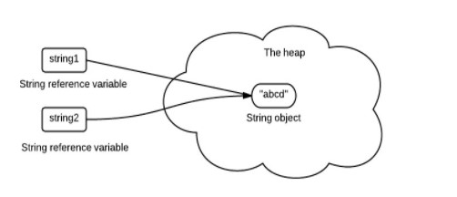

# Java基础

## 面向对象

三大特性

- 封装
- 继承
- 多态

## 知识点

### 基本数据类型

- boolean/1
- byte/8
- char/16
- short/16
- int/32
- float/32
- long/64
- double/64

8基本类型都有对应的包装类型，对应的包装类型除char(Character)外都是首字母大写，基本类型与其对应的包装类型之间的赋值使用自动装箱与拆箱完成。

```java
Integer x = 3; //装箱
int y = x; //拆箱
```

**缓存池**

new Integer(123) 与 Integer.valueOf(123) 的区别在于:

- new Integer(123) 每次都会新建一个对象
- Integer.valueOf(123) 会使用缓存池中的对象，多次调用会取得同一个对象的引用。

```java
Integer x = new Integer(123);
Integer y = new Integer(123);
System.out.println(x == y);    // false
Integer z = Integer.valueOf(123);
Integer k = Integer.valueOf(123);
System.out.println(z == k);   // true
```

valueOf() 方法的实现比较简单，就是先判断值是否在缓存池中，如果在的话就直接返回缓存池的内容。

```java
public static Integer valueOf(int i) {
        if (i >= IntegerCache.low && i <= IntegerCache.high)
            return IntegerCache.cache[i + (-IntegerCache.low)];
        return new Integer(i);
    }
```

在 Java 8 中，Integer 缓存池的大小默认为 -128~127。

```java
private static class IntegerCache {
        static final int low = -128;
        static final int high;
        static final Integer cache[];

        static {
            // high value may be configured by property
            int h = 127;
            String integerCacheHighPropValue =
                sun.misc.VM.getSavedProperty("java.lang.Integer.IntegerCache.high");
            if (integerCacheHighPropValue != null) {
                try {
                    int i = parseInt(integerCacheHighPropValue);
                    i = Math.max(i, 127);
                    // Maximum array size is Integer.MAX_VALUE
                    h = Math.min(i, Integer.MAX_VALUE - (-low) -1);
                } catch( NumberFormatException nfe) {
                    // If the property cannot be parsed into an int, ignore it.
                }
            }
            high = h;

            cache = new Integer[(high - low) + 1];
            int j = low;
            for(int k = 0; k < cache.length; k++)
                cache[k] = new Integer(j++);

            // range [-128, 127] must be interned (JLS7 5.1.7)
            assert IntegerCache.high >= 127;
        }
```

编译器会在自动装箱过程调用 valueOf() 方法，因此多个 Integer 实例使用自动装箱来创建并且值相同，那么就会引用相同的对象。

```java
Integer m = 123;
Integer n = 123;
System.out.println(m == n); // true
  
```

- boolean values true and false
- all byte values
- short values between -128 and 127
- int values between -128 and 127
- char in the range \u0000 to \u007F

在使用这些基本类型对应的包装类型时，就可以直接使用缓冲池中的对象。

### String

#### 概览

String 被声明为 final，因此它不可被继承。

内部使用 char 数组存储数据，该数组被声明为 final，这意味着 value 数组初始化之后就不能再引用其它数组。并且 String 内部没有改变 value 数组的方法，因此可以保证 String 不可变。

```java
public final class String
    implements java.io.Serializable, Comparable<String>, CharSequence {
    /** The value is used for character storage. */
    private final char value[];
```

#### 不可变的好处

**1. 可以缓存 hash 值**

因为 String 的 hash 值经常被使用，例如 String 用做 HashMap 的 key。不可变的特性可以使得 hash 值也不可变，因此只需要进行一次计算。

**2. String Pool 的需要**

如果一个 String 对象已经被创建过了，那么就会从 String Pool 中取得引用。只有 String 是不可变的，才可能使用 String Pool。



**3. 安全性**

String 经常作为参数，String 不可变性可以保证参数不可变。例如在作为网络连接参数的情况下如果 String 是可变的，那么在网络连接过程中，String 被改变，改变 String 对象的那一方以为现在连接的是其它主机，而实际情况却不一定是。

**4. 线程安全**

String 不可变性天生具备线程安全，可以在多个线程中安全地使用。

#### String, StringBuffer and StringBuilder

**1. 可变性**

- String 不可变
- StringBuffer 和 StringBuilder 可变

**2. 线程安全**

- String 不可变，因此是线程安全的
- StringBuilder 不是线程安全的
- StringBuffer 是线程安全的，内部使用 synchronized 进行同步

#### String.intern()

使用 String.intern() 可以保证相同内容的字符串变量引用同一的内存对象。

下面示例中，s1 和 s2 采用 new String() 的方式新建了两个不同对象，而 s3 是通过 s1.intern() 方法取得一个对象引用。intern() 首先把 s1 引用的对象放到 String Pool(字符串常量池)中，然后返回这个对象引用。因此 s3 和 s1 引用的是同一个字符串常量池的对象。

```java
String s1 = new String("aaa");
String s2 = new String("aaa");
System.out.println(s1 == s2); //false
String s3 = s1.intern();
System.out.println(s1.intern() == s3); //true
```

如果是采用 "bbb" 这种使用双引号的形式创建字符串实例，会自动地将新建的对象放入 String Pool 中。

```java
String s4 = "bbb";
String s5 = "bbb";
System.out.println(s4 == s5); //true
```

在 Java 7 之前，字符串常量池被放在运行时常量池中，它属于永久代。而在 Java 7，字符串常量池被移到 Native Method 中。这是因为永久代的空间有限，在大量使用字符串的场景下会导致 OutOfMemoryError 错误。

### 运算

### 继承

#### 访问权限

#### 抽象类与接口

#### super

#### 重写与重载

### object通用方法

#### 概览

#### equals()

#### hashCode()

#### toString()

#### clone()

### 关键字

#### final

#### static

### 反射

### 异常

### 泛型

## 注解机制详解

注解是JDK1.5版本开始引入的一个特性，用于对代码进行说明，可以对包、类、接口、字段、方法参数、局部变量等进行注解。它主要的作用有以下四方面：

- 生成文档，通过代码里标识的元数据生成javadoc文档。
- 编译检查，通过代码里标识的元数据让编译器在编译期间进行检查验证。
- 编译时动态处理，编译时通过代码里标识的元数据动态处理，例如动态生成代码。
- 运行时动态处理，运行时通过代码里标识的元数据动态处理，例如使用反射注入实例。

这么来说是比较抽象的，我们具体看下注解的常见分类：

- **Java自带的标准注解**，包括`@Override`、`@Deprecated`和`@SuppressWarnings`，分别用于标明重写某个方法、标明某个类或方法过时、标明要忽略的警告，用这些注解标明后编译器就会进行检查。
- **元注解**，元注解是用于定义注解的注解，包括`@Retention`、`@Target`、`@Inherited`、`@Documented`，`@Retention`用于标明注解被保留的阶段，`@Target`用于标明注解使用的范围，`@Inherited`用于标明注解可继承，`@Documented`用于标明是否生成javadoc文档。
- **自定义注解**，可以根据自己的需求定义注解，并可用元注解对自定义注解进行注解。

接下来我们通过这个分类角度来理解注解。

#### 内置注解

我们从最为常见的Java内置的注解开始说起，先看下下面的代码：

```java
public class A {
    public void test() {}
}

class B extends A {
    /**
     * 表示父类被重写的方法
     */
    @Override
    public void test() {}

    /**
     * 被弃用的方法
     */
    @Deprecated
    public void oldMethod() {}

    /**
     * 忽略告警
     * @return
     */
    @SuppressWarnings("rawtypes")
    public List processList() {
        List list = new ArrayList();
        return list;
    }
}
```

Java 1.5开始自带的标准注解，包括`@Override`、`@Deprecated`和`@SuppressWarnings`：

- `@Override`：表示当前的方法定义将覆盖父类中的方法
- `@Deprecated`：表示代码被弃用，如果使用了被@Deprecated注解的代码则编译器将发出警告
- `@SuppressWarnings`：表示关闭编译器警告信息

我们再具体看下这几个内置注解，同时通过这几个内置注解中的元注解的定义来引出元注解。

##### @Override

我们先来看一下这个注解类型的定义：

```java
@Target(ElementType.METHOD)
@Retention(RetentionPolicy.SOURCE)
public @interface Override {
} 
```

从它的定义我们可以看到，这个注解可以被用来修饰方法，并且它只在编译时有效，在编译后的class文件中便不再存在。这个注解的作用我们大家都不陌生，那就是告诉编译器被修饰的方法是重写的父类的中的相同签名的方法，编译器会对此做出检查，若发现父类中不存在这个方法或是存在的方法签名不同，则会报错。

##### @Deprecated

这个注解的定义如下：

```java
@Documented
@Retention(RetentionPolicy.RUNTIME)
@Target(value={CONSTRUCTOR, FIELD, LOCAL_VARIABLE, METHOD, PACKAGE, PARAMETER, TYPE})
public @interface Deprecated {
}
```

从它的定义我们可以知道，它会被文档化，能够保留到运行时，能够修饰构造方法、属性、局部变量、方法、包、参数、类型。这个注解的作用是告诉编译器被修饰的程序元素已被“废弃”，不再建议用户使用。

##### @SuppressWarnings

这个注解我们也比较常用到，先来看下它的定义：

```java
@Target({TYPE, FIELD, METHOD, PARAMETER, CONSTRUCTOR, LOCAL_VARIABLE})
@Retention(RetentionPolicy.SOURCE)
public @interface SuppressWarnings {
    String[] value();
}
```

它能够修饰的程序元素包括类型、属性、方法、参数、构造器、局部变量，只能存活在源码时，取值为String[]。它的作用是告诉编译器忽略指定的警告信息，它可以取的值如下所示：

| 参数                     | 作用                                               | 原描述                                                       |
| ------------------------ | -------------------------------------------------- | ------------------------------------------------------------ |
| all                      | 抑制所有警告                                       | to suppress all warnings                                     |
| boxing                   | 抑制装箱、拆箱操作时候的警告                       | to suppress warnings relative to boxing/unboxing operations  |
| cast                     | 抑制映射相关的警告                                 | to suppress warnings relative to cast operations             |
| dep-ann                  | 抑制启用注释的警告                                 | to suppress warnings relative to deprecated annotation       |
| deprecation              | 抑制过期方法警告                                   | to suppress warnings relative to deprecation                 |
| fallthrough              | 抑制确在switch中缺失breaks的警告                   | to suppress warnings relative to missing breaks in switch statements |
| finally                  | 抑制finally模块没有返回的警告                      | to suppress warnings relative to finally block that don’t return |
| hiding                   | 抑制与隐藏变数的区域变数相关的警告                 | to suppress warnings relative to locals that hide variable（） |
| incomplete-switch        | 忽略没有完整的switch语句                           | to suppress warnings relative to missing entries in a switch statement (enum case) |
| nls                      | 忽略非nls格式的字符                                | to suppress warnings relative to non-nls string literals     |
| null                     | 忽略对null的操作                                   | to suppress warnings relative to null analysis               |
| rawtype                  | 使用generics时忽略没有指定相应的类型               | to suppress warnings relative to un-specific types when using |
| restriction              | 抑制与使用不建议或禁止参照相关的警告               | to suppress warnings relative to usage of discouraged or     |
| serial                   | 忽略在serializable类中没有声明serialVersionUID变量 | to suppress warnings relative to missing serialVersionUID field for a serializable class |
| static-access            | 抑制不正确的静态访问方式警告                       | to suppress warnings relative to incorrect static access     |
| synthetic-access         | 抑制子类没有按最优方法访问内部类的警告             | to suppress warnings relative to unoptimized access from inner classes |
| unchecked                | 抑制没有进行类型检查操作的警告                     | to suppress warnings relative to unchecked operations        |
| unqualified-field-access | 抑制没有权限访问的域的警告                         | to suppress warnings relative to field access unqualified    |
| unused                   | 抑制没被使用过的代码的警告                         | to suppress warnings relative to unused code                 |

#### 元注解

上述内置注解的定义中使用了一些元注解（注解类型进行注解的注解类），在JDK 1.5中提供了4个标准的元注解：`@Target`，`@Retention`，`@Documented`，`@Inherited`, 在JDK 1.8中提供了两个元注解 `@Repeatable`和`@Native`。

##### @Target

> Target注解的作用是：描述注解的使用范围（即：被修饰的注解可以用在什么地方） 。

Target注解用来说明那些被它所注解的注解类可修饰的对象范围：注解可以用于修饰 packages、types（类、接口、枚举、注解类）、类成员（方法、构造方法、成员变量、枚举值）、方法参数和本地变量（如循环变量、catch参数），在定义注解类时使用了@Target 能够更加清晰的知道它能够被用来修饰哪些对象，它的取值范围定义在ElementType 枚举中。

```java
public enum ElementType {
 
    TYPE, // 类、接口、枚举类
 
    FIELD, // 成员变量（包括：枚举常量）
 
    METHOD, // 成员方法
 
    PARAMETER, // 方法参数
 
    CONSTRUCTOR, // 构造方法
 
    LOCAL_VARIABLE, // 局部变量
 
    ANNOTATION_TYPE, // 注解类
 
    PACKAGE, // 可用于修饰：包
 
    TYPE_PARAMETER, // 类型参数，JDK 1.8 新增
 
    TYPE_USE // 使用类型的任何地方，JDK 1.8 新增
 
}
```

##### @Retention & @RetentionTarget

> Reteniton注解的作用是：描述注解保留的时间范围（即：被描述的注解在它所修饰的类中可以被保留到何时） 。

Reteniton注解用来限定那些被它所注解的注解类在注解到其他类上以后，可被保留到何时，一共有三种策略，定义在RetentionPolicy枚举中。

```java
public enum RetentionPolicy {
 
    SOURCE,    // 源文件保留
    CLASS,       // 编译期保留，默认值
    RUNTIME   // 运行期保留，可通过反射去获取注解信息
}
```

为了验证应用了这三种策略的注解类有何区别，分别使用三种策略各定义一个注解类做测试。

```java
@Retention(RetentionPolicy.SOURCE)
public @interface SourcePolicy {
 
}
@Retention(RetentionPolicy.CLASS)
public @interface ClassPolicy {
 
}
@Retention(RetentionPolicy.RUNTIME)
public @interface RuntimePolicy {
 
}
```

用定义好的三个注解类分别去注解一个方法。

```java
public class RetentionTest {
 
	@SourcePolicy
	public void sourcePolicy() {
	}
 
	@ClassPolicy
	public void classPolicy() {
	}
 
	@RuntimePolicy
	public void runtimePolicy() {
	}
}
```

通过执行 `javap -verbose RetentionTest`命令获取到的RetentionTest 的 class 字节码内容如下。

```java
{
  public retention.RetentionTest();
    flags: ACC_PUBLIC
    Code:
      stack=1, locals=1, args_size=1
         0: aload_0
         1: invokespecial #1                  // Method java/lang/Object."<init>":()V
         4: return
      LineNumberTable:
        line 3: 0

  public void sourcePolicy();
    flags: ACC_PUBLIC
    Code:
      stack=0, locals=1, args_size=1
         0: return
      LineNumberTable:
        line 7: 0

  public void classPolicy();
    flags: ACC_PUBLIC
    Code:
      stack=0, locals=1, args_size=1
         0: return
      LineNumberTable:
        line 11: 0
    RuntimeInvisibleAnnotations:
      0: #11()

  public void runtimePolicy();
    flags: ACC_PUBLIC
    Code:
      stack=0, locals=1, args_size=1
         0: return
      LineNumberTable:
        line 15: 0
    RuntimeVisibleAnnotations:
      0: #14()
}
```

从 RetentionTest 的字节码内容我们可以得出以下两点结论：

- 编译器并没有记录下 sourcePolicy() 方法的注解信息；
- 编译器分别使用了 `RuntimeInvisibleAnnotations` 和 `RuntimeVisibleAnnotations` 属性去记录了`classPolicy()`方法 和 `runtimePolicy()`方法 的注解信息；

##### @Documented

> Documented注解的作用是：描述在使用 javadoc 工具为类生成帮助文档时是否要保留其注解信息。

以下代码在使用Javadoc工具可以生成`@TestDocAnnotation`注解信息。

```java
import java.lang.annotation.Documented;
import java.lang.annotation.ElementType;
import java.lang.annotation.Target;
 
@Documented
@Target({ElementType.TYPE,ElementType.METHOD})
public @interface TestDocAnnotation {
 
	public String value() default "default";
}
```

```java
@TestDocAnnotation("myMethodDoc")
public void testDoc() {

}
```

##### @Inherited

> Inherited注解的作用：被它修饰的Annotation将具有继承性。如果某个类使用了被@Inherited修饰的Annotation，则其子类将自动具有该注解。

我们来测试下这个注解：

- 定义`@Inherited`注解：

  ```java
  @Inherited
  @Retention(RetentionPolicy.RUNTIME)
  @Target({ElementType.TYPE,ElementType.METHOD})
  public @interface TestInheritedAnnotation {
      String [] values();
      int number();
  }
  ```

- 使用这个注解

```java
@TestInheritedAnnotation(values = {"value"}, number = 10)
public class Person {
}

class Student extends Person{
	@Test
    public void test(){
        Class clazz = Student.class;
        Annotation[] annotations = clazz.getAnnotations();
        for (Annotation annotation : annotations) {
            System.out.println(annotation.toString());
        }
    }
}
```

- 输出

  ```java
  xxxxxxx.TestInheritedAnnotation(values=[value], number=10)
  ```

即使Student类没有显示地被注解`@TestInheritedAnnotation`，但是它的父类Person被注解，而且`@TestInheritedAnnotation`被`@Inherited`注解，因此Student类自动有了该注解。

##### @Repeatable (Java8)

**什么是重复注解**

允许在同一申明类型(类，属性，或方法)的多次使用同一个注解

**JDK8之前**

java 8之前也有重复使用注解的解决方案，但可读性不是很好，比如下面的代码:

```java
public @interface Authority {
     String role();
}

public @interface Authorities {
    Authority[] value();
}

public class RepeatAnnotationUseOldVersion {

    @Authorities({@Authority(role="Admin"),@Authority(role="Manager")})
    public void doSomeThing(){
    }
}
```

由另一个注解来存储重复注解，在使用时候，用存储注解Authorities来扩展重复注解。

**JDK8重复注解**

我们再来看看java 8里面的做法:

```java
@Repeatable(Authorities.class)
public @interface Authority {
     String role();
}

public @interface Authorities {
    Authority[] value();
}

public class RepeatAnnotationUseNewVersion {
    @Authority(role="Admin")
    @Authority(role="Manager")
    public void doSomeThing(){ }
}
```

不同的地方是，创建重复注解Authority时，加上@Repeatable,指向存储注解Authorities，在使用时候，直接可以重复使用Authority注解。从上面例子看出，java 8里面做法更适合常规的思维，可读性强一点

##### @Native (Java8)

使用 @Native 注解修饰成员变量，则表示这个变量可以被本地代码引用，常常被代码生成工具使用。对于 @Native 注解不常使用，了解即可

#### 注解与反射接口

> 定义注解后，如何获取注解中的内容呢？反射包java.lang.reflect下的AnnotatedElement接口提供这些方法。这里注意：只有注解被定义为RUNTIME后，该注解才能是运行时可见，当class文件被装载时被保存在class文件中的Annotation才会被虚拟机读取。

AnnotatedElement 接口是所有程序元素（Class、Method和Constructor）的父接口，所以程序通过反射获取了某个类的AnnotatedElement对象之后，程序就可以调用该对象的方法来访问Annotation信息。我们看下具体的先关接口

- `boolean isAnnotationPresent(Class<?extends Annotation> annotationClass)`

判断该程序元素上是否包含指定类型的注解，存在则返回true，否则返回false。注意：此方法会忽略注解对应的注解容器。

- `<T extends Annotation> T getAnnotation(Class<T> annotationClass)`

返回该程序元素上存在的、指定类型的注解，如果该类型注解不存在，则返回null。

- `Annotation[] getAnnotations()`

返回该程序元素上存在的所有注解，若没有注解，返回长度为0的数组。

- `<T extends Annotation> T[] getAnnotationsByType(Class<T> annotationClass)`

返回该程序元素上存在的、指定类型的注解数组。没有注解对应类型的注解时，返回长度为0的数组。该方法的调用者可以随意修改返回的数组，而不会对其他调用者返回的数组产生任何影响。`getAnnotationsByType`方法与 `getAnnotation`的区别在于，`getAnnotationsByType`会检测注解对应的重复注解容器。若程序元素为类，当前类上找不到注解，且该注解为可继承的，则会去父类上检测对应的注解。

- `<T extends Annotation> T getDeclaredAnnotation(Class<T> annotationClass)`

返回直接存在于此元素上的所有注解。与此接口中的其他方法不同，该方法将忽略继承的注释。如果没有注释直接存在于此元素上，则返回null

- `<T extends Annotation> T[] getDeclaredAnnotationsByType(Class<T> annotationClass)`

返回直接存在于此元素上的所有注解。与此接口中的其他方法不同，该方法将忽略继承的注释

- `Annotation[] getDeclaredAnnotations()`

返回直接存在于此元素上的所有注解及注解对应的重复注解容器。与此接口中的其他方法不同，该方法将忽略继承的注解。如果没有注释直接存在于此元素上，则返回长度为零的一个数组。该方法的调用者可以随意修改返回的数组，而不会对其他调用者返回的数组产生任何影响。

#### 自定义注解

> 当我们理解了内置注解, 元注解和获取注解的反射接口后，我们便可以开始自定义注解了。这个例子我把上述的知识点全部融入进来, 代码很简单：

定义自己的注解：

```java
package com.pdai.java.annotation;

import java.lang.annotation.ElementType;
import java.lang.annotation.Retention;
import java.lang.annotation.RetentionPolicy;
import java.lang.annotation.Target;

@Target(ElementType.METHOD)
@Retention(RetentionPolicy.RUNTIME)
public @interface MyMethodAnnotation {

    public String title() default "";

    public String description() default "";

}
```

使用注解：

```java
package com.pdai.java.annotation;

import java.io.FileNotFoundException;
import java.lang.annotation.Annotation;
import java.lang.reflect.Method;
import java.util.ArrayList;
import java.util.List;

public class TestMethodAnnotation {

    @Override
    @MyMethodAnnotation(title = "toStringMethod", description = "override toString method")
    public String toString() {
        return "Override toString method";
    }

    @Deprecated
    @MyMethodAnnotation(title = "old static method", description = "deprecated old static method")
    public static void oldMethod() {
        System.out.println("old method, don't use it.");
    }

    @SuppressWarnings({"unchecked", "deprecation"})
    @MyMethodAnnotation(title = "test method", description = "suppress warning static method")
    public static void genericsTest() throws FileNotFoundException {
        List l = new ArrayList();
        l.add("abc");
        oldMethod();
    }
}
```

用反射接口获取注解信息

在TestMethodAnnotation中添加Main方法进行测试：

```java
public static void main(String[] args) {
    try {
        // 获取所有methods
        Method[] methods = TestMethodAnnotation.class.getClassLoader()
                .loadClass(("com.pdai.java.annotation.TestMethodAnnotation"))
                .getMethods();

        // 遍历
        for (Method method : methods) {
            // 方法上是否有MyMethodAnnotation注解
            if (method.isAnnotationPresent(MyMethodAnnotation.class)) {
                try {
                    // 获取并遍历方法上的所有注解
                    for (Annotation anno : method.getDeclaredAnnotations()) {
                        System.out.println("Annotation in Method '"
                                + method + "' : " + anno);
                    }

                    // 获取MyMethodAnnotation对象信息
                    MyMethodAnnotation methodAnno = method
                            .getAnnotation(MyMethodAnnotation.class);

                    System.out.println(methodAnno.title());

                } catch (Throwable ex) {
                    ex.printStackTrace();
                }
            }
        }
    } catch (SecurityException | ClassNotFoundException e) {
        e.printStackTrace();
    }
}
```

测试的输出：

```java
Annotation in Method 'public static void com.pdai.java.annotation.TestMethodAnnotation.oldMethod()' : @java.lang.Deprecated()
Annotation in Method 'public static void com.pdai.java.annotation.TestMethodAnnotation.oldMethod()' : @com.pdai.java.annotation.MyMethodAnnotation(title=old static method, description=deprecated old static method)
old static method
Annotation in Method 'public static void com.pdai.java.annotation.TestMethodAnnotation.genericsTest() throws java.io.FileNotFoundException' : @com.pdai.java.annotation.MyMethodAnnotation(title=test method, description=suppress warning static method)
test method
Annotation in Method 'public java.lang.String com.pdai.java.annotation.TestMethodAnnotation.toString()' : @com.pdai.java.annotation.MyMethodAnnotation(title=toStringMethod, description=override toString method)
toStringMethod
```


#### 深入理解注解

##### 重复注解

**什么是重复注解**

允许在同一申明类型(类，属性，或方法)的多次使用同一个注解

**JDK8之前**

java 8之前也有重复使用注解的解决方案，但可读性不是很好，比如下面的代码:

```java
public @interface Authority {
     String role();
}

public @interface Authorities {
    Authority[] value();
}

public class RepeatAnnotationUseOldVersion {

    @Authorities({@Authority(role="Admin"),@Authority(role="Manager")})
    public void doSomeThing(){
    }
}
```

由另一个注解来存储重复注解，在使用时候，用存储注解Authorities来扩展重复注解。

**Jdk8重复注解**

我们再来看看java 8里面的做法:

```java
@Repeatable(Authorities.class)
public @interface Authority {
     String role();
}

public @interface Authorities {
    Authority[] value();
}

public class RepeatAnnotationUseNewVersion {
    @Authority(role="Admin")
    @Authority(role="Manager")
    public void doSomeThing(){ }
}
```

不同的地方是，创建重复注解Authority时，加上@Repeatable,指向存储注解Authorities，在使用时候，直接可以重复使用Authority注解。从上面例子看出，java 8里面做法更适合常规的思维，可读性强一点

##### 类型注解

###### 什么是类型注解

> 注解大家都知道，从java5开始加入这一特性，发展到现在已然是遍地开花，在很多框架中得到了广泛的使用，用来简化程序中的配置。那充满争议的类型注解究竟是什么? 复杂还是便捷?

1. 在java 8之前，注解只能是在声明的地方所使用，比如类，方法，属性；
2. java 8里面，注解可以应用在任何地方，比如:

创建类实例

```java
new @Interned MyObject();
```

类型映射

```java
myString = (@NonNull String) str;
```

implements 语句中

```java
void monitorTemperature() throws @Critical TemperatureException { … }
```

###### 类型注解的作用

先看看下面代码

```java
Collections.emptyList().add("One");
int i=Integer.parseInt("hello");
System.console().readLine();
```

上面的代码编译是通过的，但运行是会分别报UnsupportedOperationException； NumberFormatException；NullPointerException异常，这些都是runtime error；

类型注解被用来支持在Java的程序中做强类型检查。配合插件式的check framework，可以在编译的时候检测出runtime error，以提高代码质量。这就是类型注解的作用了。

check framework是第三方工具，配合Java的类型注解效果就是1+1>2。它可以嵌入到javac编译器里面，可以配合ant和maven使用, 地址是http://types.cs.washington.edu/checker-framework/。 check framework可以找到类型注解出现的地方并检查，举个简单的例子:

```java
import checkers.nullness.quals.*;
public class GetStarted {
    void sample() {
        @NonNull Object ref = new Object();
    }
}
```

使用javac编译上面的类

```java
javac -processor checkers.nullness.NullnessChecker GetStarted.java
```

编译是通过，但如果修改成

```java
@NonNull Object ref = null;
```

再次编译，则出现

```java
GetStarted.java:5: incompatible types.
found   : @Nullable <nulltype>
required: @NonNull Object
        @NonNull Object ref = null;
                              ^
1 error
```

###### 类型注解向下兼容的解决方案

###### 关于JSR 308

###### 总结

#### 注解的应用场景

## 反射机制详解

### 反射基础

RRIT（Run-Time Type Identification）运行时类型识别。在《Thinking in Java》一书第十四章中有提到，其作用是在运行时识别一个对象的类型和类的信息。主要有两种方式：一种是“传统的”RTTI，它假定我们在编译时已经知道了所有的类型；另一种是“反射”机制，它允许我们在运行时发现和使用类的信息。

反射就是把java类中的各种成分映射成一个个的Java对象

例如：一个类有：成员变量、方法、构造方法、包等等信息，利用反射技术可以对一个类进行解剖，把个个组成部分映射成一个个对象。

> 这里我们首先需要理解 Class类，以及类的加载机制； 然后基于此我们如何通过反射获取Class类以及类中的成员变量、方法、构造方法等。

#### Class类

Class类，Class类也是一个实实在在的类，存在于JDK的java.lang包中。Class类的实例表示java应用运行时的类(class ans enum)或接口(interface and annotation)（每个java类运行时都在JVM里表现为一个class对象，可通过类名.class、类型.getClass()、Class.forName("类名")等方法获取class对象）。数组同样也被映射为为class 对象的一个类，所有具有相同元素类型和维数的数组都共享该 Class 对象。基本类型boolean，byte，char，short，int，long，float，double和关键字void同样表现为 class  对象。

```java
public final class Class<T> implements java.io.Serializable,
                              GenericDeclaration,
                              Type,
                              AnnotatedElement {
    private static final int ANNOTATION= 0x00002000;
    private static final int ENUM      = 0x00004000;
    private static final int SYNTHETIC = 0x00001000;

    private static native void registerNatives();
    static {
        registerNatives();
    }

    /*
     * Private constructor. Only the Java Virtual Machine creates Class objects.   //私有构造器，只有JVM才能调用创建Class对象
     * This constructor is not used and prevents the default constructor being
     * generated.
     */
    private Class(ClassLoader loader) {
        // Initialize final field for classLoader.  The initialization value of non-null
        // prevents future JIT optimizations from assuming this final field is null.
        classLoader = loader;
    }
```

到这我们也就可以得出以下几点信息：

- Class类也是类的一种，与class关键字是不一样的。
- 手动编写的类被编译后会产生一个Class对象，其表示的是创建的类的类型信息，而且这个Class对象保存在同名.class的文件中(字节码文件)
- 每个通过关键字class标识的类，在内存中有且只有一个与之对应的Class对象来描述其类型信息，无论创建多少个实例对象，其依据的都是用一个Class对象。
- Class类只存私有构造函数，因此对应Class对象只能有JVM创建和加载
- Class类的对象作用是运行时提供或获得某个对象的类型信息，这点对于反射技术很重要(关于反射稍后分析)。

#### 类加载

### 反射的使用

#### Class类对象的获取

在类加载的时候，jvm会创建一个class对象

class对象是可以说是反射中最常用的，获取class对象的方式的主要有三种

- 根据类名：类名.class
- 根据对象：对象.getClass()
- 根据全限定类名：Class.forName(全限定类名)

```java
    @Test
    public void classTest() throws Exception {
        // 获取Class对象的三种方式
        logger.info("根据类名:  \t" + User.class);
        logger.info("根据对象:  \t" + new User().getClass());
        logger.info("根据全限定类名:\t" + Class.forName("com.test.User"));
        // 常用的方法
        logger.info("获取全限定类名:\t" + userClass.getName());
        logger.info("获取类名:\t" + userClass.getSimpleName());
        logger.info("实例化:\t" + userClass.newInstance());
    }

    // ...
    package com.test;

    public class User {
        private String name = "init";
        private int age;
        public User() {}
        public User(String name, int age) {
            super();
            this.name = name;
            this.age = age;
        }
        private String getName() {
            return name;
        }
        private void setName(String name) {
            this.name = name;
        }
        public int getAge() {
            return age;
        }
        public void setAge(int age) {
            this.age = age;
        }
        @Override
        public String toString() {
            return "User [name=" + name + ", age=" + age + "]";
        }
    }
```

- 再来看看 **Class类的方法**

| 方法名                                              | 说明                                                         |
| --------------------------------------------------- | ------------------------------------------------------------ |
| forName()                                           | (1)获取Class对象的一个引用，但引用的类还没有加载(该类的第一个对象没有生成)就加载了这个类。 |
| (2)为了产生Class引用，forName()立即就进行了初始化。 |                                                              |
| Object-getClass()                                   | 获取Class对象的一个引用，返回表示该对象的实际类型的Class引用。 |
| getName()                                           | 取全限定的类名(包括包名)，即类的完整名字。                   |
| getSimpleName()                                     | 获取类名(不包括包名)                                         |
| getCanonicalName()                                  | 获取全限定的类名(包括包名)                                   |
| isInterface()                                       | 判断Class对象是否是表示一个接口                              |
| getInterfaces()                                     | 返回Class对象数组，表示Class对象所引用的类所实现的所有接口。 |
| getSupercalss()                                     | 返回Class对象，表示Class对象所引用的类所继承的直接基类。应用该方法可在运行时发现一个对象完整的继承结构。 |
| newInstance()                                       | 返回一个Oject对象，是实现“虚拟构造器”的一种途径。使用该方法创建的类，必须带有无参的构造器。 |
| getFields()                                         | 获得某个类的所有的公共（public）的字段，包括继承自父类的所有公共字段。 类似的还有getMethods和getConstructors。 |
| getDeclaredFields                                   | 获得某个类的自己声明的字段，即包括public、private和proteced，默认但是不包括父类声明的任何字段。类似的还有getDeclaredMethods和getDeclaredConstructors。 |

简单测试下

```java
package net.coderstudy.demo;

import java.lang.reflect.Field;

interface I1 {}
interface I2 {}
class Cell {
    public int mCellPublic;
}
class Animal extends  Cell {
    private int mAnimalPrivate;
    protected int mAnimalProtected;
    int mAnimalDefault;
    private static int sAnimalPrivate;
    protected static int sAnimalProtected;
    static int sAnimalDefault;
    public static int sAnimalPublic;
}
class Dog extends Animal implements I1, I2 {
    private int mDogPrivate;
    public int mDogPublic;
    protected int mDogProtected;
    int mDogDefault;
    private static int sDogPrivate;
    protected static int sDogProtected;
    static int sDogDefault;
    public static int sDogPublic;
}
public class ClassTest {
    public static void main(String[] args) throws IllegalAccessException, InstantiationException {
        Class<Dog> dog = Dog.class;
        //类名打印
        System.out.println(dog.getName()); //net.coderstudy.demo.Dog
        System.out.println(dog.getSimpleName()); //Dog
        System.out.println(dog.getCanonicalName()); //net.coderstudy.demo.Dog
        //接口
        System.out.println(dog.isInterface()); //false
        for (Class<?> iI : dog.getInterfaces()) {
            System.out.println(iI);
        }
        /*interface net.coderstudy.demo.I1
        interface net.coderstudy.demo.I2*/
        //父类
        System.out.println(dog.getSuperclass()); //class net.coderstudy.demo.Animal
        //创建对象
        Dog d = dog.newInstance();
        //字段
        for (Field field : dog.getFields()) {
            System.out.println(field.getName());
        }
        /*mDogPublic
        sDogPublic
        sAnimalPublic
        mCellPublic //父类的父类的公共字段也打印出来了
        */
        System.out.println("-------------");
        for (Field field : dog.getDeclaredFields()) {
            System.out.println(field.getName());
        }
        /*只有自己类声明的字段
        mDogPrivate
        mDogPublic
        mDogProtected
        mDogDefault
        sDogPrivate
        sDogProtected
        sDogDefault
        sDogPublic*/

    }
}
```

**getName、getCanonicalName与getSimpleName的区别**：

- getSimpleName：只获取类名
- getName：类的全限定名，jvm中Class的表示，可以用于动态加载Class对象，例如Class.forName。
- getCanonicalName：返回更容易理解的表示，主要用于输出（toString）或log打印，大多数情况下和getName一样，但是在内部类、数组等类型的表示形式就不同了。

```java
package net.coderstudy.demo;

public class NameTest {
    private class inner {}
    public static void main(String[] args) throws ClassNotFoundException {
        //普通类
        System.out.println(NameTest.class.getName()); //net.coderstudy.demo.NameTest
        System.out.println(NameTest.class.getSimpleName()); //NameTest
        System.out.println(NameTest.class.getCanonicalName()); //net.coderstudy.demo.NameTest
        //内部类
        System.out.println(inner.class.getName()); //net.coderstudy.demo.NameTest$inner
        System.out.println(inner.class.getSimpleName()); //inner
        System.out.println(inner.class.getCanonicalName()); //net.coderstudy.demo.NameTest.inner
        //数组
        System.out.println(args.getClass().getName()); //[Ljava.lang.String;
        System.out.println(args.getClass().getSimpleName()); //String[]
        System.out.println(args.getClass().getCanonicalName()); //java.lang.String[]
        //我们不能用getCanonicalName去加载类对象，必须用getName
        //Class.forName(inner.class.getCanonicalName()); //报错
        Class.forName(inner.class.getName());
    }
}
```

#### Constructor类及其用法

> Constructor类存在于反射包(java.lang.reflect)中，反映的是Class 对象所表示的类的构造方法。

著作权归https://www.pdai.tech所有。 链接：https://www.pdai.tech/md/java/basic/java-basic-x-reflection.html

获取Constructor对象是通过Class类中的方法获取的，Class类与Constructor相关的主要方法如下：

| 方法返回值       | 方法名称                                           | 方法说明                                                  |
| ---------------- | -------------------------------------------------- | --------------------------------------------------------- |
| static Class<?>  | forName(String className)                          | 返回与带有给定字符串名的类或接口相关联的 Class 对象。     |
| Constructor      | getConstructor(Class<?>... parameterTypes)         | 返回指定参数类型、具有public访问权限的构造函数对象        |
| Constructor<?>[] | getConstructors()                                  | 返回所有具有public访问权限的构造函数的Constructor对象数组 |
| Constructor      | getDeclaredConstructor(Class<?>... parameterTypes) | 返回指定参数类型、所有声明的（包括private）构造函数对象   |
| Constructor<?>[] | getDeclaredConstructor()                           | 返回所有声明的（包括private）构造函数对象                 |
| T                | newInstance()                                      | 调用无参构造器创建此 Class 对象所表示的类的一个新实例。   |

下面看一个简单例子来了解Constructor对象的使用：

```java
package net.coderstudy.demo;

import java.lang.reflect.Constructor;
import java.lang.reflect.InvocationTargetException;

public class ConstructionTest {
    public static void main(String[] args) throws ClassNotFoundException, IllegalAccessException, InstantiationException, NoSuchMethodException, InvocationTargetException {
        Class<?> clazz = null;
        clazz = Class.forName("net.coderstudy.demo.User");

        //第一种方法，实例化默认构造方法，User必须无参构造函数,否则将抛异常
        User user = (User) clazz.newInstance();
        user.setAge(20);
        user.setName("Jack");
        System.out.println("user:" + user);
        System.out.println("-----------------------------");

        //获取带String参数的public构造函数
        Constructor cs1 = clazz.getConstructor(String.class);
        User user1 = (User) cs1.newInstance("honey");
        user1.setAge(22);
        System.out.println("suer1:" + user1);
        System.out.println("-----------------------------");

        //取得指定带int和String参数构造函数,该方法是私有构造private
        Constructor cs2 = clazz.getDeclaredConstructor(int.class, String.class);
        //由于是private必须设置可访问
        cs2.setAccessible(true);
        User user2 = (User) cs2.newInstance(23, "zhangsan");
        System.out.println("user2:" + user2);
        System.out.println("-----------------------------");

        //获取所有构造包含private
        Constructor<?> cons[] = clazz.getDeclaredConstructors();
        // 查看每个构造方法需要的参数
        for (int i = 0; i < cons.length; i++) {
            //获取构造函数参数类型
            Class<?> clazzs[] = cons[i].getParameterTypes();
            System.out.println("构造函数["+i+"]:"+cons[i].toString() );
            System.out.print("参数类型["+i+"]:(");
            for (int j = 0; j < clazzs.length; j++) {
                if (j == clazzs.length - 1)
                    System.out.print(clazzs[j].getName());
                else
                    System.out.print(clazzs[j].getName() + ",");
            }
            System.out.println(")");
        }
    }
}
class User {
    private int age;
    private String name;

    public User() {
        super();
    }
    public User(String name) {
        super();
        this.name = name;
    }

    /**
     * 私有构造
     * @param age
     * @param name
     */
    private User(int age, String name) {
        this.age = age;
        this.name = name;
    }

    public int getAge() {
        return age;
    }

    public void setAge(int age) {
        this.age = age;
    }

    public String getName() {
        return name;
    }

    public void setName(String name) {
        this.name = name;
    }

    @Override
    public String toString() {
        return "User{" +
                "age=" + age +
                ", name='" + name + '\'' +
                '}';
    }
}
```

输出结果

```java
user:User{age=20, name='Jack'}
-----------------------------
suer1:User{age=22, name='honey'}
-----------------------------
user2:User{age=23, name='zhangsan'}
-----------------------------
构造函数[0]:private net.coderstudy.demo.User(int,java.lang.String)
参数类型[0]:(int,java.lang.String)
构造函数[1]:public net.coderstudy.demo.User(java.lang.String)
参数类型[1]:(java.lang.String)
构造函数[2]:public net.coderstudy.demo.User()
参数类型[2]:()
```

关于**Constructor类本身一些常用方法**如下(仅部分，其他可查API)

| 方法返回值 | 方法名称                        | 方法说明                                                     |
| ---------- | ------------------------------- | ------------------------------------------------------------ |
| Class      | getDeclaringClass()             | 返回 Class 对象，该对象表示声明由此 Constructor 对象表示的构造方法的类,其实就是返回真实类型（不包含参数） |
| Type[]     | getGenericParameterTypes()      | 按照声明顺序返回一组 Type 对象，返回的就是 Constructor对象构造函数的形参类型。 |
| String     | getName()                       | 以字符串形式返回此构造方法的名称。                           |
| Class<?>[] | getParameterTypes()             | 按照声明顺序返回一组 Class 对象，即返回Constructor 对象所表示构造方法的形参类型 |
| T          | newInstance(Object... initargs) | 使用此 Constructor对象表示的构造函数来创建新实例             |
| String     | toGenericString()               | 返回描述此 Constructor 的字符串，其中包括类型参数。          |

代码演示如下：

```java
System.out.println("-----getGenericParameterTypes-----");
//对象表示此 Constructor 对象所表示的方法的形参类型
Type[] tps = cs3.getGenericParameterTypes();
for (Type tp : tps) {
    System.out.println("参数名称tp:" + tp);
}

System.out.println("-----getParameterTypes-----");
Class[] clazzs = cs3.getParameterTypes();
//获取构造函数参数类型
for (Class claz : clazzs) {
    System.out.println("参数名称：" + claz.getName());
}

System.out.println("-----getName-----");
//以字符串形式返回此构造方法的名称
System.out.println("getName:" + cs3.getName());

System.out.println("-----getoGenericString-----");
//返回描述此 Constructor 的字符串，其中包括类型参数。
System.out.println("getoGenericString():" + cs3.toGenericString());
```

输出结果

```java
-----getParameterTypes-----
参数名称：int
参数名称：java.lang.String
-----getName-----
getName:net.coderstudy.demo.User
-----getoGenericString-----
getoGenericString():private net.coderstudy.demo.User(int,java.lang.String)
```

#### Field类及其用法

> Field 提供有关类或接口的单个字段的信息，以及对它的动态访问权限。反射的字段可能是一个类（静态）字段或实例字段。

同样的道理，我们可以通过Class类的提供的方法来获取代表字段信息的Field对象，Class类与Field对象相关方法如下：

| 方法返回值 | 方法名称                      | 方法说明                                                     |
| ---------- | ----------------------------- | ------------------------------------------------------------ |
| Field      | getDeclaredField(String name) | 获取指定name名称的(包含private修饰的)字段，不包括继承的字段  |
| Field[]    | getDeclaredField()            | 获取Class对象所表示的类或接口的所有(包含private修饰的)字段,不包括继承的字段 |
| Field      | getField(String name)         | 获取指定name名称、具有public修饰的字段，包含继承字段         |
| Field[]    | getField()                    | 获取修饰符为public的字段，包含继承字段                       |

下面的代码演示了上述方法的使用过程

```java
public class ReflectField {

    public static void main(String[] args) throws ClassNotFoundException, NoSuchFieldException {
        Class<?> clazz = Class.forName("net.coderstudy.demo.Student");
        //获取指定字段名称的Field类,注意字段修饰符必须为public而且存在该字段,
        // 否则抛NoSuchFieldException
        Field field = clazz.getField("age");
        System.out.println("field:"+field);

        //获取所有修饰符为public的字段,包含父类字段,注意修饰符为public才会获取
        Field fields[] = clazz.getFields();
        for (Field f:fields) {
            System.out.println("f:"+f.getDeclaringClass());
        }

        System.out.println("================getDeclaredFields====================");
        //获取当前类所字段(包含private字段),注意不包含父类的字段
        Field fields2[] = clazz.getDeclaredFields();
        for (Field f:fields2) {
            System.out.println("f2:"+f.getDeclaringClass());
        }
        //获取指定字段名称的Field类,可以是任意修饰符的自动,注意不包含父类的字段
        Field field2 = clazz.getDeclaredField("desc");
        System.out.println("field2:"+field2);
    }
    /**
      输出结果: 
     	field:public int net.coderstudy.demo.Person.age
        f:class net.coderstudy.demo.Student
        f:class net.coderstudy.demo.Person
        f:class net.coderstudy.demo.Person
        ================getDeclaredFields====================
        f2:class net.coderstudy.demo.Student
        f2:class net.coderstudy.demo.Student
        field2:public java.lang.String net.coderstudy.demo.Student.desc
     */
}

class Person{
    public int age;
    public String name;
    //省略set和get方法
}

class Student extends Person{
    public String desc;
    private int score;
    //省略set和get方法
}
```

#### Method类及其用法

### 反射机制执行的流程

#### 反射获取类实例

#### 反射获取方法

#### 调用`method.invoke()`方法

#### 反射调用流程小结

## 新特性

## 图谱 & Q/A

## 泛型机制详解

## 异常机制详解
