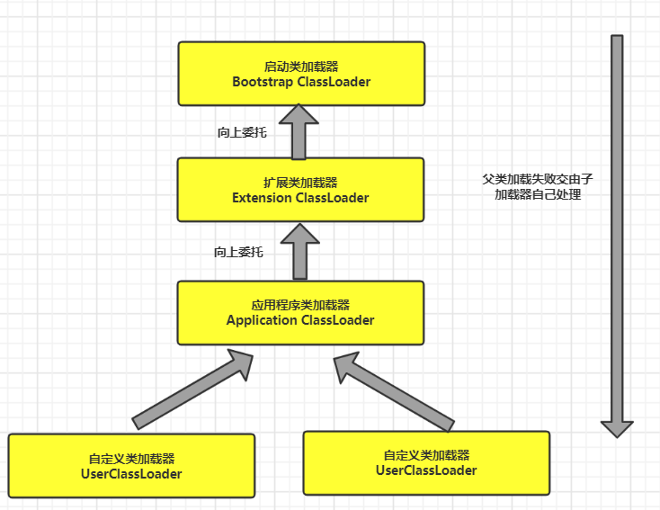
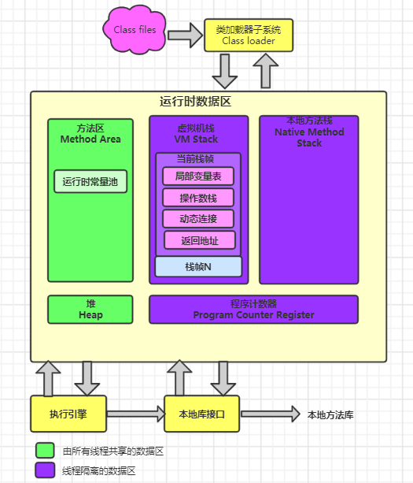

# JVM

## 类加载器的种类

1.首先检查类是否被加载；
2.若未加载，则调用父类加载器的**loadClass**方法；
3.若该方法抛出**ClassNotFoundException**异常，表示父类加载器无法加载，则当前类加载器调用**findClass**加载
类；
4.若父类加载器可以加载，则直接返回Class对象。 

> 注：双亲委托模型机制保证了一个类只会被一个加载器加载一次
- **启动类加载器**

  主要加载JVM自身需要的类，这个类加载器使用C++语言实现，是虚拟机的一部分，负责加载**<JAVA_HOME>/lib**路径下的核心类库

- **扩展类加载器**

  负责加载**<JAVA_HOME>/lib/ext**路径下的类库

- **应用类加载器(系统类加载器)**

  负责加载自定义类和第三方jar中的类，也就是**classpath**路径下的类 

## 类加载的过程

## JVM的组成部分？及其作用

- **类加载器**（ClassLoader）
- **运行时数据区**（Runtime Data Area）
- **执行引擎** （Execution Engine）
- **本地方法接口**（Native Interface）
> **组件的作用**：首先通过**类加载器**（ClassLoader）会把 Java 代码转换成字节码，**运行时数据区**（Runtime Data Area）再把字节码加载到内存中，而字节码文件只是 JVM 的一套指令集规范，并不能直接交给底层操作系统去执行，因此需要特定的命令解析器**执行引擎**（Execution Engine），将字节码翻译成底层系统指令，再交由 CPU 去执行，而这个过程中需要调用其他语言（C++）的**本地方法接口**（Native Interface）来实现整个程序的功能 。

## JVM 运行时数据区？详细介绍下每个区域的作用?  

- **方法区**（Methed Area）

  用于存储已被虚拟机加载的类信息、常量、静态变量、即时编译后的代码等数据。

-  **虚拟机栈**（Java Virtual Machine Stacks）

  用于存储局部变量表、操作数栈、动态链接、方法出口等信息；

- **本地方法栈**（Native Method Stack）

  与虚拟机栈的作用是一样的，只不过虚拟机栈是服务 Java 方法的，而本地
  方法栈是为虚拟机调用 Native 方法服务的；

- **堆**（Java Heap）

  Java 虚拟机中内存最大的一块，是被所有线程共享的，几乎所有的对象实例都在这里分配内
  存；

- **程序计数器**（Program Counter Register）

  当前线程所执行的字节码的行号指示器，字节码解析器的工作是通过改
  变这个计数器的值，来选取下一条需要执行的字节码指令，分支、循环、跳转、异常处理、线程恢复等基础功能，都需要依赖这个计数器来完成；

## 堆栈的区别

- 功能方面：堆是用来存放对象的，栈是用来执行程序的。
- 共享性：堆是线程共享的，栈是线程私有的。
- 空间大小：堆大小远远大于栈。 

# MYSQL

