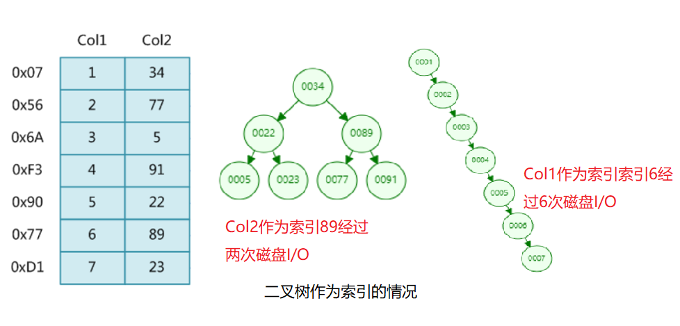
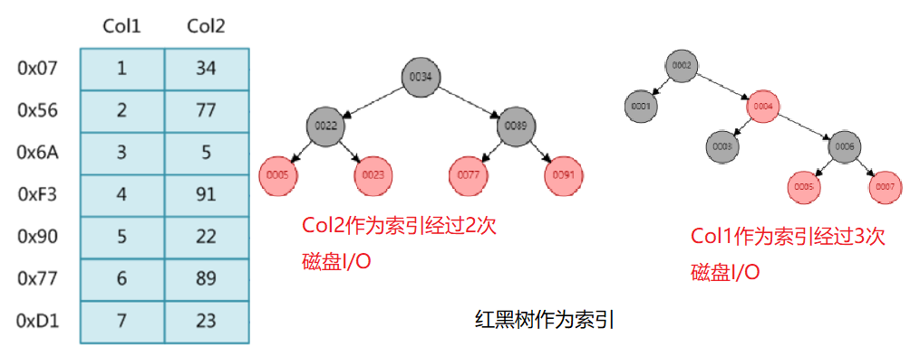
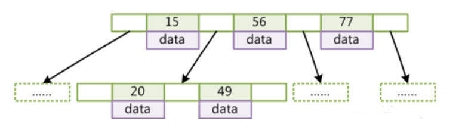
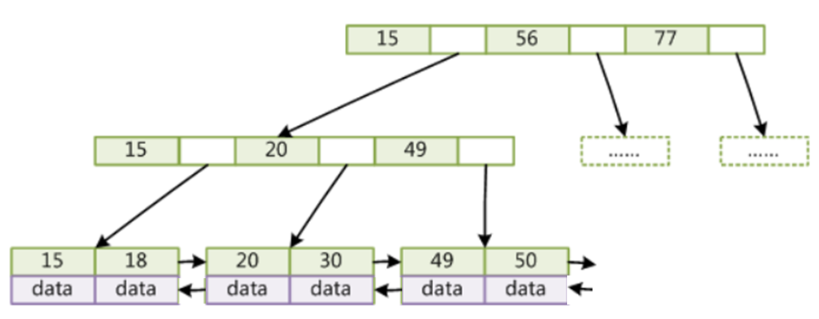
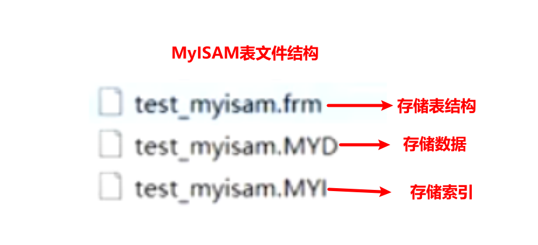
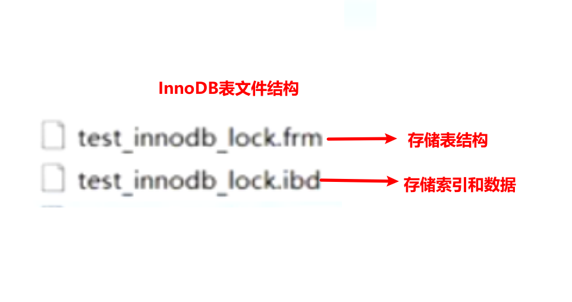
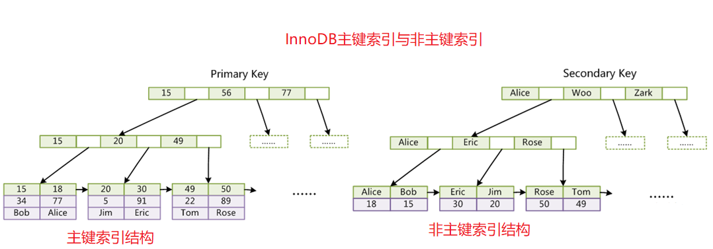

# 索引原理

**索引**是帮助MySQL高效获取数据的**排好序**的**数据结构**

## 常见数据结构

- 二叉树

- 红黑树

- Hash表

- B-Tree

  

**结论：二叉树存在当索引为增长是，会形成类似链表的结构查询效率低**

**结论：红黑树虽然因为自旋的特性不会出现二叉树的链表结构，但树的高度在存储大数据量时树的高度较高，需要较多次的磁盘I/O效率较低**

**B-Tree**

- 叶节点具有相同的深度，叶节点的指针为空
- 所有索引元素不重复
- 节点中的数据索引从左到右递增排列

**结论：一个节点存储多个索引，但是数据与索引存储在一起一个节点存储的索引个数下降**

**B+Tree**(B-Tree变种)

- 非叶子节点不存储data，只存储索引(冗余)，可以放更多的索引
- 叶子节点包含所有索引字段
- 叶子节点用指针双向连接，提高区间访问的性能(便于进行范围查找)

**结论：相对于B-Tree非叶子节点只存储子节点的指针只有叶子节点存储数据，相同大小节点MySQL默认一个节点大小16KB可以存储更多索引减少了磁盘I/O次数提高查询速率**

科普：假设一个主键索引使用bigint类型则索引占用8byte，MySQL给指向下一级的指针分配6byte，MySQL给每个节点分配16KB，则一个节点大概存储1170个索引，一个高度为3的树可以存储1170x1170x16kb=2190万KB，假设一条记录1KB则一颗高度为3的树可存储2190万条记录。

**补充**：在MySQL中99%使用B+Tree，还有一种索引哈希，不管数据量多大都只需要进行一次磁盘I/O效率相当高，不使用的原因是**不支持模糊和范围查找**

# 两种主要的存储引擎(**MyISAM和InnoDB**)

> 注：MEMORY使用hash数据结构作为索引（不管存储再多数据都只需要一次I/O完成一次查询）但是不支持范围查询，所以不能满足业务需求，一般不用

- **MyISAM**

MyISAM索引文件和数据文件是分离的(非聚集或非聚簇)

**文件结构**

MyISAM索引的主键索引与非主键索引结构基本一致

- **InnoDB**

InnoDB索引文件和数据文件是存储在一起的(聚集或叫聚簇)

**文件结构**

InnoDB索引主键索引与非主键索引有所差异

由图看出，主键索引叶子节点存储数据，非主键索引叶子节点存储主键，所以由非主键索引查找数据需要经过两棵树。

**Q&A**

- 问：为什么InnoDB表必须有主键，并且推荐使用整型的自增主键？

  答：因为B+Tree索引是基于表的主键的，使用自增型整型主键是为了插入和查询的效率；如果建表时没有主建，MySQL会在已有的字段中寻找一个唯一的字段作为主键，如果没有则会生成一个自增的隐藏的rowId字段作为主键；至于为什么推荐整型，假设用UUID，索引插入位置不可控在16KB空间已满时可能需要对原有索引位置进行移动，在比较时将UUID转为ASCII码在比较，效率可想而知。

- 问：为什么非主键索引结构叶子节点存储的是主键值？(一致性和节省存储空间)

  答：为了保持一致性和节省存储空间；插入一条数据的过程是先维护索引再写入数据，如果非主键索引的叶子节点也存储数据，为了保持一致性就要处理类似事务的问题，要保证存储在多个位置数据全部写入成功；同时，非主键索引叶子节点存储主键也节约了空间。

# 联合索引

**联合索引结构**

