# Explain工具介绍

使用EXPLAIN关键字可以模拟优化器执行SQL语句，分析你的查询语句或是结构的性能瓶颈
在 select 语句之前增加 explain 关键字，MySQL 会在查询上设置一个标记，执行查询会返
回执行计划的信息，而不是执行这条SQL
注意：如果 from 中包含子查询，仍会执行该子查询，将结果放入临时表中
Explain分析示例

```mysql
示例表：
DROP TABLE IF EXISTS `actor`;
CREATE TABLE `actor` (
`id` int(11) NOT NULL,
`name` varchar(45) DEFAULT NULL,
`update_time` datetime DEFAULT NULL,
PRIMARY KEY (`id`)
) ENGINE=InnoDB DEFAULT CHARSET=utf8;

 INSERT INTO `actor` (`id`, `name`, `update_time`) VALUES (1,'a',now()), (2,'b',now()), (3,'c',now());

 DROP TABLE IF EXISTS `film`;
 CREATE TABLE `film` (
 `id` int(11) NOT NULL AUTO_INCREMENT,
 `name` varchar(10) DEFAULT NULL,
 PRIMARY KEY (`id`),
 KEY `idx_name` (`name`)
 ) ENGINE=InnoDB DEFAULT CHARSET=utf8;

 INSERT INTO `film` (`id`, `name`) VALUES (3,'film0'),(1,'film1'),(2,'film2');

 DROP TABLE IF EXISTS `film_actor`;
 CREATE TABLE `film_actor` (
 `id` int(11) NOT NULL,
 `film_id` int(11) NOT NULL,
 `actor_id` int(11) NOT NULL,
 `remark` varchar(255) DEFAULT NULL,
 PRIMARY KEY (`id`),
 KEY `idx_film_actor_id` (`film_id`,`actor_id`)
 ) ENGINE=InnoDB DEFAULT CHARSET=utf8;

 INSERT INTO `film_actor` (`id`, `film_id`, `actor_id`) VALUES (1,1,1),(2,1,2),(3,2,1);
```


```mysql
mysql> explain select * from actor;
```

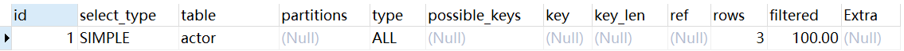

在查询中的每个表会输出一行，如果有两个表通过 join 连接查询，那么会输出两行

# explain 两个变种

**1）explain extended`[ɪkˈstendɪd]`：**会在 explain 的基础上额外提供一些查询优化的信息。紧随其后通
过 show warnings 命令可以得到优化后的查询语句，从而看出优化器优化了什么。额外还有
filtered 列，是一个半分比的值，rows * filtered/100 可以估算出将要和 explain 中前一个表
进行连接的行数（前一个表指 explain 中的id值比当前表id值小的表）。

```mysql
mysql> explain extended select * from film where id = 1;
mysql> show warnings;
```

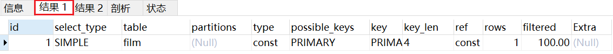


> Message中的是mysql优化后的语句(不一定准确)

**2）explain partitions：**相比 explain 多了个 partitions`[pɑːˈtɪʃnz]` 字段，如果查询是基于分区表的
话，会显示查询将访问的分区。

> 注意：在5.7以前的版本中，想要显示partitions需要使用explain partitions命令；想要显示filtered需要使用explain extended命令。在5.7版本后，默认explain直接显示partitions和filtered中的信息

# explain中的列

接下来我们将展示 explain 中每个列的信息。
1. **id列**
   id列的编号是 select 的序列号，有几个 select 就有几个id，并且id的顺序是按 select 出现的
   顺序增长的。
   id列越大执行优先级越高，id相同则从上往下执行，id为NULL最后执行。

2. **select_type列**
   **select_type** 表示对应行是简单还是复杂的查询。
- **simple**：简单查询。查询不包含子查询和union
  
     ```mysql
     mysql> explain select * from film where id = 2;
     ```

     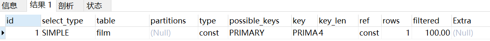

- **primary**`[ˈpraɪməri]`：复杂查询中最外层的 select
- **subquery**：包含在 select 中的子查询（不在 from 子句中）
- **derived**`[dɪˈraɪvd]`：包含在 from 子句中的子查询。MySQL会将结果存放在一个临时表中，也称为派生表（derived的英文含义）
          用这个例子来了解 primary、subquery 和 derived 类型
      
    ```mysql
    mysql> set session optimizer_switch='derived_merge=off'; #关闭mysql5.7新特性对衍生表的合并优化
    mysql> explain select (select 1 from actor where id = 1) from (select * from film where id = 1) der;
    ```
   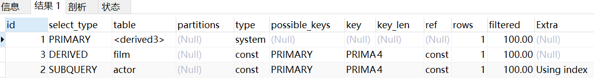

    mysql> set session optimizer_switch='derived_merge=on'; #还原默认配置

- **union**：在 union 中的第二个和随后的 select

    ```mysql
    mysql> explain select 1 union all select 1;
    ```
    
    ​	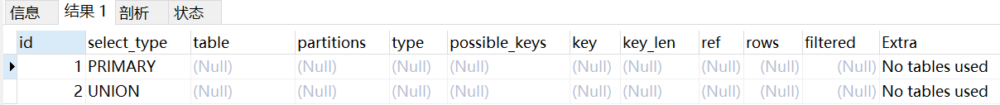


3. **table列**
   这一列表示 explain 的一行正在访问哪个表。
   
   > 当 from 子句中有子查询时，table列是 <derivenN> 格式，表示当前查询依赖 id=N 的查
   > 询，于是先执行 id=N 的查询。(运用了零时表)
   > 当有 union 时，UNION RESULT 的 table 列的值为<union1,2>，1和2表示参与 union 的select 行id。

   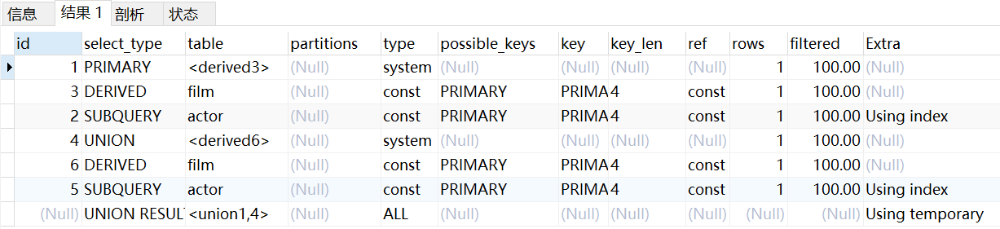

4. **type列**
   这一列表示关联类型或访问类型，即MySQL决定如何查找表中的行，查找数据行记录的大概
   范围。
   依次从最优到最差分别为：**system > const > eq_ref > ref > range > index > ALL**
   一般来说，得保证查询达到range级别，最好达到ref
   **NULL**：mysql能够在优化阶段分解查询语句，在执行阶段用不着再访问表或索引。例如：在
   索引列中选取最小值，可以单独查找索引来完成，不需要在执行时访问表

    ```mysql
    mysql> explain select min(id) from film;
    ```
   
   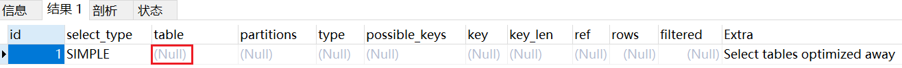

    **const, system**：mysql能对查询的某部分进行优化并将其转化成一个常量（可以看show warnings 的结果）。用于 primary key 或 unique key 的所有列与常数比较时，所以表最多 有一个匹配行，读取1次，速度比较快。system是const的特例，表里只有一条元组匹配时为system
   
    ```mysql
   mysql> set session optimizer_switch='derived_merge=off'; #关闭mysql5.7新特性对衍生表的合并优化
   mysql> explain extended select * from (select * from film where id = 1) tmp;
   mysql> show warnings;
    ```
   
   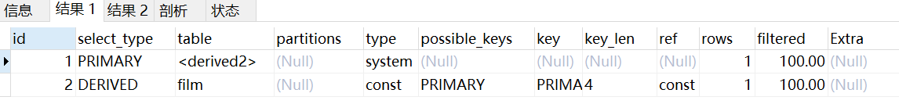
   
   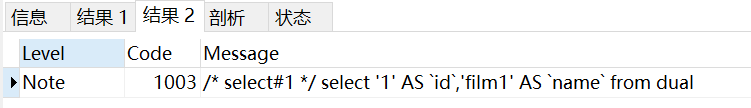
   
    **eq_ref**：primary key 或 unique key 索引的所有部分被连接使用 ，最多只会返回一条符合条件的记录。这可能是在 const 之外最好的联接类型了，简单的 select 查询不会出现这种type。
   
    ```mysql
   mysql> explain select * from film_actor left join film on film_actor.film_id = film.id;
    ```
   
   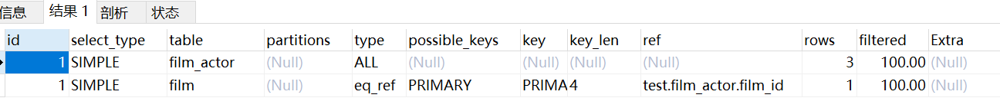
   
    **ref**：相比 eq_ref，不使用唯一索引，而是使用普通索引或者唯一性索引的部分前缀，索引要
    和某个值相比较，可能会找到多个符合条件的行。
   
    1. 简单 select 查询，name是普通索引（非唯一索引）
   
    ```mysql
   mysql> explain select * from film where name = 'film1';
    ```
   
    
   
   2.关联表查询，idx_film_actor_id是film_id和actor_id的联合索引，这里使用到了film_actor
    的左边前缀film_id部分。
   
    ```mysql
    mysql> explain select film_id from film left join film_actor on film.id =
    film_actor.film_id;
    ```
   
   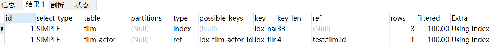
   
   **range**：范围扫描通常出现在 in(), between ,> ,<, >= 等操作中。使用一个索引来检索给定范围的行。
   
    ```mysql
   mysql> explain select * from actor where id > 1;
    ```
   
   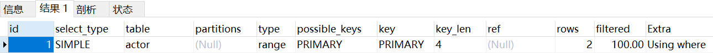
   
   **index**：扫描全表索引，这通常比ALL快一些。
   
    ```sql
   mysql> explain select * from film;
    ```
   
   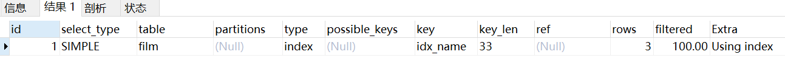 
   
   **ALL**：即全表扫描，意味着mysql需要从头到尾去查找所需要的行。通常情况下这需要增加索引来进行优化了
   
    ```mysql
   mysql> explain select * from actor;
    ```
   
   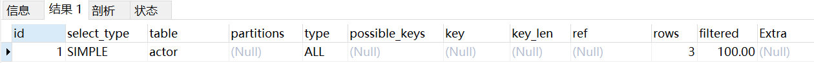
   
5. **possible_keys列**
   这一列显示查询可能使用哪些索引来查找。

   > explain 时可能出现 possible_keys 有列，而 key 显示 NULL 的情况，这种情况是因为表中
   > 数据不多，mysql认为索引对此查询帮助不大，选择了全表查询。
   > 如果该列是NULL，则没有相关的索引。在这种情况下，可以通过检查 where 子句看是否可
   > 以创造一个适当的索引来提高查询性能，然后用 explain 查看效果。

6. **key列**
   这一列显示mysql实际采用哪个索引来优化对该表的访问。

   > 如果没有使用索引，则该列是 NULL。如果想强制mysql使用或忽视possible_keys列中的索
   > 引，在查询中使用 force index、ignore index。

7. **key_len列**
   这一列显示了mysql在索引里使用的字节数，通过这个值可以算出具体使用了索引中的哪些列。

   > 举例来说，film_actor的联合索引 idx_film_actor_id 由 film_id 和 actor_id 两个int列组成，
   > 并且每个int是4字节。通过结果中的key_len=4可推断出查询使用了第一个列：film_id列来执
   > 行索引查找。

    ```mysql
   mysql> explain select * from film_actor where film_id = 2;
    ```
   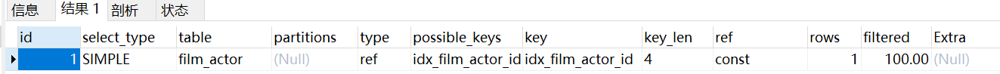 

   > key_len计算规则如下：
   >
   > - 字符串
   >    char(n)：n字节长度
   >    varchar(n)：2字节存储字符串长度，如果是utf-8，则长度 3n + 2
   > - 数值类型
   >    tinyint：1字节
   >    smallint：2字节
   >    int：4字节
   >    bigint：8字节
   > - 时间类型
   >    date：3字节
   >    timestamp：4字节
   >    datetime：8字节
   >    如果字段允许为 NULL，需要1字节记录是否为 NULL
   >    索引最大长度是768字节，当字符串过长时，mysql会做一个类似左前缀索引的处理，将前半部分的字符提取出来做索引。
   
8. **ref列**
   这一列显示了在key列记录的索引中，表查找值所用到的列或常量，常见的有：const（常
   量），字段名（例：film.id）

9. **rows列**
   这一列是mysql估计要读取并检测的行数，注意这个不是结果集里的行数。

10. **Extra列**
    这一列展示的是额外信息。常见的重要值如下：
    1）**Using index**：使用覆盖索引

    ```mysql
    mysql> explain select film_id from film_actor where film_id = 1;
    ```
    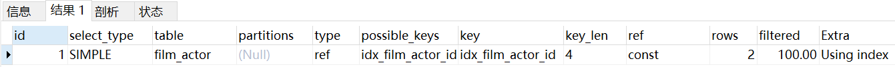

    2）**Using where**：使用 where 语句来处理结果，查询的列未被索引覆盖
    
    ```mysql
    mysql> explain select * from actor where name = 'a';
    ```
    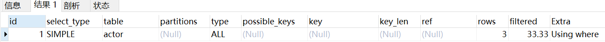
    
    3）**Using index condition**：查询的列不完全被索引覆盖，where条件中是一个前导列的范围；
    
    ```mysql
    mysql> explain select * from film_actor where film_id > 1;
    ```
    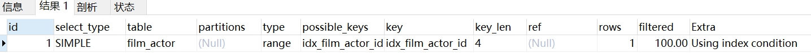
    
    4）**Using temporary**：mysql需要创建一张临时表来处理查询。出现这种情况一般是要进行
    优化的，首先是想到用索引来优化。
    
    1. actor.name没有索引，此时创建了张临时表来distinct
    ```mysql
    mysql> explain select distinct name from actor;
    ```
    
    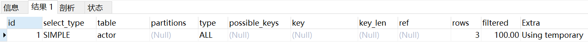
    
    2. film.name建立了idx_name索引，此时查询时extra是using index,没有用临时表
    ```mysql
    mysql> explain select distinct name from film;
    ```
    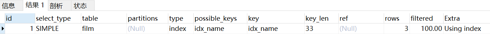
    
    5）**Using filesort**：将用外部排序而不是索引排序，数据较小时从内存排序，否则需要在磁盘
    完成排序。这种情况下一般也是要考虑使用索引来优化的。
    
    1. actor.name未创建索引，会浏览actor整个表，保存排序关键字name和对应的id，然后排序name并检索行记录
    ```mysql
    mysql> explain select * from actor order by name;
    ```
    
    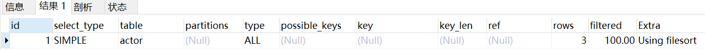
    
    2. film.name建立了idx_name索引,此时查询时extra是using index
    ```mysql
    mysql> explain select * from film order by name;
    ```
    
    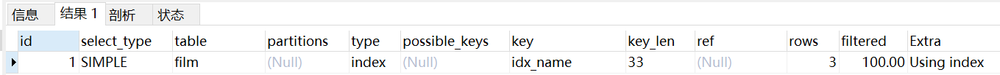
    
    6）**Select tables optimized away**：使用某些聚合函数（比如 max、min）来访问存在索引的某个字段
    
    ```mysql
    mysql> explain select min(id) from film;
    ```
    
    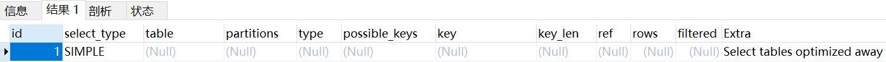
    

# 索引最佳实践


```mysql
示例表：
CREATE TABLE `employees` (
`id` int(11) NOT NULL AUTO_INCREMENT,
`name` varchar(24) NOT NULL DEFAULT '' COMMENT '姓名',
`age` int(11) NOT NULL DEFAULT '0' COMMENT '年龄',
`position` varchar(20) NOT NULL DEFAULT '' COMMENT '职位',
`hire_time` timestamp NOT NULL DEFAULT CURRENT_TIMESTAMP COMMENT '入职时间',
PRIMARY KEY (`id`),
KEY `idx_name_age_position` (`name`,`age`,`position`) USING BTREE
 ) ENGINE=InnoDB AUTO_INCREMENT=4 DEFAULT CHARSET=utf8 COMMENT='员工记录表';

INSERT INTO employees(name,age,position,hire_time) VALUES('LiLei',22,'manager',NOW());
INSERT INTO employees(name,age,position,hire_time) VALUES('HanMeimei',23,'dev',NOW());
INSERT INTO employees(name,age,position,hire_time) VALUES('Lucy',23,'dev',NOW());
```
1. 全值匹配

```mysql
EXPLAIN SELECT * FROM employees WHERE name= 'LiLei';
```

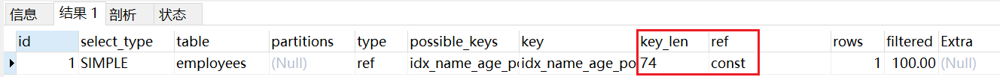

```mysql
EXPLAIN SELECT * FROM employees WHERE name= 'LiLei' AND age = 22;
```

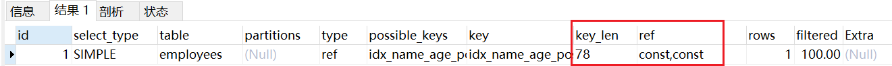

```mysql
EXPLAIN SELECT * FROM employees WHERE name= 'LiLei' AND age = 22 AND
position ='manager';
```

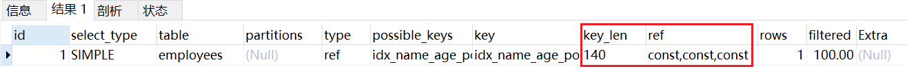

2. 最左前缀法则
   如果索引了多列，要遵守最左前缀法则。指的是查询从索引的最左前列开始并且不跳过索引中的列。

```mysql
EXPLAIN SELECT * FROM employees WHERE age = 22 AND position ='manager';
```

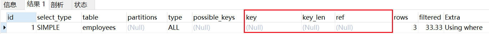

```mysql
EXPLAIN SELECT * FROM employees WHERE position = 'manager';
```

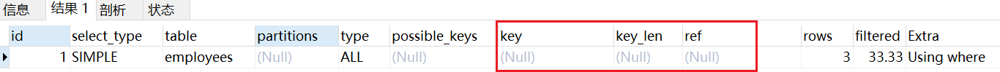

```mysql
EXPLAIN SELECT * FROM employees WHERE name = 'LiLei';
```

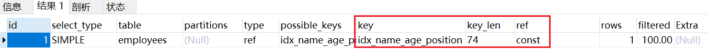

3. 不在索引列上做任何操作（计算、函数、（自动or手动）类型转换），会导致索引失效而转向全表扫描

```mysql
EXPLAIN SELECT * FROM employees WHERE name = 'LiLei';
```

```mysql
EXPLAIN SELECT * FROM employees WHERE left(name,3) = 'LiLei';
```

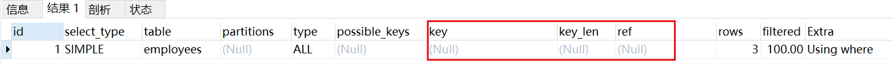

给hire_time增加一个普通索引：

```mysql
ALTER TABLE `employees`
ADD INDEX `idx_hire_time` (`hire_time`) USING BTREE;
```

```mysql
EXPLAIN select * from employees where date(hire_time) ='2018-09-30';
```
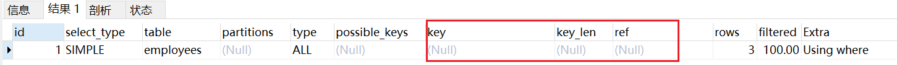

转化为日期范围查询，会走索引：

```mysql
EXPLAIN select * from employees where hire_time >='2018-09-30 00:00:00' and
hire_time <='2018-09-30 23:59:59';
```
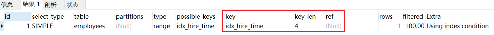

还原最初索引状态

```mysql
ALTER TABLE `employees`
DROP INDEX `idx_hire_time`;
```

4. 存储引擎不能使用索引中范围条件右边的列

```mysql
EXPLAIN SELECT * FROM employees WHERE name= 'LiLei' AND age = 22 AND
position ='manager';
```

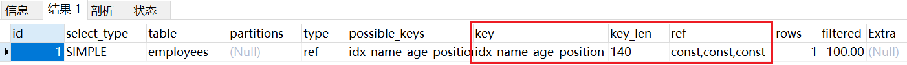

```mysql
EXPLAIN SELECT * FROM employees WHERE name= 'LiLei' AND age > 22 AND
position ='manager';
```

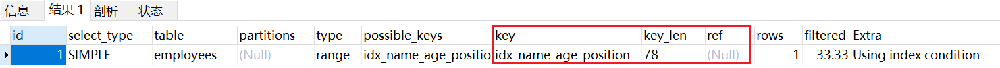

5. 尽量使用覆盖索引（只访问索引的查询（索引列包含查询列）），减少select *语句

```mysql
EXPLAIN SELECT name,age FROM employees WHERE name= 'LiLei' AND age = 23
AND position ='manager';
```

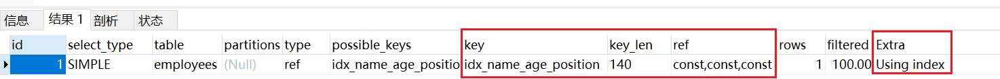

```mysql
EXPLAIN SELECT * FROM employees WHERE name= 'LiLei' AND age = 23 AND
position ='manager';
```

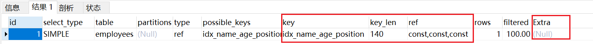

6. mysql在使用不等于（！=或者<>）的时候无法使用索引会导致全表扫描

```mysql
EXPLAIN SELECT * FROM employees WHERE name != 'LiLei';
```

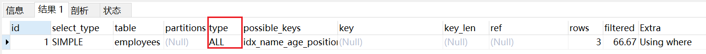

7. is null,is not null 也无法使用索引

```mysql
EXPLAIN SELECT * FROM employees WHERE name is null
```

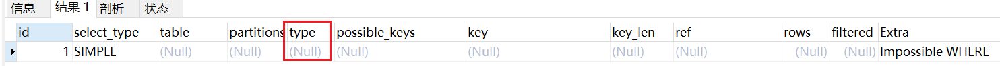

8. like以通配符开头（'$abc...'）mysql索引失效会变成全表扫描操作

```mysql
EXPLAIN SELECT * FROM employees WHERE name like '%Lei'
```

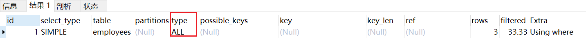

```mysql
EXPLAIN SELECT * FROM employees WHERE name like 'Lei%'
```

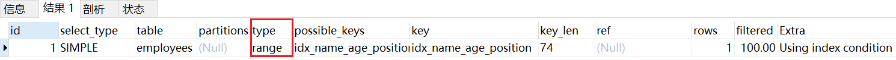

问题：解决like'%字符串%'索引不被使用的方法？
a）使用覆盖索引，查询字段必须是建立覆盖索引字段

```mysql
EXPLAIN SELECT name,age,position FROM employees WHERE name like '%Lei%';
```
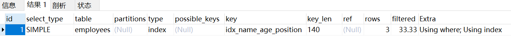

b）如果不能使用覆盖索引则可能需要借助搜索引擎

9. 字符串不加单引号索引失效

```mysql
EXPLAIN SELECT * FROM employees WHERE name = '1000';
```

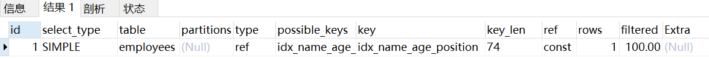

```mysql
EXPLAIN SELECT * FROM employees WHERE name = 1000;
```

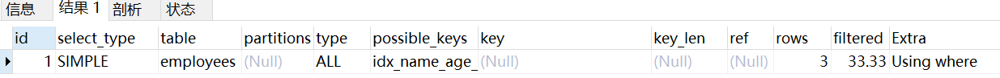

10. 少用or或in，用它查询时，mysql不一定使用索引，mysql内部优化器会根据检索比例、表大小等多个因素整体评估是否使用索引，详见范围查询优化

```mysql
EXPLAIN SELECT * FROM employees WHERE name = 'LiLei' or name = 'HanMeimei';
```

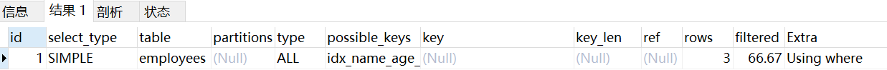

11. 范围查询优化
    给年龄添加单值索引
```MYSQL
ALTER TABLE `employees`
ADD INDEX `idx_age` (`age`) USING BTREE;
```

```mysql
EXPLAIN select * from employees where age >=1 and age <=2000;
```


```mysql
EXPLAIN select * from employees where age >=1 and age <=10;
```

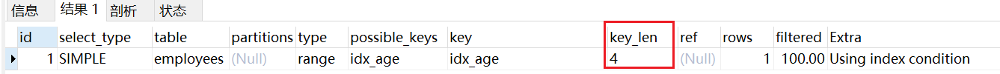

没走索引原因：mysql内部优化器会根据检索比例、表大小等多个因素整体评估是否使用索
引。比如这个例子，可能是由于单次数据量查询过大导致优化器最终选择不走索引
优化方法：可以讲大的范围拆分成多个小范围

```mysql
EXPLAIN select * from employees where age >=1 and age <=1000;
```
```mysql
EXPLAIN select * from employees where age >=1001 and age <=2000;
```
还原最初索引状态

```MYSQL
ALTER TABLE `employees`
DROP INDEX `idx_age`;
```

索引使用总结：

假设index(a,b,c)

| Where语句                                      | 索引是否被使用                       |
| :--------------------------------------------- | ------------------------------------ |
| where a=3                                      | Y,使用到a                            |
| where a=3 and b=5                              | Y,使用到a,b                          |
| where a=3 and b=5 and c=4                      | Y,使用到a,b,c                        |
| where b=3 或者 where b=3 and c=4 或者where c=4 | N                                    |
| where a=3 and c=5                              | 使用到a，但是c不可以，b中间断了      |
| where a=3 and b>4 and c=5                      | 使用到a，b，c不能用在范围之后，b断了 |
| where a=3 and b like 'kk%' and c=4             | Y,使用到a,b,c                        |
| where a=3 and b like '%kk' and c=4             | Y,只使用到a                          |
| where a=3 and b like '%kk%' and c=4            | Y,只使用到a                          |
| where a=3 and b like '%k%k%' and c=4           | Y,使用到a,b,c                        |

<font color='red'>**like KK%相当于=常量，%KK和%KK% 相当于范围  **</font>