**示例表**

```mysql
CREATE TABLE `employees` (
`id` int(11) NOT NULL AUTO_INCREMENT,
`name` varchar(24) NOT NULL DEFAULT '' COMMENT '姓名',
`age` int(11) NOT NULL DEFAULT '0' COMMENT '年龄',
`position` varchar(20) NOT NULL DEFAULT '' COMMENT '职位',
`hire_time` timestamp NOT NULL DEFAULT CURRENT_TIMESTAMP COMMENT '入职时间',
PRIMARY KEY (`id`),
KEY `idx_name_age_position` (`name`,`age`,`position`) USING BTREE
) ENGINE=InnoDB AUTO_INCREMENT=1 DEFAULT CHARSET=utf8 COMMENT='员工记录表';

INSERT INTO employees(name,age,position,hire_time) VALUES('LiLei',22,'manager',NOW());
INSERT INTO employees(name,age,position,hire_time) VALUES('HanMeimei', 23,'dev',NOW());
INSERT INTO employees(name,age,position,hire_time) VALUES('Lucy',23,'dev',NOW());
```

# Mysql如何选择合适的索引

```mysql
mysql> EXPLAIN select * from employees where name > 'a';
```

如果用name索引需要遍历name字段联合索引树，然后还需要根据遍历出来的主键值去主键索引树里再去查出最终数据，成本比全表扫描还高，可以用覆盖索引优化，这样只需要遍历name字段的联合索引树就能拿到所有结果，如下：

```mysql
mysql> EXPLAIN select name,age,position from employees where name > 'a';
```

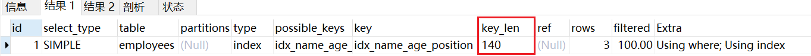

```mysql
mysql> EXPLAIN select * from employees where name > 'zzz' ;
```

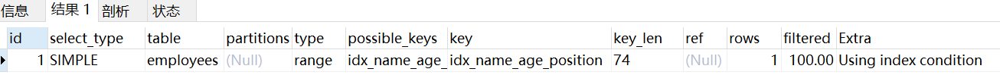

对于上面这两种 name>'a' 和 name>'zzz' 的执行结果，mysql最终是否选择走索引或者一张表涉及多个索引，mysql最终如何选择索引，我们可以用trace工具来一查究竟，开启trace工具会影响mysql性能，所以只能临时分析sql使用，用完之后立即关闭
trace工具用法：

该工具记录了SQL的三个阶段

**SQL准备阶段**

**SQL优化阶段**：预估使用主键索引、辅助索引、全表扫描的成本，来决定使用哪一种来执行SQL

**SQL执行阶段**

```mysql
mysql> set session optimizer_trace="enabled=on",end_markers_in_json=on; ‐‐开启trace
mysql> select * from employees where name > 'a' order by position;
mysql> SELECT * FROM information_schema.OPTIMIZER_TRACE;

查看trace字段：

{
  "steps": [
    {
      "join_preparation": {  ‐‐第一阶段：SQL准备阶段
        "select#": 1,
        "steps": [
          {
            "expanded_query": "/* select#1 */ select `employees`.`id` AS `id`,`employees`.`name` AS `name`,`employees`.`age` AS `age`,`employees`.`position` AS `position`,`employees`.`hire_time` AS `hire_time` from `employees` where (`employees`.`name` > 'a') order by `employees`.`position`"
          }
        ] /* steps */
      } /* join_preparation */
    },
    {
      "join_optimization": {  ‐‐第二阶段：SQL优化阶段
        "select#": 1,
        "steps": [
          {
            "condition_processing": {  ‐‐条件处理
              "condition": "WHERE",
              "original_condition": "(`employees`.`name` > 'a')",
              "steps": [
                {
                  "transformation": "equality_propagation",
                  "resulting_condition": "(`employees`.`name` > 'a')"
                },
                {
                  "transformation": "constant_propagation",
                  "resulting_condition": "(`employees`.`name` > 'a')"
                },
                {
                  "transformation": "trivial_condition_removal",
                  "resulting_condition": "(`employees`.`name` > 'a')"
                }
              ] /* steps */
            } /* condition_processing */
          },
          {
            "substitute_generated_columns": {
            } /* substitute_generated_columns */
          },
          {
            "table_dependencies": [  ‐‐表依赖详情
              {
                "table": "`employees`",
                "row_may_be_null": false,
                "map_bit": 0,
                "depends_on_map_bits": [
                ] /* depends_on_map_bits */
              }
            ] /* table_dependencies */
          },
          {
            "ref_optimizer_key_uses": [
            ] /* ref_optimizer_key_uses */
          },
          {
            "rows_estimation": [  ‐‐预估表的访问成本
              {
                "table": "`employees`",
                "range_analysis": {
                  "table_scan": {   ‐‐全表扫描情况
                    "rows": 3, ‐‐扫描行数
                    "cost": 3.7 ‐‐查询成本
                  } /* table_scan */,
                  "potential_range_indexes": [ ‐‐查询可能使用的索引
                    {
                      "index": "PRIMARY", ‐‐主键索引
                      "usable": false,
                      "cause": "not_applicable"
                    },
                    {
                      "index": "idx_name_age_position", ‐‐辅助索引
                      "usable": true,
                      "key_parts": [
                        "name",
                        "age",
                        "position",
                        "id"
                      ] /* key_parts */
                    },
                    {
                      "index": "idx_age",
                      "usable": false,
                      "cause": "not_applicable"
                    }
                  ] /* potential_range_indexes */,
                  "setup_range_conditions": [
                  ] /* setup_range_conditions */,
                  "group_index_range": {
                    "chosen": false,
                    "cause": "not_group_by_or_distinct"
                  } /* group_index_range */,
                  "analyzing_range_alternatives": {  ‐‐分析各个索引使用成本
                    "range_scan_alternatives": [
                      {
                        "index": "idx_name_age_position",
                        "ranges": [
                          "a < name"  ‐‐索引使用范围
                        ] /* ranges */,
                        "index_dives_for_eq_ranges": true,
                        "rowid_ordered": false,  ‐‐使用该索引获取的记录是否按照主键排序
                        "using_mrr": false, 
                        "index_only": false,
                        "rows": 3,  ‐‐索引扫描行数
                        "cost": 4.61,  ‐‐索引使用成本
                        "chosen": false,  ‐‐是否选择该索引
                        "cause": "cost"
                      }
                    ] /* range_scan_alternatives */,
                    "analyzing_roworder_intersect": {
                      "usable": false,
                      "cause": "too_few_roworder_scans"
                    } /* analyzing_roworder_intersect */
                  } /* analyzing_range_alternatives */
                } /* range_analysis */
              }
            ] /* rows_estimation */
          },
          {
            "considered_execution_plans": [
              {
                "plan_prefix": [
                ] /* plan_prefix */,
                "table": "`employees`",
                "best_access_path": {  ‐‐最优访问路径
                  "considered_access_paths": [  ‐‐最终选择的访问路径
                    {
                      "rows_to_scan": 3,
                      "access_type": "scan",  ‐‐访问类型：为scan，全表扫描
                      "resulting_rows": 3,
                      "cost": 1.6,
                      "chosen": true,  ‐‐确定选择
                      "use_tmp_table": true
                    }
                  ] /* considered_access_paths */
                } /* best_access_path */,
                "condition_filtering_pct": 100,
                "rows_for_plan": 3,
                "cost_for_plan": 1.6,
                "sort_cost": 3,
                "new_cost_for_plan": 4.6,
                "chosen": true
              }
            ] /* considered_execution_plans */
          },
          {
            "attaching_conditions_to_tables": {
              "original_condition": "(`employees`.`name` > 'a')",
              "attached_conditions_computation": [
              ] /* attached_conditions_computation */,
              "attached_conditions_summary": [
                {
                  "table": "`employees`",
                  "attached": "(`employees`.`name` > 'a')"
                }
              ] /* attached_conditions_summary */
            } /* attaching_conditions_to_tables */
          },
          {
            "clause_processing": {
              "clause": "ORDER BY",
              "original_clause": "`employees`.`position`",
              "items": [
                {
                  "item": "`employees`.`position`"
                }
              ] /* items */,
              "resulting_clause_is_simple": true,
              "resulting_clause": "`employees`.`position`"
            } /* clause_processing */
          },
          {
            "reconsidering_access_paths_for_index_ordering": {
              "clause": "ORDER BY",
              "steps": [
              ] /* steps */,
              "index_order_summary": {
                "table": "`employees`",
                "index_provides_order": false,
                "order_direction": "undefined",
                "index": "unknown",
                "plan_changed": false
              } /* index_order_summary */
            } /* reconsidering_access_paths_for_index_ordering */
          },
          {
            "refine_plan": [
              {
                "table": "`employees`"
              }
            ] /* refine_plan */
          }
        ] /* steps */
      } /* join_optimization */
    },
    {
      "join_execution": {  ‐‐第三阶段：SQL执行阶段
        "select#": 1,
        "steps": [
          {
            "filesort_information": [
              {
                "direction": "asc",
                "table": "`employees`",
                "field": "position"
              }
            ] /* filesort_information */,
            "filesort_priority_queue_optimization": {
              "usable": false,
              "cause": "not applicable (no LIMIT)"
            } /* filesort_priority_queue_optimization */,
            "filesort_execution": [
            ] /* filesort_execution */,
            "filesort_summary": {
              "rows": 3,
              "examined_rows": 3,
              "number_of_tmp_files": 0,
              "sort_buffer_size": 200704,
              "sort_mode": "<sort_key, packed_additional_fields>"
            } /* filesort_summary */
          }
        ] /* steps */
      } /* join_execution */
    }
  ] /* steps */
}


结论：全表扫描的成本低于索引扫描，所以mysql最终选择全表扫描


查看trace字段可知索引扫描的成本低于全表扫描，所以mysql最终选择索引扫描

mysql> set session optimizer_trace="enabled=off"; ‐‐关闭trace
```

# 常见sql深入优化

## Order by与Group by优化

**Case1**：

```mysql
EXPLAIN select * from employees where name = 'LiLei' and position = 'dev' order by age;
```

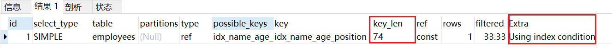

分析：
利用最左前缀法则：中间字段不能断，因此查询用到了name索引，从key_len=74（3X24+2）也能看出，age索引列用在排序过程中，因为Extra字段里没有using filesort  
**Case 2**：

```mysql
EXPLAIN SELECT * FROM employees where name = 'LiLei' ORDER BY position;
```

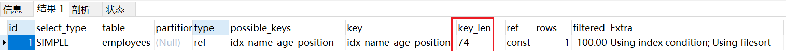分析：
从explain的执行结果来看：key_len=74，查询只使用了name索引，由于用了position进行排序，跳过了
age，出现了Using filesort。
**Case 3**：

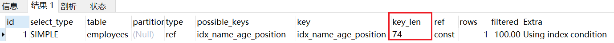

分析：
查找只用到索引name，age和position用于排序，无Using filesort。
**Case 4**：

```mysql
EXPLAIN SELECT * FROM employees where name = 'LiLei' ORDER BY position,age;
```

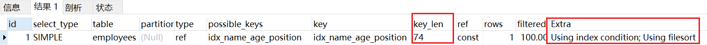

分析：
和Case 3中explain的执行结果一样，但是出现了Using filesort，因为索引的创建顺序为
name,age,position，但是排序的时候age和position颠倒位置了。
**Case 5**：

```mysql
EXPLAIN SELECT * FROM employees where name = 'LiLei' and age= 18 ORDER BY position,age;
```

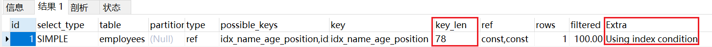

分析：
与Case 4对比，在Extra中并未出现Using filesort，因为age为常量，在排序中被优化，所以索引未颠倒，
不会出现Using filesort。
**Case 6**：

```mysql
EXPLAIN SELECT * FROM employees where name = 'LiLei' ORDER BY age asc,position desc;
```

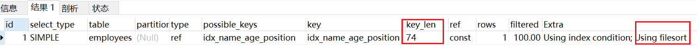

分析：
虽然排序的字段列与索引顺序一样，且order by默认升序，这里position desc变成了降序，导致与索引的
排序方式不同，从而产生Using filesort。Mysql8以上版本有降序索引可以支持该种查询方式。
**Case 7**：

```mysql
EXPLAIN SELECT * FROM employees where name in ('LiLei', 'zhuge') ORDER BY age,position;
```

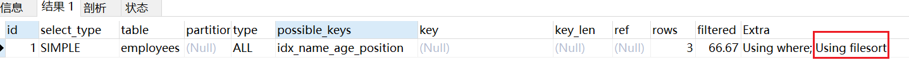

分析：
对于排序来说，多个相等条件也是范围查询
**Case 8**：

```mysql
EXPLAIN SELECT * FROM employees where name >'a' ORDER BY name;
```

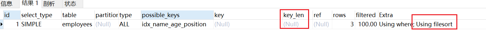

可以用覆盖索引优化

```mysql
EXPLAIN SELECT name, age, position FROM employees where name >'a' ORDER BY name;
```

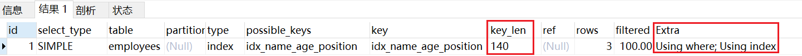

优化总结：
1. MySQL支持两种方式的排序<font color='red'>filesort</font>和<font color='red'>index</font>，Using index是指MySQL<font color='red'>扫描索引本身完成排序</font>。index效率高，filesort效率低。
2. order by满足两种情况会使用Using index。
    1) order by语句使用<font color='red'>索引最左前列</font>。
    2) 使用where子句与order by子句<font color='red'>条件列组合满足索引最左前列</font>。
3. 尽量在索引列上完成排序，遵循索引建立（索引创建的顺序）时的最左前缀法则。
4. 如果order by的条件不在索引列上，就会产生Using filesort。
5. 能用覆盖索引尽量用覆盖索引
6. group by与order by很类似，其实质是<font color='red'>先排序后分组</font>，遵照<font color='red'>索引创建顺序</font>的最左前缀法则。对于group by的优化如果不需要排序的可以加上**order by null禁止排序**。注意，where高于having，能写在where中的限定条件就不要去having限定了。

  ## Using filesort文件排序原理详解

  **filesort文件排序方式**

- **单路排序**：是一次性取出满足条件行的所有字段，然后在sort buffer中进行排序；用trace工具可
    以看到sort_mode信息里显示< sort_key, additional_fields >或者< sort_key,packed_additional_fields >
    
- **双路排序**（又叫回表排序模式）：是首先根据相应的条件取出相应的排序字段和可以直接定位数据的行 ID，然后在 sort buffer 中进行排序，排序完后需要再次取回其它需要的字段；用trace工具可以看到sort_mode信息里显示< sort_key, rowid >
  MySQL 通过比较系统变量 <font color='red'>**max_length_for_sort_data**</font>(默认1024字节) 的大小和需要查询的<font color='red'>**字段总大小**</font>来判断使用哪种排序模式。(字段总大小，即表中所有列字段的总和)

- 如果 max_length_for_sort_data 比查询字段的总长度大，那么使用 单路排序模式；

- 如果 max_length_for_sort_data 比查询字段的总长度小，那么使用 双路排序模式。

**示例验证下各种排序方式**：

```mysql
EXPLAIN select * from employees where name = 'LiLei' order by position;
```

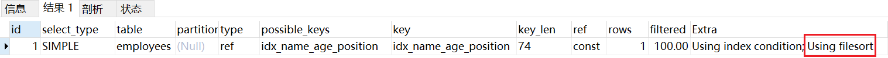

 查看下这条sql对应trace结果如下(只展示排序部分)：

```json
mysql> set session optimizer_trace="enabled=on",end_markers_in_json=on; ‐‐开启trace
mysql> select * from employees where name = 'LiLei' order by position;
mysql> select * from information_schema.OPTIMIZER_TRACE;

trace排序部分结果：
"join_execution": {
        "select#": 1,
        "steps": [
          {
            "filesort_information": [
              {
                "direction": "asc",
                "table": "`employees`",
                "field": "position"
              }
            ] /* filesort_information */,
            "filesort_priority_queue_optimization": {
              "usable": false,
              "cause": "not applicable (no LIMIT)"
            } /* filesort_priority_queue_optimization */,
            "filesort_execution": [
            ] /* filesort_execution */,
            "filesort_summary": { ‐‐文件排序信息
              "rows": 1, ‐‐预计扫描行数
              "examined_rows": 1, ‐‐参数排序的行
              "number_of_tmp_files": 0, ‐‐使用临时文件的个数，这个值如果为0代表全部使用的sort_buffer内存排序，否则使用的磁盘文件排序
              "sort_buffer_size": 200704,‐‐排序缓存的大小
              "sort_mode": "<sort_key, packed_additional_fields>" ‐‐排序方式，这里用的单路排序
            } /* filesort_summary */
          }
        ] /* steps */
      } /* join_execution */
```

我们先看**单路排序**的详细过程：

1. 从索引name找到第一个满足 name = ‘LiLei’ 条件的主键 id
2. 根据主键 id 取出整行，**取出所有字段的值，存入 sort_buffer 中**
3. 从索引name找到下一个满足 name = ‘LiLei’ 条件的主键 id
4. 重复步骤 2、3 直到不满足 name = ‘LiLei’
5. 对 sort_buffer 中的数据按照字段 position 进行排序
6. 返回结果给客户端

我们再看下**双路排序**的详细过程：
1. 从索引 name 找到第一个满足 name = ‘LiLei’ 的主键id
2. 根据主键 id 取出整行，**把排序字段 position 和主键 id 这两个字段放到 sort buffer 中**
3. 从索引 name 取下一个满足 name = ‘LiLei’ 记录的主键 id
4. 重复 3、4 直到不满足 name = 'LiLei'
5. 对 sort_buffer 中的字段 position 和主键 id 按照字段 position 进行排序
6. 遍历排序好的 id 和字段 position，按照 id 的值**回到原表**中取出 所有字段的值返回给客端

其实对比两个排序模式，单路排序会把所有需要查询的字段都放到 sort buffer 中，而双路排序只会把主键
和需要排序的字段放到 sort buffer 中进行排序，然后再通过主键回到原表查询需要的字段。
如果 MySQL 排序内存配置的比较小并且没有条件继续增加了，可以适当把 max_length_for_sort_data 配
置小点，让优化器选择使用**双路排序**算法，可以在sort_buffer 中一次排序更多的行，只是需要再根据主键
回到原表取数据。
如果 MySQL 排序内存有条件可以配置比较大，可以适当增大 max_length_for_sort_data 的值，让优化器
优先选择全字段排序(**单路排序**)，把需要的字段放到 sort_buffer 中，这样排序后就会直接从内存里返回查
询结果了。
所以，MySQL通过 **max_length_for_sort_data** 这个参数来控制排序，在不同场景使用不同的排序模式，
从而提升排序效率。
**注意**，如果全部使用sort_buffer内存排序一般情况下效率会高于磁盘文件排序，但不能因为这个就随便增
大sort_buffer(默认1M)，mysql很多参数设置都是做过优化的，不要轻易调整。    