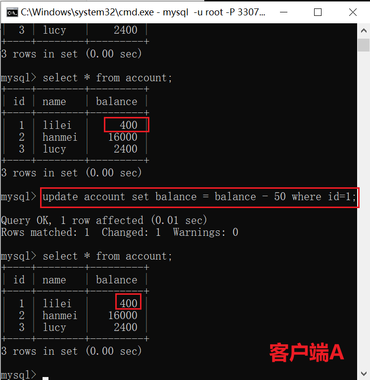

# 1、锁定义

​	锁是计算机协调多个进程或线程并发访问某一资源的机制。
​	在数据库中，除了传统的计算资源（如CPU、RAM、I/O等）的争用以外，
数据也是一种供需要用户共享的资源。如何保证数据并发访问的一致性、有效性是所有数据库必须解决的一个问题，锁冲突也是影响数据库并发访问性能的一个重要因素。

# 2、锁分类

**从性能上分**为<font color='red'>**乐观锁**</font>(用版本对比来实现)和<font color='red'>**悲观锁**</font>从对数据库操作的类型分，分为读锁和写锁(都属于悲观锁)

**读锁（共享锁）**：针对同一份数据，多个读操作可以同时进行而不会互相影响
**写锁（排它锁）**：当前写操作没有完成前，它会阻断其他写锁和读锁
**从对数据操作的粒度分**，分为表锁和行锁

## 2.1 表锁

每次操作锁住整张表。开销小，加锁快；不会出现死锁；锁定粒度大，发生锁冲
突的概率最高，并发度最低；

### 2.1.1 基本操作

```mysql
‐‐建表SQL
CREATE TABLE `mylock` (
`id` INT (11) NOT NULL AUTO_INCREMENT,
`NAME` VARCHAR (20) DEFAULT NULL,
PRIMARY KEY (`id`)
) ENGINE = MyISAM DEFAULT CHARSET = utf8;

‐‐插入数据
INSERT INTO`test`.`mylock` (`id`, `NAME`) VALUES ('1', 'a');
INSERT INTO`test`.`mylock` (`id`, `NAME`) VALUES ('2', 'b');
INSERT INTO`test`.`mylock` (`id`, `NAME`) VALUES ('3', 'c');
INSERT INTO`test`.`mylock` (`id`, `NAME`) VALUES ('4', 'd');
```

- 手动增加表锁

```mysql
lock table 表名称 read(write),表名称2 read(write);
```

- 查看表上加过的锁

```mysql
show open tables;
```

- 删除表锁

```mysql
unlock tables;
```

### 2.1.2 案例分析(加读锁）


当前session和其他session都可以读该表
当前session中插入或者更新锁定的表都会报错，其他session插入或更新则会等待


###  2.1.3 案例分析(加写锁）

当前session对该表的增删改查都没有问题，其他session对该表的所有操作被阻塞 

### 2.1.4 案例结论

<font color='red'>**MyISAM在执行查询语句(SELECT)前,会自动给涉及的所有表加读锁,在执行增删改，操作前,会自动给涉及的表加写锁。**</font>
1、对MyISAM表的读操作(加读锁) ,不会阻寒其他进程对同一表的读请求,但会阻
赛对同一表的写请求。只有当读锁释放后,才会执行其它进程的写操作。
2、对MylSAM表的写操作(加写锁) ,会阻塞其他进程对同一表的读和写操作,只有
当写锁释放后,才会执行其它进程的读写操作
总结：
简而言之，就是<font color='red'>**读锁会阻塞写，但是不会阻塞读。而写锁则会把读和写都阻塞。**</font>

## 2.2 行锁

每次操作锁住一行数据。开销大，加锁慢；会出现死锁；锁定粒度最小，发生锁
冲突的概率最低，并发度最高。
InnoDB与MYISAM的最大不同有两点：

- **支持事务（TRANSACTION）**
- **支持行级锁**

### 2.2.1 行锁支持事务

- **事务（Transaction）及其ACID属性**
  事务是由一组SQL语句组成的逻辑处理单元,事务具有以下4个属性,通常简称为事务的ACID属性。
  <font color='red'>**原子性(Atomicity)**</font> ：事务是一个原子操作单元,其对数据的修改,要么全都执
  行,要么全都不执行。
  <font color='red'>**一致性(Consistent)**</font> ：在事务开始和完成时,数据都必须保持一致状态。这意味着所有相关的数据规则都必须应用于事务的修改,以保持数据的完整性;事务结束时,所有的内部数据结构(如B树索引或双向链表)也都必须是正确的。
  <font color='red'>**隔离性(Isolation) **</font>：数据库系统提供一定的隔离机制,保证事务在不受外部并发操作影响的“独立”环境执行。这意味着事务处理过程中的中间状态对外部是不可见的,反之亦然。
  <font color='red'>**持久性(Durable) **</font>：事务完成之后,它对于数据的修改是永久性的,即使出现系统故障也能够保持。
  
- **并发事务处理带来的问题**
    <font color='red'>**更新丢失（Lost Update） **</font>
    当两个或多个事务选择同一行，然后基于最初选定的值更新该行时，由于每个事务都不知道其他事务的存在，就会发生丢失更新问题–最后的更新覆盖了由其他事务所做的更新。
    <font color='red'>**脏读（Dirty Reads）**</font>
    一个事务正在对一条记录做修改，在这个事务完成并提交前，这条记录的数据就处于不一致的状态；这时，另一个事务也来读取同一条记录，如果不加控制，第二个事务读取了这些“脏”数据，并据此作进一步的处理，就会产生未提交的数据依赖关系。这种现象被形象的叫做“脏读”。
    一句话：事务A读取到了事务B已经修改但尚未提交的数据，还在这个数据基础上做了操作。此时，如果B事务回滚，A读取的数据无效，不符合一致性要求。
    <font color='red'>**不可重读（Non-Repeatable Reads）**</font>
    一个事务在读取某些数据后的某个时间，再次读取以前读过的数据，却发现其读出的数据已经发生了改变、或某些记录已经被删除了！这种现象就叫做“不可重复读”。
    一句话：事务A读取到了事务B已经提交的修改数据，不符合隔离性
    <font color='red'>**幻读（Phantom Reads）**</font>
    一个事务按相同的查询条件重新读取以前检索过的数据，却发现其他事务插入了满足其查询条件的新数据，这种现象就称为“幻读”。
    一句话：事务A读取到了事务B提交的新增数据，不符合隔离性
    
- **事务隔离级别**
    脏读”、“不可重复读”和“幻读”,其实都是数据库读一致性问题,必须由数
    据库提供一定的事务隔离机制来解决。
    
    | 隔离级别                     | 脏读（Drity Read） | 不可重复读（NonRepeatable Read） | 幻读（Phantom Read） |
    | ---------------------------- | ------------------ | -------------------------------- | -------------------- |
    | 读未提交（Read uncommitted） | 可能               | 可能                             | 可能                 |
    | 读已提交（Read committed）   | 不可能             | 可能                             | 可能                 |
    | 可重复度（Repeatable read）  | 不可能             | 不可能                           | 可能                 |
    | 可串行化（Serializable）     | 不可能             | 不可能                           | 不可能               |
    
    数据库的事务隔离越严格,并发副作用越小,但付出的代价也就越大,因为事务隔
    离实质上就是使事务在一定程度上“串行化”进行,这显然与“并发”是矛盾的。
    同时,不同的应用对读一致性和事务隔离程度的要求也是不同的,比如许多应用
    对“不可重复读"和“幻读”并不敏感,可能更关心数据并发访问的能力。
    **常看当前数据库的事务隔离级别: show variables like 'tx_isolation';**
    **设置事务隔离级别：set tx_isolation='REPEATABLE-READ';**

### 2.2.2 行锁与隔离级别案例分析

```mysql
CREATE TABLE `account` (
`id` int(11) NOT NULL AUTO_INCREMENT,
`name` varchar(255) DEFAULT NULL,
`balance` int(11) DEFAULT NULL,
PRIMARY KEY (`id`)
) ENGINE=InnoDB DEFAULT CHARSET=utf8;
INSERT INTO `test`.`account` (`name`, `balance`) VALUES ('lilei', '450');
INSERT INTO `test`.`account` (`name`, `balance`) VALUES ('hanmei', '16000');
INSERT INTO `test`.`account` (`name`, `balance`) VALUES ('lucy', '2400');
```

**1、行锁演示**
一个session开启事务更新不提交，另一个session更新同一条记录会阻塞，更
新不同记录不会阻塞
**2、读未提交：**
（1）打开一个客户端A，并设置当前事务模式为read uncommitted（未提交
读），查询表account的初始值：`set tx_isolation='read-uncommitted';`


（2）在客户端A的事务提交之前，打开另一个客户端B，更新表account：


（3）这时，虽然客户端B的事务还没提交，但是客户端A就可以查询到B已经更新的数据：


（4）一旦客户端B的事务因为某种原因回滚，所有的操作都将会被撤销，那客户端A查询到的数据其实就是**脏数据**：


（5）在客户端A执行更新语句update account set balance = balance - 50 where id =1，lilei的balance没有变成350，居然是400，是不是很奇怪，数据不一致啊，<font color='red'>如果你这么想就太天真 了，在应用程序中，我们会用400-50=350，并不知道其他会话回滚了，要想解决这个问题可以采用读已提交的隔离级别</font>


**3、读已提交**
（1）打开一个客户端A，并设置当前事务模式为read committed（未提交读），查询表account的所有记录：`set tx_isolation='read-committed';`


（2）在客户端A的事务提交之前，打开另一个客户端B，更新表account：

（3）这时，客户端B的事务还没提交，客户端A不能查询到B已经更新的数据，<font color='red'>解决了脏读问题</font>：


（4）客户端B的事务提交


（5）客户端A执行与上一步相同的查询，结果 与上一步不一致，即产生了不
可重复读的问题


**4、可重复读**
（1）打开一个客户端A，并设置当前事务模式为repeatable read，查询表account的所有记录`set tx_isolation='repeatable-read';`


（2）在客户端A的事务提交之前，打开另一个客户端B，更新表account并提交


（3）在客户端A查询表account的所有记录，与步骤（1）查询结果一致，没有出现不可重复读的问题


（4）<font color='red'>在客户端A，接着执行update account set balance = balance - 50 where id = 1，balance没有变成400-50=350，lilei的balance值用的是步骤（2）中的350来算的，所以是300，数据的一致性倒是没有被破坏。可重复读的隔离级别下使用了MVCC(multi-version concurrency control)机制，select操作不会更新版本号，是快照读（历史版本）；insert、update和delete会更新版本号，是当前读（当前版本）。</font>


MVCC机制详解

```mysql
id name balance 创建事务id 删除事务id
1 lilei 450 10 13
2 hanmei 16000 11 空
2 han666 16000 13 空
```

对于事务id为12的操作，先查询select * from account(**创建了查询快照，记录执行sql这一刻最大的已提交事务id(快照点已提交最大事务id)**)，对于事务id为13的操作，先删除id=1的记录，然后更新id=2的记录，再提交
对于删除操作，mysql底层会记录好被删除的数据行的删除事务id，对于更新操作mysql底层会新增一行相同数据并记录好对应的创建事务id
在id为12的事务里执行查询操作mysql底层会带上过滤条件，**创建事务id <=max(当前事务id(12)，快照点已提交最大事务id），删除事务id> max(当前事务id(12)，快照点已提交最大事务id）**
**注意**：begin/start transaction 命令并不是一个事务的起点，在执行到它们之后的第一个操作InnoDB 表的语句，事务才真正启动，才会向mysql申请事务id，
mysql内部是严格按照事务的启动顺序来分配事务id的
（5）重新打开客户端B，插入一条新数据后提交
（6）在客户端A查询表account的所有记录，没有查出新增数据，所以没有出
现幻读
(7)验证幻读
在客户端A执行update account set balance=888 where id = 4;能更新成
功，再次查询能查到客户端B新增的数据
5、串行化
（1）打开一个客户端A，并设置当前事务模式为serializable，查询表account
的初始值：
set tx_isolation='serializable';
1 mysql> set session transaction isolation level serializable;
2 Query OK, 0 rows affected (0.00 sec)
3 4
mysql> start transaction;
5 Query OK, 0 rows affected (0.00 sec)
6 7
mysql> select * from account;
8 +‐‐‐‐‐‐+‐‐‐‐‐‐‐‐+‐‐‐‐‐‐‐‐‐+
9 | id | name | balance |
10 +‐‐‐‐‐‐+‐‐‐‐‐‐‐‐+‐‐‐‐‐‐‐‐‐+
11 | 1 | lilei | 10000 |
12 | 2 | hanmei | 10000 |
13 | 3 | lucy | 10000 |
14 | 4 | lily | 10000 |
15 +‐‐‐‐‐‐+‐‐‐‐‐‐‐‐+‐‐‐‐‐‐‐‐‐+
16 4 rows in set (0.00 sec)
（2）打开一个客户端B，并设置当前事务模式为serializable，插入一条记录
报错，表被锁了插入失败，mysql中事务隔离级别为serializable时会锁表，因此
不会出现幻读的情况，这种隔离级别并发性极低，开发中很少会用到。
1 mysql> set session transaction isolation level serializable;
2 Query OK, 0 rows affected (0.00 sec)
3 4
mysql> start transaction;
5 Query OK, 0 rows affected (0.00 sec)
6 7
mysql> insert into account values(5,'tom',0);
8 ERROR 1205 (HY000): Lock wait timeout exceeded; try restarting transaction
Mysql默认级别是repeatable-read，有办法解决幻读问题吗？
间隙锁在某些情况下可以解决幻读问题
要避免幻读可以用间隙锁在Session_1下面执行update account set name =
'zhuge' where id > 10 and id <=20;，则其他Session没法在这个范围所包含的
间隙里插入或修改任何数据
无索引行锁会升级为表锁：锁主要是加在索引上，如果对非索引字
段更新, 行锁可能会变表锁
session1执行：
update account set balance = 800 where name = 'lilei';
session2对该表任一行操作都会阻塞住
InnoDB的行锁是针对索引加的锁，不是针对记录加的锁。并且该索引不能失
效，否则都会从行锁升级为表锁。
锁定某一行还可以用lock in share mode(共享锁) 和for update(排
它锁)，例如：select * from test_innodb_lock where a = 2 for update;
这样其他session只能读这行数据，修改则会被阻塞，直到锁定行的session
提交

### 2.2.3 案例结论

Innodb存储引擎由于实现了行级锁定，虽然在锁定机制的实现方面所带来的
性能损耗可能比表级锁定会要更高一下，但是在整体并发处理能力方面要远远优
于MYISAM的表级锁定的。当系统并发量高的时候，Innodb的整体性能和
MYISAM相比就会有比较明显的优势了。
但是，Innodb的行级锁定同样也有其脆弱的一面，当我们使用不当的时候，
可能会让Innodb的整体性能表现不仅不能比MYISAM高，甚至可能会更差。

### 2.2.4 行锁分析

通过检查InnoDB_row_lock状态变量来分析系统上的行锁的争夺情况
show status like'innodb_row_lock%';
对各个状态量的说明如下：
Innodb_row_lock_current_waits: 当前正在等待锁定的数量
Innodb_row_lock_time: 从系统启动到现在锁定总时间长度
Innodb_row_lock_time_avg: 每次等待所花平均时间
Innodb_row_lock_time_max：从系统启动到现在等待最长的一次所花时间
Innodb_row_lock_waits:系统启动后到现在总共等待的次数
对于这5个状态变量，比较重要的主要是：
Innodb_row_lock_time_avg （等待平均时长）
Innodb_row_lock_waits （等待总次数）
Innodb_row_lock_time（等待总时长）
尤其是当等待次数很高，而且每次等待时长也不小的时候，我们就需要分析系统
中为什么会有如此多的等待，然后根据分析结果着手制定优化计划。

### 2.2.5 死锁

set tx_isolation='repeatable-read';
Session_1执行：select * from account where id=1 for update;
Session_2执行：select * from account where id=2 for update;
Session_1执行：select * from account where id=2 for update;
Session_2执行：select * from account where id=1 for update;
查看近期死锁日志信息：show engine innodb status\G;
大多数情况mysql可以自动检测死锁并回滚产生死锁的那个事务，但是有些情况
mysql没法自动检测死锁

### 2.2.6 优化建议

尽可能让所有数据检索都通过索引来完成，避免无索引行锁升级为表锁
合理设计索引，尽量缩小锁的范围
尽可能减少检索条件范围，避免间隙锁
尽量控制事务大小，减少锁定资源量和时间长度，涉及事务加锁的sql
尽量放在事务最后执行
尽可能低级别事务隔离